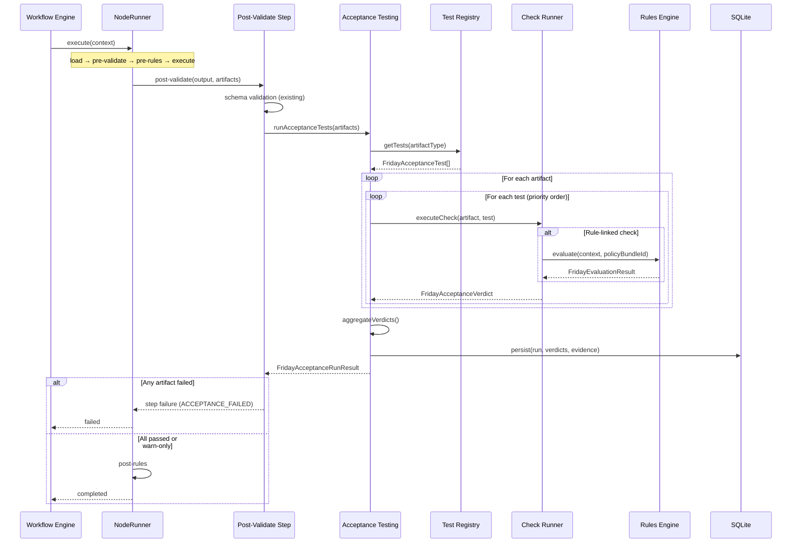
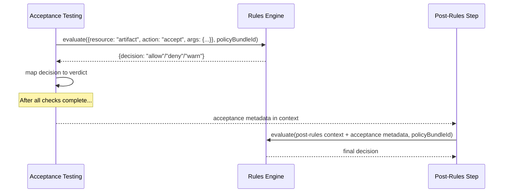

# RFC: Friday Acceptance Testing Layer

**Status:** Draft
**Author:** Friday Platform Team
**Created:** 2026-02-23
**Tickets:** FRI-PLAT-021, FRI-PLAT-022, FRI-PLAT-023

---

## 1. Summary

The Acceptance Testing Layer adds mandatory schema, quantitative, and quality acceptance gates that run against every artifact produced by the NodeRunner pipeline. Before a node execution is considered "completed," all registered acceptance tests for the artifact type must pass. Each test produces a verdict (pass / fail / warn) with structured evidence, enabling deterministic quality enforcement and full audit trails.

## 2. Motivation

Today, the NodeRunner pipeline validates inputs (pre-validate) and outputs (post-validate) using schema checks, and the Rules Engine gates execution with policy decisions. However, neither mechanism addresses **artifact quality** in a structured, extensible way:

1. **No quantitative thresholds** — There is no way to reject an artifact because a metric (confidence score, token count, latency budget) falls outside an acceptable range.
2. **No quality scoring** — Generated text, code, or images have no structured quality gate.
3. **No per-artifact-type extensibility** — Acceptance criteria vary by artifact type (JSON, text, file, image, audio, video), but the current pipeline treats all outputs identically.
4. **No evidence chain** — When an output is rejected, the reason is a validation error string. There is no structured evidence model linking the failure to a specific check, threshold, or rule.
5. **No registry** — Adding a new acceptance check requires modifying pipeline code rather than registering a check against an artifact type.

The Acceptance Testing Layer addresses all five gaps by introducing a test registry, per-artifact verdicts with evidence, and integration with both the Rules Engine and NodeRunner.

## 3. Goals and Non-Goals

### Goals

- Acceptance test registry: register checks by artifact type at startup or runtime.
- Four built-in check types: schema validation, quantitative thresholds, quality scoring, and custom (user-defined).
- Per-artifact verdicts: pass / fail / warn with severity and structured evidence chain.
- Rule-linked checks: acceptance gates can reference Rules Engine policy decisions.
- Integration with NodeRunner: acceptance runs as a post-validate sub-step.
- **Pass/fail determinism > 99.5%** — Given the same artifact and check configuration, the verdict must be identical.
- **Escaped bad artifacts < 1%** — Artifacts that should fail must be caught by acceptance gates.
- **Mean validation latency < 200 ms** — Acceptance testing must not become a bottleneck.
- Full persistence: every acceptance run, verdict, and evidence chain is stored for audit.
- Idempotent API: re-running the same acceptance suite on the same artifact returns the same result.

### Non-Goals (Out of Scope)

- **Human-in-the-loop approval** — v1 is fully automated; manual review gates are a future phase.
- **ML-based quality models** — Quality scoring in v1 uses deterministic heuristics (readability, keyword density, structural checks). ML models are a future phase.
- **Real-time acceptance editing UI** — Frontend work is a separate workstream.
- **Cross-artifact dependency checks** — v1 evaluates each artifact independently.
- **Acceptance test marketplace** — Sharing/importing third-party checks is a future phase.
- **Retry or remediation** — When acceptance fails, the NodeRunner marks the execution as failed. Retry is the workflow engine's responsibility.

## 4. Architecture Overview

```
┌─────────────────────────────────────────────────────────────────────┐
│                      NodeRunner Pipeline                            │
│                                                                     │
│  load → pre-validate → pre-rules → execute → post-validate         │
│                                                        │            │
│                                              ┌─────────▼─────────┐  │
│                                              │ Acceptance Testing │  │
│                                              │      Layer         │  │
│                                              │                    │  │
│                                              │  ┌──────────────┐  │  │
│                                              │  │ Test Registry │  │  │
│                                              │  └──────┬───────┘  │  │
│                                              │         │          │  │
│                                              │  ┌──────▼───────┐  │  │
│                                              │  │ Check Runner  │  │  │
│                                              │  │ (per artifact)│  │  │
│                                              │  └──────┬───────┘  │  │
│                                              │         │          │  │
│                                              │  ┌──────▼───────┐  │  │
│                                              │  │   Verdicts    │  │  │
│                                              │  │  + Evidence   │  │  │
│                                              │  └──────┬───────┘  │  │
│                                              └─────────┼─────────┘  │
│                                                        │            │
│                                              ┌─────────▼─────────┐  │
│                                              │    post-rules      │  │
│                                              └───────────────────┘  │
└─────────────────────────────────────────────────────────────────────┘
                         │                              │
              ┌──────────▼──────────┐        ┌──────────▼──────────┐
              │    Rules Engine     │        │   SQLite Persistence │
              │ (policy decisions)  │        │  (verdicts + evidence)│
              └─────────────────────┘        └──────────────────────┘
```

### Components

| Component | Responsibility |
|-----------|---------------|
| **Acceptance Test Registry** | Maps artifact types to ordered lists of acceptance checks. Supports registration at startup and runtime. |
| **Check Runner** | Iterates registered checks for a given artifact, executes each, and aggregates verdicts. |
| **Verdict Aggregator** | Combines per-check verdicts into a single artifact verdict using worst-verdict-wins semantics. |
| **Evidence Collector** | Structures check output into evidence records with measurements, thresholds, and messages. |
| **Rules Engine Bridge** | Optionally evaluates a Rules Engine policy as part of an acceptance check (rule-linked checks). |
| **Persistence Layer** | Stores acceptance runs, verdicts, and evidence in SQLite for audit and history queries. |

## 5. Detailed Design

### 5.1 Acceptance Test Registry

The registry is a type-safe map from artifact type to an ordered list of acceptance tests:

```typescript
Registry: Map<FridayAcceptanceArtifactType, FridayAcceptanceTest[]>
```

Each `FridayAcceptanceTest` declares:
- A unique test ID.
- The artifact type(s) it applies to.
- The check type (schema / quantitative / quality / custom).
- Check-specific configuration (JSON schema, thresholds, scoring params, or a custom handler reference).
- Priority (lower = runs first).
- Enabled flag.

**Registration rules:**
- Tests are registered by artifact type. A test may target multiple artifact types.
- Duplicate test IDs within the same artifact type are rejected.
- Tests execute in priority order. If a `fail` verdict is reached with `shortCircuit: true`, remaining checks are skipped.

### 5.2 Check Types

#### 5.2.1 Schema Check

Validates the artifact content against a JSON Schema (draft 2020-12). Applicable primarily to `json` artifacts but can validate structured text (e.g., YAML parsed to JSON).

```
Input: artifact content + JSON Schema
Output: pass (valid) / fail (invalid) with validation error paths
```

#### 5.2.2 Quantitative Check

Compares a numeric metric extracted from the artifact against a threshold. Common metrics: token count, file size, confidence score, execution duration.

**Single-threshold variant** (operators: `gt`, `gte`, `lt`, `lte`, `eq`):
```
Input: artifact + metric extractor + operator + threshold
Output: pass (within threshold) / fail (outside threshold) / warn (within soft limit)
```

**Between variant** (operator: `between`):
```
Input: artifact + metric extractor + lowerBound + upperBound
Output: pass (value in [lowerBound, upperBound]) / fail (outside range) / warn (within soft limit)
```

The type system enforces mutual exclusivity: single-bound configs require `threshold` and forbid `lowerBound`/`upperBound`; between configs require `lowerBound` and `upperBound` and forbid `threshold`.

#### 5.2.3 Quality Check

Runs deterministic quality heuristics against the artifact. Examples: readability score for text, structural completeness for JSON, resolution/dimension checks for images.

```
Input: artifact + quality dimension + minimum score
Output: pass / fail / warn with score evidence
```

Quality dimensions are extensible but v1 ships with: `completeness`, `consistency`, `validity`, `readability`.

#### 5.2.4 Custom Check

A user-defined or plugin-provided check function. The function receives the artifact and returns a verdict with evidence.

```
Input: artifact + custom handler reference + handler config
Output: FridayAcceptanceVerdict
```

### 5.3 Rule-Linked Checks

An acceptance test can optionally reference a Rules Engine policy bundle. When executed, the check:

1. Builds a `FridayEvaluationContext` with `resource: "artifact"`, `action: "accept"`, artifact metadata in `args`, and the test's `rulePolicyBundleId` in `context.policyBundleIds`.
2. Calls the Rules Engine `evaluate()` function with `policyBundleId` set in the request to scope evaluation to the referenced bundle.
3. Maps the rule decision to an acceptance verdict:
   - `allow` → `pass`
   - `deny` → `fail`
   - `warn` → `warn`
   - `audit` → `pass` (with evidence noting the audit flag)

This allows operators to define acceptance policies using the same YAML DSL as other rules.

### 5.4 Verdict Model

Each check produces a `FridayAcceptanceVerdict`:

```typescript
{
  verdict: "pass" | "fail" | "warn";
  severity: "critical" | "major" | "minor" | "info";
  evidence: FridayAcceptanceEvidence[];
}
```

**Aggregation (worst-verdict-wins):**
- If any check returns `fail`, the artifact verdict is `fail`.
- If no `fail` but any `warn`, the artifact verdict is `warn`.
- Otherwise, `pass`.

### 5.5 Evidence Chain

Each `FridayAcceptanceEvidence` record contains:
- `checkId` — Which check produced this evidence.
- `checkType` — Schema / quantitative / quality / custom.
- `message` — Human-readable explanation.
- `expected` — What the check expected (threshold, schema, score).
- `actual` — What the artifact produced (value, validation errors, score).
- `metadata` — Arbitrary structured data for debugging.

### 5.6 Integration with NodeRunner

Acceptance testing integrates into the NodeRunner pipeline as a sub-step within **post-validate**:



### 5.7 Integration with Rules Engine

Beyond rule-linked checks (§5.3), the acceptance layer integrates with the Rules Engine in two ways:

1. **Post-rules receives acceptance metadata** — The `FridayEvaluationContext` for the post-rules step includes acceptance verdict summaries in its `metadata` field. Rules can gate based on acceptance outcomes (e.g., deny if any check scored below a threshold).

2. **Acceptance policies as rule bundles** — Operators can define acceptance thresholds as Rules Engine policy bundles. The acceptance layer queries these at runtime, enabling runtime-configurable acceptance criteria without code changes.



## 6. API Surface

The acceptance layer exposes a REST API for managing tests and querying results:

| Method | Path | Description |
|--------|------|-------------|
| `POST` | `/api/acceptance/run` | Run acceptance tests against artifact(s) |
| `GET` | `/api/acceptance/runs/:runId` | Get acceptance run result |
| `GET` | `/api/acceptance/tests` | List registered acceptance tests |
| `POST` | `/api/acceptance/tests` | Register a new acceptance test |
| `GET` | `/api/acceptance/tests/:testId` | Get acceptance test detail |
| `PUT` | `/api/acceptance/tests/:testId` | Update an acceptance test |
| `DELETE` | `/api/acceptance/tests/:testId` | Delete an acceptance test |
| `GET` | `/api/acceptance/artifacts/:artifactUri/history` | Get acceptance history for an artifact |

All endpoints follow Friday API conventions: `FridayApiSuccessResponse<T>` / `FridayApiErrorResponse`, cursor-based pagination via `FridayPaginationQuery` / `FridayPage<T>`, and idempotency keys on run/register create endpoints; update/delete rely on etag optimistic concurrency.

## 7. Persistence Schema

### 7.1 acceptance_tests

Stores registered acceptance test definitions.

| Column | Type | Description |
|--------|------|-------------|
| `id` | TEXT PK | Test UUID |
| `name` | TEXT NOT NULL | Human-readable name |
| `description` | TEXT | Optional description |
| `artifact_type` | TEXT NOT NULL | Target artifact type |
| `check_type` | TEXT NOT NULL | schema / quantitative / quality / custom |
| `config_json` | TEXT NOT NULL | Check-specific configuration |
| `priority` | INTEGER NOT NULL | Execution order (lower = first) |
| `enabled` | INTEGER NOT NULL | 0 or 1 |
| `short_circuit` | INTEGER NOT NULL DEFAULT 0 | If 1, stop testing after this check fails |
| `rule_policy_bundle_id` | TEXT | Optional Rules Engine policy bundle reference |
| `version` | INTEGER NOT NULL | Optimistic concurrency version |
| `etag` | TEXT NOT NULL | Optimistic concurrency token |
| `tags_json` | TEXT NOT NULL | JSON array of tags |
| `created_at` | TEXT NOT NULL | ISO 8601 |
| `updated_at` | TEXT NOT NULL | ISO 8601 |
| `deleted_at` | TEXT | Soft-delete timestamp |

### 7.2 acceptance_runs

Stores acceptance run results (one per artifact per pipeline execution).

| Column | Type | Description |
|--------|------|-------------|
| `id` | TEXT PK | Run UUID |
| `execution_id` | TEXT NOT NULL | NodeRunner execution ID (FK) |
| `artifact_uri` | TEXT NOT NULL | Artifact URI being tested |
| `artifact_type` | TEXT NOT NULL | Artifact type |
| `overall_verdict` | TEXT NOT NULL | pass / fail / warn |
| `overall_severity` | TEXT NOT NULL | Worst severity across checks |
| `checks_total` | INTEGER NOT NULL | Total checks executed |
| `checks_passed` | INTEGER NOT NULL | Checks that passed |
| `checks_failed` | INTEGER NOT NULL | Checks that failed |
| `checks_warned` | INTEGER NOT NULL | Checks that warned |
| `checks_skipped` | INTEGER NOT NULL | Checks skipped (short-circuit) |
| `duration_ms` | INTEGER NOT NULL | Total acceptance duration |
| `idempotency_key` | TEXT | Idempotency key |
| `created_at` | TEXT NOT NULL | ISO 8601 |

### 7.3 acceptance_check_results

Stores per-check results within an acceptance run.

| Column | Type | Description |
|--------|------|-------------|
| `id` | TEXT PK | Check result UUID |
| `run_id` | TEXT NOT NULL | Parent acceptance run ID (FK) |
| `test_id` | TEXT NOT NULL | Acceptance test ID (FK) |
| `check_type` | TEXT NOT NULL | schema / quantitative / quality / custom |
| `status` | TEXT NOT NULL | executed / skipped |
| `verdict` | TEXT | pass / fail / warn (NULL when status is skipped) |
| `severity` | TEXT | critical / major / minor / info (NULL when status is skipped) |
| `evidence_json` | TEXT | JSON array of evidence records (NULL when status is skipped) |
| `duration_ms` | INTEGER NOT NULL | Check duration |
| `rule_evaluation_id` | TEXT | Rules Engine evaluation ID (if rule-linked) |
| `created_at` | TEXT NOT NULL | ISO 8601 |

## 8. Non-Functional Requirements

| NFR | Target | Measurement |
|-----|--------|-------------|
| Pass/fail determinism | > 99.5% | Same artifact + same checks = same verdict. Measured via golden test suite. |
| Escaped bad artifacts | < 1% | Artifacts that should fail but pass. Measured via chaos/mutation testing. |
| Mean validation latency | < 200 ms | End-to-end acceptance run time. Measured via p50 across production runs. |
| p99 validation latency | < 500 ms | Tail latency budget. |
| Audit completeness | 100% | Every acceptance run, verdict, and evidence persisted. |
| Registry lookup | < 1 ms | In-memory map lookup time. |

## 9. Edge Cases

1. **No checks registered for artifact type** — Verdict is `pass` with zero checks. An `info`-severity evidence record notes the absence.
2. **Check throws an uncaught exception** — The check is marked as `fail` with `critical` severity and the error message as evidence. The run continues (no short-circuit unless configured).
3. **Artifact content is empty or null** — Schema checks fail; quantitative checks treat the metric as 0 or absent; quality checks return `fail` with `completeness: 0`.
4. **Rule-linked check and Rules Engine is unavailable** — Fail-closed: the check returns `fail` with evidence noting the Rules Engine timeout/error.
5. **Short-circuit after first failure** — If `shortCircuit: true` on the test, remaining checks for that artifact are skipped (status: `skipped`; verdict is not set for skipped checks). Other artifacts are still tested.
6. **Concurrent acceptance runs for the same artifact** — Idempotency key ensures at-most-once semantics within the TTL window. Concurrent runs with different keys produce independent results.
7. **Artifact URI no longer accessible** — If the artifact cannot be retrieved, all checks fail with `critical` severity and evidence noting the retrieval failure.
8. **Very large artifacts** — Checks should respect a configurable size limit. Artifacts exceeding the limit are failed with evidence noting the size violation.

## 10. Out of Scope Boundaries

- **Artifact content storage** — The acceptance layer receives artifact URIs; it does not manage artifact storage.
- **Custom check isolation hardening beyond the current sandbox** — Custom checks already execute in a sandboxed runtime; deeper OS-level isolation remains a future hardening phase.
- **Distributed acceptance** — All checks run locally; distributed execution across workers is not supported in v1.
- **Acceptance marketplace and cross-hub sharing** — Versioned test definitions already exist locally; marketplace-style sharing remains a future phase.

## 11. Architecture Decision Records

### ADR-001: Acceptance as a Post-Validate Sub-Step (Not a New Pipeline Step)

**Context:** Should acceptance testing be a 7th pipeline step or a sub-step within post-validate?

**Decision:** Sub-step within post-validate.

**Rationale:**
- The NodeRunner pipeline is intentionally fixed at 6 steps. Adding a 7th step would break the state machine, transition table, and all existing adapters.
- Post-validate already handles output quality; acceptance is a structured extension of that responsibility.
- The post-validate step result includes acceptance metadata, so the pipeline's structured result model is preserved without schema changes.

**Consequences:**
- Acceptance failures surface as post-validate failures with error code `ACCEPTANCE_FAILED`.
- The post-validate step duration now includes acceptance testing time.
- Future phases may promote acceptance to a dedicated step if the pipeline expands.

### ADR-002: Worst-Verdict-Wins Aggregation

**Context:** How should per-check verdicts be combined into an artifact verdict?

**Decision:** Worst-verdict-wins: fail > warn > pass.

**Rationale:**
- Simple, predictable, and deterministic.
- Aligns with the Rules Engine's `FRIDAY_RULE_DECISION_PRIORITY` pattern (deny wins).
- Operators who want more nuanced aggregation can use a custom check that implements its own logic.

**Consequences:**
- A single failing check fails the entire artifact.
- Warn-level checks never block execution but are visible in the audit trail.

### ADR-003: Rule-Linked Checks Map Decisions to Verdicts

**Context:** How should Rules Engine decisions translate to acceptance verdicts?

**Decision:** Direct mapping: allow→pass, deny→fail, warn→warn, audit→pass (with evidence).

**Rationale:**
- Reuses existing Rules Engine infrastructure without reinventing policy evaluation.
- The audit decision maps to pass because audit is observational, not blocking.
- Evidence records always include the full `FridayEvaluationResult` for traceability.

**Consequences:**
- Rule-linked checks are only as good as the rules they reference.
- Operators must maintain both acceptance tests and rule policies, but can use one to enforce the other.

### ADR-004: Fail-Closed on Rules Engine Unavailability

**Context:** What happens when a rule-linked check cannot reach the Rules Engine?

**Decision:** Fail-closed: the check returns `fail` with `critical` severity.

**Rationale:**
- Consistent with the NodeRunner's fail-closed design for pre-rules and post-rules.
- Safety-first: if we cannot verify policy compliance, we must not pass the artifact.
- Operators can disable rule-linked checks if they prefer fail-open behavior.

**Consequences:**
- Rules Engine downtime causes acceptance failures for rule-linked checks.
- Non-rule-linked checks (schema, quantitative, quality) are unaffected.

### ADR-005: In-Memory Registry with Persistence Backing

**Context:** Should the test registry be purely in-memory, purely database-driven, or hybrid?

**Decision:** In-memory map backed by SQLite persistence.

**Rationale:**
- Registry lookups must be < 1 ms to meet the 200 ms latency budget.
- Persistence ensures tests survive restarts.
- On startup, the registry is hydrated from SQLite. API mutations update both the in-memory map and the database.

**Consequences:**
- Multi-instance deployments would need a cache invalidation mechanism (out of scope for v1 single-hub).
- Registry is eventually consistent with the database (writes are synchronous, so effectively immediate for single-hub).
