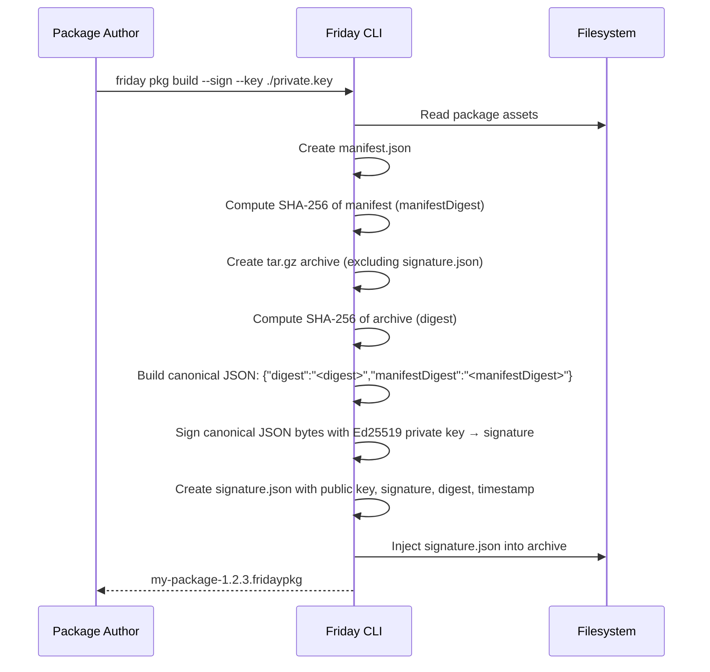
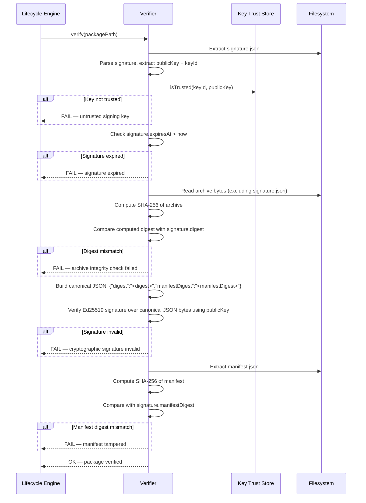
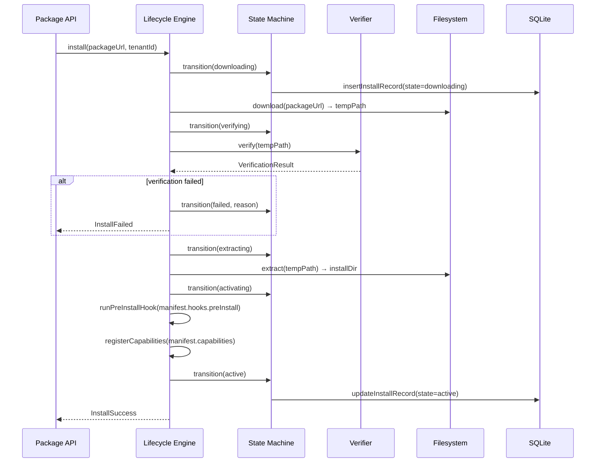
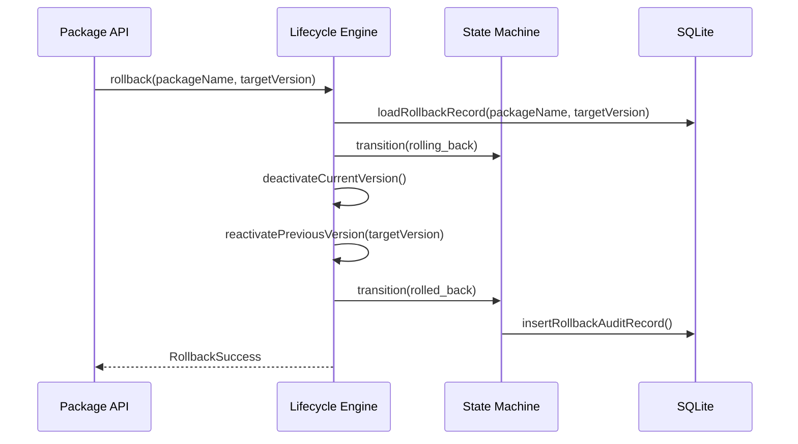

# RFC: Friday Agent Package and Publishing

**Status:** Draft  
**Author:** Friday Platform Team  
**Created:** 2026-02-23  
**Tickets:** FRI-PLAT-051, FRI-PLAT-052, FRI-PLAT-053

---

## 1. Summary

The Agent Package and Publishing system provides a mechanism for packaging agent capabilities as signed, versioned, publishable units. Packages bundle manifests, assets, and metadata into a deterministic archive format with Ed25519 cryptographic signatures. The system manages the full lifecycle: build, publish, discover, install, upgrade, verify, and rollback — with tenant-scoped isolation via the Security (SEC) module.

## 2. Motivation

Friday agents assemble capabilities from skills, playbooks, rules, and provider configurations. Today these components are deployed as part of the monolithic hub codebase. This creates several problems:

1. **No independent versioning** — capability updates require a full hub deployment.
2. **No distribution mechanism** — sharing capabilities between hubs requires manual file copying.
3. **No integrity verification** — there is no cryptographic proof that installed capabilities have not been tampered with.
4. **No rollback guarantee** — a bad capability update requires a full hub rollback.
5. **No tenant isolation** — multi-tenant deployments cannot scope capabilities per tenant.

The Agent Package system addresses all five problems by introducing a self-contained package format with cryptographic signing, a registry for discovery, and a lifecycle engine with atomic install/rollback semantics.

## 3. Goals and Non-Goals

### Goals

- Deterministic package format with content-addressable archive (tar+gzip).
- Ed25519 signature on every package with full chain-of-trust verification.
- Semantic versioning with dependency resolution and compatibility ranges.
- Atomic install and rollback with < 1% failure rate.
- Signature verification coverage of 100% (no unsigned package can be installed).
- Tenant-scoped package visibility and installation via the SEC module.
- SQLite-based registry for package metadata, install state, and audit trail.
- Cursor-based API for package discovery and management.

### Non-Goals (Out of Scope)

- Package marketplace UI (frontend work is separate).
- Cross-hub package federation (single-hub for v1).
- Runtime sandboxing of package code (relies on existing skill permission model).
- Automatic dependency resolution during install (explicit resolution in v1).
- Package streaming/lazy loading (full download before install in v1).

## 4. Architecture Overview

```
┌─────────────────────────────────────────────────────────────┐
│                        Hub Bootstrap                         │
│  ┌──────────────┐  ┌──────────────┐  ┌────────────────────┐ │
│  │ Agent Runtime │  │ Workflow RT  │  │   API Runtime      │ │
│  └──────┬───────┘  └──────┬───────┘  └────────┬───────────┘ │
│         │                 │                    │             │
│         └────────┬────────┘                    │             │
│                  ▼                              │             │
│  ┌────────────────────────────────┐            │             │
│  │    Package Lifecycle Engine     │◄───────────┘             │
│  │  ┌──────────────┐ ┌──────────┐ │                          │
│  │  │ State Machine │ │ Verifier │ │                          │
│  │  └──────┬───────┘ └────┬─────┘ │                          │
│  │         │              │        │                          │
│  │  ┌──────▼──────────────▼─────┐  │                          │
│  │  │   Package Registry Cache   │  │                          │
│  │  └────────────┬──────────────┘  │                          │
│  │               │                  │                          │
│  │  ┌────────────▼──────────────┐  │                          │
│  │  │   SQLite Persistence       │  │                          │
│  │  └───────────────────────────┘  │                          │
│  └────────────────────────────────┘                          │
│                                                              │
│  ┌────────────────────────────────┐                          │
│  │   Security (SEC) Module         │                          │
│  │  ┌──────────────────────────┐  │                          │
│  │  │ Tenant Scope Resolver     │  │                          │
│  │  │ Key Management Service    │  │                          │
│  │  └──────────────────────────┘  │                          │
│  └────────────────────────────────┘                          │
└──────────────────────────────────────────────────────────────┘
```

### Components

| Component | Responsibility |
|---|---|
| **Package Lifecycle Engine** | Top-level facade for install/upgrade/rollback operations; drives the state machine |
| **State Machine** | Manages install state transitions (downloading → verifying → extracting → activating → active) |
| **Verifier** | Ed25519 signature verification, manifest integrity check, dependency validation |
| **Package Registry Cache** | In-memory cache of installed package metadata; invalidated on state transitions |
| **SQLite Persistence** | Stores package registry, install records, rollback history, key trust entries |
| **Tenant Scope Resolver** | Resolves which packages are visible/installable for a given tenant |
| **Key Management Service** | Manages trusted public keys and key rotation |

## 5. Package Format Specification

### 5.1 Archive Structure

A Friday package is a gzip-compressed tar archive (`.fridaypkg`) with the following structure:

```
my-package-1.2.3.fridaypkg
├── manifest.json          # Package manifest (required)
├── signature.json         # Detached Ed25519 signature (required)
├── assets/                # Package assets directory (optional)
│   ├── skills/            # Skill definitions
│   ├── rules/             # Rule policy bundles
│   ├── playbooks/         # Playbook templates
│   └── providers/         # Provider configurations
├── migrations/            # SQLite migration scripts (optional)
│   └── 001-initial.sql
└── README.md              # Human-readable documentation (optional)
```

### 5.2 Manifest (`manifest.json`)

```json
{
  "name": "@friday/example-skills",
  "version": "1.2.3",
  "description": "Example skill package for Friday agents",
  "author": {
    "name": "Friday Platform Team",
    "email": "team@friday.dev",
    "url": "https://friday.dev"
  },
  "license": "MIT",
  "capabilities": ["skill:web-search", "skill:code-analysis"],
  "dependencies": {
    "@friday/core-utils": "^2.0.0",
    "@friday/provider-openai": ">=1.5.0 <3.0.0"
  },
  "peerDependencies": {
    "@friday/rules-engine": "^1.0.0"
  },
  "fridayVersionRange": ">=0.10.0 <1.0.0",
  "assets": {
    "skills": ["assets/skills/*.yaml"],
    "rules": ["assets/rules/*.yaml"],
    "playbooks": ["assets/playbooks/*.json"],
    "providers": ["assets/providers/*.json"]
  },
  "hooks": {
    "preInstall": "migrations/001-initial.sql",
    "postInstall": null,
    "preUninstall": null,
    "postUninstall": null
  },
  "metadata": {
    "repository": "https://github.com/friday-ai/example-skills",
    "keywords": ["skills", "web", "analysis"],
    "tenantScopes": ["*"]
  }
}
```

### 5.3 Signature (`signature.json`)

```json
{
  "algorithm": "Ed25519",
  "publicKey": "MCowBQYDK2VwAyEA...",
  "signature": "U2lnbmF0dXJlQnl0ZXM...",
  "digest": "sha256:a1b2c3d4e5f6...",
  "manifestDigest": "sha256:f6e5d4c3b2a1...",
  "timestamp": "2026-02-23T12:00:00.000Z",
  "expiresAt": "2027-02-23T12:00:00.000Z",
  "keyId": "friday-signing-key-2026",
  "certificateChain": ["-----BEGIN CERTIFICATE-----\n..."]
}
```

The `digest` field is the SHA-256 hash of the entire archive excluding `signature.json`. The `manifestDigest` is the SHA-256 hash of `manifest.json` alone, providing a quick integrity check without full archive extraction.

The `signature` field is the **base64-encoded Ed25519 signature bytes**. The signed payload is the **canonical JSON** of the two digests:

```json
{"digest":"sha256:a1b2c3d4e5f6...","manifestDigest":"sha256:f6e5d4c3b2a1..."}
```

Keys are sorted lexicographically with no whitespace. This deterministic byte sequence is signed with the author's Ed25519 private key and verified against the `publicKey`.

## 6. Signing and Verification Flow

### 6.1 Key Management

- **Signing keys** are Ed25519 key pairs. The private key is held by the package author and never transmitted.
- **Trusted public keys** are registered in the hub's key trust store (SQLite table `package_trusted_keys`).
- **Key rotation** follows a grace period model: old keys remain trusted for 90 days after rotation.
- **Key revocation** immediately invalidates all packages signed with the revoked key.

### 6.2 Key Lifecycle API

The platform exposes explicit REST endpoints for trusted key management (all require `package.admin` scope):

| Endpoint | Method | Operation |
|---|---|---|
| `/api/packages/keys` | GET | List trusted keys (paginated, filterable by tenant and revocation status) |
| `/api/packages/keys` | POST | Add a new trusted key (idempotent via `idempotencyKey`) |
| `/api/packages/keys/:keyId/revoke` | POST | Revoke a key; affected active installs transition to `verification_failed` |
| `/api/packages/keys/:keyId/rotate` | POST | Rotate a key; old key enters grace period (default 90 days) before auto-revocation |

See the `FridayListTrustedKeysRequest`, `FridayAddTrustedKeyRequest`, `FridayRevokeTrustedKeyRequest`, and `FridayRotateTrustedKeyRequest` API types for full request/response contracts.

### 6.3 Signing Flow



### 6.4 Verification Flow



## 7. Install/Upgrade Lifecycle

### 7.1 State Machine

```
                    ┌──────────────┐
                    │  downloading  │
                    └──────┬───────┘
                           │ download complete
                    ┌──────▼───────┐
                    │   verifying   │
                    └──────┬───────┘
                           │ signature valid
                    ┌──────▼───────┐
                    │  extracting   │
                    └──────┬───────┘
                           │ assets extracted
                    ┌──────▼───────┐
                    │  activating   │
                    └──────┬───────┘
                           │ activation hooks complete
                    ┌──────▼───────┐
              ┌─────│    active     │─────┬─────────────┐
              │     └──────────────┘     │             │
              │ degraded                  │ uninstall    │ key revoked
       ┌──────▼───────┐          ┌───────▼──────┐  ┌───▼───────────────┐
       │ rolling_back  │          │  uninstalling │  │verification_failed│
       └──────┬───────┘          └───────┬──────┘  └───┬───────┬───────┘
              │                          │             │       │
       ┌──────▼───────┐          ┌───────▼──────┐      │       │
       │  rolled_back  │          │  uninstalled  │  (can transition to
       └──────────────┘          └──────────────┘  rolling_back or
                                                   uninstalling)

    Any non-terminal state → failed (on error)

    Terminal states: rolled_back, uninstalled, failed
    (active is NOT terminal — it can transition out)
```

### 7.2 Install Sequence



### 7.3 Upgrade Sequence

Upgrades are modelled as an atomic operation:

1. Install the new version to a staging directory.
2. Verify the new version.
3. Record the current version as the rollback target.
4. Atomically swap the active version pointer.
5. Clean up the old version after a configurable grace period (default: 24 hours).

If any step fails, the original version remains active.

### 7.4 Rollback Sequence



## 8. Version Resolution and Dependency Management

### 8.1 Semantic Versioning

All packages use strict semver (major.minor.patch). Pre-release identifiers (e.g., `1.0.0-beta.1`) are supported.

### 8.2 Dependency Resolution Algorithm

1. **Flatten** — collect all direct and transitive dependencies into a flat list.
2. **Intersect** — for each dependency appearing multiple times, compute the intersection of all requested ranges.
3. **Resolve** — for each dependency, select the highest version satisfying the intersected range from the registry.
4. **Validate** — check peer dependencies and `fridayVersionRange` compatibility.
5. **Conflict** — if any dependency has an empty intersection or no satisfying version, report a `FridayDependencyConflict`.

### 8.3 Lock File

Resolved dependency versions are persisted in a `package-lock.json` within the install directory. Subsequent installs use the lock file for reproducible builds unless `--update` is specified.

## 9. Integration with Security (SEC) Module

### 9.1 Tenant-Scoped Packages

- Each package manifest declares `metadata.tenantScopes` — an array of tenant IDs or `["*"]` for global visibility.
- The SEC module's tenant scope resolver filters package queries to only return packages visible to the requesting tenant.
- Install operations verify that the requesting principal has the `package.install` scope for the target tenant.

### 9.2 Required Scopes

Scope names follow the platform-wide dot-separated convention used by `FridayScope` (e.g. `workflow.read`, `plugin.install`).

| Operation | Required Scope |
|---|---|
| Publish | `package.publish` |
| List / Get | `package.read` |
| Install | `package.install` |
| Upgrade | `package.install` |
| Rollback | `package.rollback` |
| Uninstall | `package.uninstall` |
| List trusted keys | `package.admin` |
| Add trusted key | `package.admin` |
| Revoke trusted key | `package.admin` |
| Rotate trusted key | `package.admin` |

### 9.3 Audit Integration

All package lifecycle events emit audit log entries via the existing `friday-audit-log.ts` module in the SEC directory. Audit entries include: operation, package name, version, principal, tenant, timestamp, and outcome.

## 10. Edge Cases

| Edge Case | Handling |
|---|---|
| **Corrupted package archive** | Verification fails at digest comparison; state transitions to `failed` with descriptive error |
| **Signature expired** | Verification rejects; package cannot be installed until re-signed with a valid signature |
| **Signing key revoked** | Active installs signed with the revoked key transition to `verification_failed` state; from there an operator may choose to `rolling_back` or `uninstalling`. They are NOT auto-uninstalled (operator decision) |
| **Version conflict** | Dependency resolver reports `FridayDependencyConflict` with the conflicting ranges; install is blocked |
| **Partial install (crash mid-extraction)** | On startup, the lifecycle engine scans for records in non-terminal states (downloading/verifying/extracting/activating) and transitions them to `failed` with `reason: "interrupted"` |
| **Concurrent upgrades** | Optimistic concurrency via `etag` + `version` on the install record; second upgrade receives `ETAG_MISMATCH` and must retry. A partial unique index `(tenant_id, package_name) WHERE state = 'active'` prevents multiple active versions from coexisting |
| **Disk space exhaustion** | Pre-flight check estimates required space from manifest `size` field; install rejected if insufficient |
| **Duplicate package name+version** | Publish is idempotent — same name+version with same digest returns the existing entry; different digest returns `VERSION_ALREADY_EXISTS` |
| **Circular dependencies** | Dependency resolver maintains a visited set; cycles are reported as `CIRCULAR_DEPENDENCY` conflict |
| **Missing dependency in registry** | Resolver reports `DEPENDENCY_NOT_FOUND` conflict; install is blocked |

## 11. Non-Functional Requirements

| Requirement | Target | Measurement |
|---|---|---|
| **Package install success rate** | > 99% | Ratio of successful installs to total install attempts over 30-day window |
| **Signature verification coverage** | 100% | Every install attempt must pass signature verification; no bypass path |
| **Rollback success rate** | > 99% | Ratio of successful rollbacks to total rollback attempts over 30-day window |
| **Verification latency (p95)** | < 500 ms | Ed25519 verification + SHA-256 digest for packages up to 50 MB |
| **Install latency (p95)** | < 5 s | Full lifecycle (download excluded) for packages up to 50 MB |
| **Registry query latency (p95)** | < 20 ms | Cursor-based list with up to 10,000 registered packages |
| **Maximum package size** | 100 MB | Enforced at upload; configurable per deployment |
| **Concurrent installs** | 4 | Semaphore-gated to prevent resource exhaustion |

## 12. SQLite Schema

```sql
-- ═══════════════════════════════════════════════════════════════
-- PACKAGE REGISTRY
-- ═══════════════════════════════════════════════════════════════

-- Published package versions
CREATE TABLE IF NOT EXISTS package_registry (
  id                TEXT PRIMARY KEY,
  name              TEXT NOT NULL,
  version           TEXT NOT NULL,
  description       TEXT,
  author_json       TEXT NOT NULL,
  license           TEXT,
  capabilities_json TEXT NOT NULL DEFAULT '[]',
  dependencies_json TEXT NOT NULL DEFAULT '{}',
  peer_deps_json    TEXT NOT NULL DEFAULT '{}',
  friday_version    TEXT NOT NULL,
  assets_json       TEXT NOT NULL DEFAULT '{}',
  hooks_json        TEXT NOT NULL DEFAULT '{}',
  metadata_json     TEXT NOT NULL DEFAULT '{}',
  size_bytes        INTEGER NOT NULL,
  archive_digest    TEXT NOT NULL,
  manifest_digest   TEXT NOT NULL,
  signature_json    TEXT NOT NULL,
  published_by      TEXT NOT NULL,
  tenant_id         TEXT,
  etag              TEXT NOT NULL,
  created_at        TEXT NOT NULL,
  updated_at        TEXT NOT NULL,
  deleted_at        TEXT,
  UNIQUE(name, version)
);

CREATE INDEX IF NOT EXISTS idx_package_registry_name
  ON package_registry(name) WHERE deleted_at IS NULL;

CREATE INDEX IF NOT EXISTS idx_package_registry_tenant
  ON package_registry(tenant_id) WHERE deleted_at IS NULL;

-- ═══════════════════════════════════════════════════════════════
-- INSTALL RECORDS
-- ═══════════════════════════════════════════════════════════════

-- Per-tenant install state tracking
CREATE TABLE IF NOT EXISTS package_installs (
  id                TEXT PRIMARY KEY,
  package_id        TEXT NOT NULL REFERENCES package_registry(id),
  package_name      TEXT NOT NULL,
  package_version   TEXT NOT NULL,
  tenant_id         TEXT NOT NULL,
  state             TEXT NOT NULL CHECK(state IN (
    'downloading', 'verifying', 'extracting', 'activating',
    'active', 'verification_failed', 'rolling_back', 'rolled_back',
    'uninstalling', 'uninstalled', 'failed'
  )),
  install_dir       TEXT,
  error_message     TEXT,
  error_code        TEXT,
  previous_version  TEXT,
  etag              TEXT NOT NULL,
  version           INTEGER NOT NULL DEFAULT 1,
  installed_by      TEXT NOT NULL,
  idempotency_key   TEXT,
  created_at        TEXT NOT NULL,
  updated_at        TEXT NOT NULL
);

-- Prevent multiple active versions of the same package per tenant.
-- Only one row with state='active' may exist for a given (tenant_id, package_name).
CREATE UNIQUE INDEX IF NOT EXISTS idx_package_installs_one_active
  ON package_installs(tenant_id, package_name) WHERE state = 'active';

CREATE INDEX IF NOT EXISTS idx_package_installs_tenant_name
  ON package_installs(tenant_id, package_name) WHERE state = 'active';

CREATE INDEX IF NOT EXISTS idx_package_installs_state
  ON package_installs(state) WHERE state NOT IN ('active', 'uninstalled', 'rolled_back', 'failed');

CREATE INDEX IF NOT EXISTS idx_package_installs_idempotency
  ON package_installs(idempotency_key) WHERE idempotency_key IS NOT NULL;

-- ═══════════════════════════════════════════════════════════════
-- ROLLBACK RECORDS
-- ═══════════════════════════════════════════════════════════════

CREATE TABLE IF NOT EXISTS package_rollbacks (
  id                TEXT PRIMARY KEY,
  install_id        TEXT NOT NULL REFERENCES package_installs(id),
  package_name      TEXT NOT NULL,
  from_version      TEXT NOT NULL,
  to_version        TEXT NOT NULL,
  reason            TEXT NOT NULL,
  initiated_by      TEXT NOT NULL,
  state             TEXT NOT NULL CHECK(state IN ('initiated', 'completed', 'failed')),
  error_message     TEXT,
  started_at        TEXT NOT NULL,
  completed_at      TEXT
);

CREATE INDEX IF NOT EXISTS idx_package_rollbacks_install
  ON package_rollbacks(install_id);

-- ═══════════════════════════════════════════════════════════════
-- TRUSTED SIGNING KEYS
-- ═══════════════════════════════════════════════════════════════

CREATE TABLE IF NOT EXISTS package_trusted_keys (
  id                TEXT PRIMARY KEY,
  key_id            TEXT NOT NULL UNIQUE,
  public_key        TEXT NOT NULL,
  algorithm         TEXT NOT NULL DEFAULT 'Ed25519',
  owner             TEXT NOT NULL,
  tenant_id         TEXT,
  trusted_at        TEXT NOT NULL,
  expires_at        TEXT,
  revoked_at        TEXT,
  revocation_reason TEXT,
  created_at        TEXT NOT NULL,
  updated_at        TEXT NOT NULL
);

CREATE INDEX IF NOT EXISTS idx_package_trusted_keys_key_id
  ON package_trusted_keys(key_id) WHERE revoked_at IS NULL;

-- ═══════════════════════════════════════════════════════════════
-- DEPENDENCY LOCKS
-- ═══════════════════════════════════════════════════════════════

CREATE TABLE IF NOT EXISTS package_dependency_locks (
  id                TEXT PRIMARY KEY,
  install_id        TEXT NOT NULL REFERENCES package_installs(id),
  dependency_name   TEXT NOT NULL,
  resolved_version  TEXT NOT NULL,
  requested_range   TEXT NOT NULL,
  resolved_at       TEXT NOT NULL,
  UNIQUE(install_id, dependency_name)
);

CREATE INDEX IF NOT EXISTS idx_package_dep_locks_install
  ON package_dependency_locks(install_id);

-- ═══════════════════════════════════════════════════════════════
-- LIFECYCLE AUDIT LOG
-- ═══════════════════════════════════════════════════════════════

CREATE TABLE IF NOT EXISTS package_lifecycle_log (
  id                TEXT PRIMARY KEY,
  package_name      TEXT NOT NULL,
  package_version   TEXT,
  operation         TEXT NOT NULL,
  state_from        TEXT,
  state_to          TEXT NOT NULL,
  principal_id      TEXT,
  tenant_id         TEXT,
  details_json      TEXT NOT NULL DEFAULT '{}',
  created_at        TEXT NOT NULL
);

CREATE INDEX IF NOT EXISTS idx_package_lifecycle_log_created
  ON package_lifecycle_log(created_at);

CREATE INDEX IF NOT EXISTS idx_package_lifecycle_log_package
  ON package_lifecycle_log(package_name, created_at DESC);

-- ═══════════════════════════════════════════════════════════════
-- IDEMPOTENCY KEYS
-- ═══════════════════════════════════════════════════════════════

-- Composite primary key: (principal_id, operation, key).
-- The same key string may be reused by different principals or for
-- different operations without conflict.
CREATE TABLE IF NOT EXISTS package_idempotency_keys (
  principal_id      TEXT NOT NULL,
  operation         TEXT NOT NULL,
  key               TEXT NOT NULL,
  payload_hash      TEXT NOT NULL,
  response_json     TEXT NOT NULL,
  created_at        TEXT NOT NULL,
  expires_at        TEXT NOT NULL,
  PRIMARY KEY (principal_id, operation, key)
);

CREATE INDEX IF NOT EXISTS idx_package_idempotency_expires
  ON package_idempotency_keys(expires_at);
```

## 13. Architecture Decision Records (ADRs)

### ADR-001: Ed25519 Over RSA for Package Signatures

**Context:** Packages need cryptographic signatures for integrity and authenticity. RSA and Ed25519 are the primary candidates.

**Decision:** Use Ed25519 (RFC 8032) for all package signatures.

**Consequences:**
- (+) 64-byte signatures vs. 256+ bytes for RSA-2048 — smaller package overhead.
- (+) Faster signing and verification (5–10× faster than RSA-2048).
- (+) No padding oracle attacks — Ed25519 has a simpler security model.
- (+) Native support in Node.js `crypto` module since Node 15.
- (−) Cannot directly interoperate with legacy RSA-based PKI systems (acceptable — greenfield system).

### ADR-002: Tar+Gzip Archive Format Over Zip

**Context:** The package format needs a container for manifest, signature, and assets.

**Decision:** Use gzip-compressed tar (`.tar.gz` renamed to `.fridaypkg`) as the archive format.

**Consequences:**
- (+) Deterministic archive creation (sorted entries, fixed timestamps) enables reproducible builds.
- (+) Streaming extraction — no need to buffer the entire archive in memory.
- (+) Well-supported in Node.js via `tar` and built-in `zlib`.
- (−) No random-access to individual files (acceptable — packages are small, always fully extracted).

### ADR-003: Detached Signature File Over Embedded Signature

**Context:** The signature must cover the archive contents. It can be embedded in the archive or stored as a separate entry.

**Decision:** Store the signature as `signature.json` inside the archive but exclude it from the digest computation. The digest covers all archive entries except `signature.json`.

**Consequences:**
- (+) Self-contained — the signature travels with the package, no side-channel needed.
- (+) Simple verification — extract signature, compute digest of remaining contents, verify.
- (−) Slightly more complex archive creation (must inject signature after digest computation).

### ADR-004: State Machine for Install Lifecycle Over Simple Status Flag

**Context:** Package installation involves multiple steps that can fail independently. A simple "installed/not-installed" flag is insufficient for crash recovery.

**Decision:** Model install as a finite state machine with explicit states (downloading → verifying → extracting → activating → active) persisted in SQLite.

**Consequences:**
- (+) Crash recovery — on startup, scan for non-terminal states and clean up.
- (+) Observable — operators can see exactly where an install is in the pipeline.
- (+) Rollback-aware — the state machine knows whether rollback is possible from the current state.
- (−) More complex than a boolean flag (acceptable — correctness requires it).

### ADR-005: Optimistic Concurrency via ETags Over Pessimistic Locks

**Context:** Concurrent operations (e.g., two admins upgrading the same package) must be handled safely.

**Decision:** Use ETags (optimistic concurrency tokens) on registry entries and install records. Write operations require a matching ETag; mismatches return `ETAG_MISMATCH`.

**Consequences:**
- (+) No database-level locks — compatible with SQLite's single-writer model.
- (+) Clear conflict semantics for API consumers.
- (+) Standard HTTP ETag pattern familiar to API developers.
- (−) Clients must handle retry-on-conflict (acceptable — standard optimistic concurrency pattern).

### ADR-006: Content-Addressable Digests Over Sequential Version IDs

**Context:** Packages need unique identification beyond name+version for integrity verification.

**Decision:** Every package is identified by its SHA-256 content digest in addition to name+version. The digest is computed over the archive contents and stored in the registry.

**Consequences:**
- (+) Tamper-evident — any modification changes the digest.
- (+) Deduplication — identical content always produces the same digest.
- (+) Enables content-addressable caching and verification without full archive comparison.
- (−) Digest computation adds ~50ms for a 50MB package (acceptable).

### ADR-007: 24-Hour Idempotency Window Over Infinite Retention

**Context:** Write operations (publish, install, upgrade, rollback) need idempotency to handle retries safely.

**Decision:** Idempotency keys are scoped to the composite `(principal_id, operation, key)` and expire after 24 hours. The database enforces uniqueness via `PRIMARY KEY (principal_id, operation, key)` — not on `key` alone. Same payload hash returns the cached response; different payload hash with the same composite key returns `409 PACKAGING_IDEMPOTENCY_KEY_CONFLICT`.

**Conflict behavior:** On `INSERT ... ON CONFLICT` against `(principal_id, operation, key)`, the server compares the `payload_hash`. If it matches the existing row, the stored `response_json` is replayed. If it differs, the request is rejected with HTTP 409. This means two different principals can independently use the same key string without collision.

**Consequences:**
- (+) Bounded storage — expired keys are cleaned up by a periodic job.
- (+) Safe retries within a reasonable window.
- (+) Conflict detection prevents accidental overwrites.
- (+) Composite scope prevents cross-principal key collisions.
- (−) Operations cannot be replayed after 24 hours (acceptable — they should be re-initiated explicitly).

---

## 14. Future Work (Phase 2+)

- **Package marketplace UI**: Visual package browser with search, ratings, and install buttons.
- **Cross-hub federation**: Package registry federation protocol for multi-hub deployments.
- **Automatic dependency resolution**: Smart resolver that auto-installs missing dependencies during install.
- **Package streaming**: Lazy-load package assets on demand instead of full download.
- **Differential upgrades**: Delta packages that contain only changed files between versions.
- **Runtime sandboxing**: Capability-based sandbox for package code execution.
- **Signed manifests with timestamps**: Integration with RFC 3161 timestamping authority for non-repudiation.
- **Package deprecation**: Formal deprecation workflow with migration guides and sunset dates.
