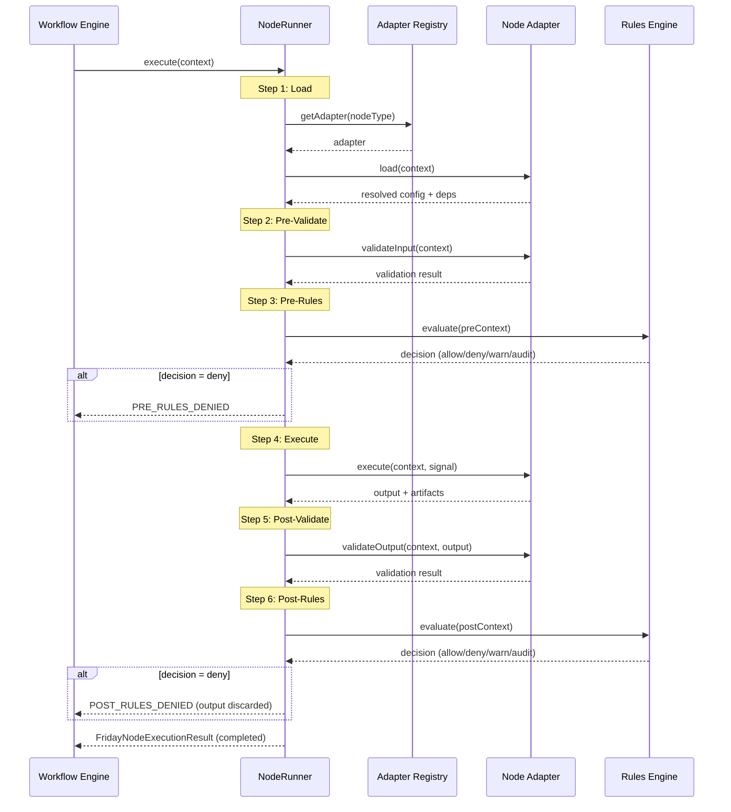
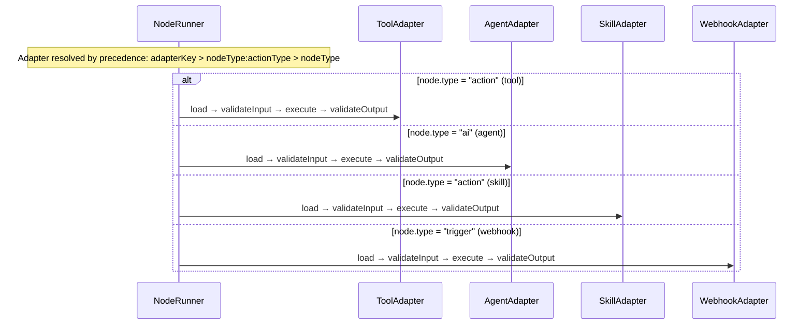
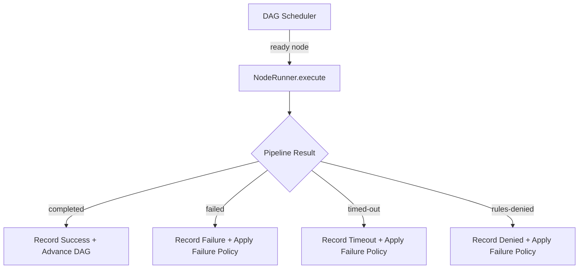
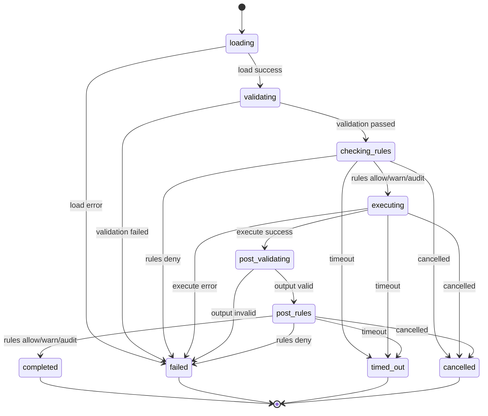

# RFC: Friday NodeRunner Execution Framework

**Status:** Draft
**Author:** Friday Platform Team
**Created:** 2026-02-23
**Tickets:** FRI-PLAT-011, FRI-PLAT-012, FRI-PLAT-013

---

## 1. Summary

The NodeRunner Execution Framework standardizes every workflow node execution in Friday into a deterministic 6-step pipeline: **load → pre-validate → pre-rules → execute → post-validate → post-rules**. This replaces the ad-hoc `switch`-based executor with a structured runner that integrates schema validation, Rules Engine policy evaluation, and a type-safe adapter pattern for different node types.

## 2. Motivation

The current workflow node executor (`friday-workflow-node-executor.ts`) is a single `switch` statement that dispatches by `node.type`. This works but has significant gaps:

1. **No validation** — Node inputs are passed directly without schema or type checking.
2. **No policy enforcement** — The Rules Engine is not consulted before or after node execution.
3. **No structured lifecycle** — There is no standard place to add pre/post hooks, logging, or metrics.
4. **No output quality checks** — Node outputs are returned as-is with no post-execution validation.
5. **No adapter extensibility** — Adding a new node type requires modifying the core executor.

The NodeRunner addresses all five gaps by wrapping every execution in a fixed 6-step pipeline with clear extension points.

## 3. Goals and Non-Goals

### Goals

- Fixed 6-step pipeline with deterministic state transitions.
- Adapter pattern: each node type registers a `FridayNodeAdapter` implementation.
- Pre-execution and post-execution Rules Engine evaluation via `FridayEvaluationContext`.
- Input schema validation (pre-validate) and output schema validation (post-validate).
- Execution success rate > 99% for well-formed inputs.
- Timeout handling accuracy 100% (every execution respects `AbortSignal` / `timeoutMs`).
- Full audit trail: every step result persisted for debugging and compliance.
- Backward-compatible: existing `FridayWorkflowNodeExecutor` can delegate to NodeRunner.

### Non-Goals (Out of Scope)

- Parallel node execution orchestration (that's the DAG scheduler's job).
- Retry logic (handled by the workflow engine's retry policy layer above).
- Visual editor integration (separate UI workstream).
- Custom user-defined pipeline steps (v1 is fixed at 6 steps).
- Node-to-node data flow wiring (handled by the expression evaluator).

## 4. Architecture Overview

```
┌───────────────────────────────────────────────────────────┐
│                  Workflow Engine (DAG Scheduler)           │
│                                                           │
│  For each ready node:                                     │
│    nodeRunner.execute(context) ──────────────────────┐    │
│                                                      │    │
│  ┌───────────────────────────────────────────────────▼──┐ │
│  │                   NodeRunner Pipeline                 │ │
│  │                                                      │ │
│  │  ┌──────┐  ┌────────────┐  ┌───────────┐            │ │
│  │  │ Load │→ │Pre-Validate│→ │ Pre-Rules  │            │ │
│  │  └──────┘  └────────────┘  └─────┬─────┘            │ │
│  │                                  │ (deny → abort)    │ │
│  │                            ┌─────▼─────┐             │ │
│  │                            │  Execute   │             │ │
│  │                            └─────┬─────┘             │ │
│  │                                  │                   │ │
│  │  ┌─────────────┐  ┌─────────────▼──┐                │ │
│  │  │ Post-Rules   │← │ Post-Validate  │                │ │
│  │  └──────┬──────┘  └────────────────┘                │ │
│  │         │                                            │ │
│  │         ▼ FridayNodeRunnerStepResult[]               │ │
│  └──────────────────────────────────────────────────────┘ │
│                                                           │
│  ┌───────────────────┐  ┌──────────────────────────────┐  │
│  │  Adapter Registry  │  │     Rules Engine Runtime     │  │
│  │  (tool, agent,     │  │  evaluate(pre) / evaluate(   │  │
│  │   skill, webhook)  │  │   post)                      │  │
│  └───────────────────┘  └──────────────────────────────┘  │
└───────────────────────────────────────────────────────────┘
```

## 5. The 6-Step Pipeline

Each node execution passes through exactly six steps in order. Every step produces a `FridayNodeRunnerStepResult`. If any step fails, the pipeline short-circuits and records the failure. The fixed step order is mandatory. `skipped` only means "not reached due to earlier terminal outcome". Rules steps are never skipped because rules are missing or configured off.

### Step 1: Load

Resolve the node's configuration, dependencies, and adapter.

- Resolve the `FridayNodeAdapter` from the adapter registry using 3-level precedence:
  1. `node.config.adapterKey` — exact match (highest priority).
  2. `nodeType:actionType` — compound key (e.g. `action:tool`, `action:skill`).
  3. `nodeType` — fallback by node type alone.
- Call `adapter.load(context)` to resolve node-specific configuration (skill references, webhook URLs, agent config, etc.).
- Populate the execution context with resolved dependencies.
- **Failure mode:** `NODE_ADAPTER_NOT_FOUND` or `NODE_LOAD_FAILED`.

### Step 2: Pre-Validate

Validate the resolved inputs against the node's expected schema.

- Call `adapter.validateInput(context)` to perform type and schema checks.
- Verify required fields are present, types match, and constraints are satisfied.
- **Failure mode:** `VALIDATION_FAILED` with details of which fields failed.

### Step 3: Pre-Rules

Evaluate Rules Engine policies before execution.

- Build a `FridayEvaluationContext` with `source: "workflow"`, the node's resource/action, and resolved args.
- Call the Rules Engine `evaluate()` function.
- If decision is `deny`, abort the pipeline with `PRE_RULES_DENIED`.
- If decision is `warn` or `audit`, log and continue.
- **Failure mode:** `PRE_RULES_DENIED` or `RULE_EVALUATION_FAILED`.

### Step 4: Execute

Run the actual node logic via the adapter.

- Call `adapter.execute(context)` with the validated, policy-approved inputs.
- Respect the `AbortSignal` and `timeoutMs` from the execution context.
- Capture output data and any artifacts produced.
- **Failure mode:** `NODE_EXECUTION_FAILED` or `NODE_TIMEOUT`.

### Step 5: Post-Validate

Validate the execution output against the expected output schema.

- Call `adapter.validateOutput(context, output)` to check output integrity.
- Verify output types, required fields, and quality constraints.
- **Failure mode:** `VALIDATION_FAILED` on output.

### Step 6: Post-Rules

Evaluate Rules Engine policies after execution.

- Build a `FridayEvaluationContext` enriched with execution output.
- Call the Rules Engine `evaluate()` function.
- If decision is `deny`, mark the execution as `POST_RULES_DENIED` (output is discarded).
- If decision is `warn` or `audit`, log and continue (output is kept).
- **Failure mode:** `POST_RULES_DENIED` or `RULE_EVALUATION_FAILED`.

### Pipeline Sequence Diagram



### Adapter Delegation Sequence (Detail)



## 6. Execution Context Contract

The `FridayNodeExecutionContext` is the single data structure that flows through all six pipeline steps. It accumulates data as each step completes:

| Field | Set by | Description |
|---|---|---|
| `executionId` | NodeRunner | Unique execution ID (UUID) |
| `runId` | Workflow Engine | Parent workflow run ID |
| `workflowId` | Workflow Engine | Parent workflow ID |
| `nodeId` | Workflow Engine | Node ID within the graph |
| `nodeType` | Workflow Engine | Node type (trigger, action, condition, etc.) |
| `node` | Workflow Engine | Full `FridayWorkflowNode` reference |
| `inputData` | Workflow Engine | Raw input data from upstream nodes |
| `resolvedConfig` | Load step | Adapter-resolved configuration |
| `resolvedDeps` | Load step | Resolved dependencies (skills, providers) |
| `validatedInput` | Pre-Validate step | Schema-validated input |
| `preRulesResult` | Pre-Rules step | Rules Engine evaluation result |
| `output` | Execute step | Raw execution output |
| `artifacts` | Execute step | Produced artifacts |
| `validatedOutput` | Post-Validate step | Schema-validated output |
| `postRulesResult` | Post-Rules step | Rules Engine evaluation result |
| `signal` | Workflow Engine | `AbortSignal` for cancellation |
| `timeoutMs` | Node config | Execution timeout |
| `startedAt` | NodeRunner | Pipeline start timestamp |
| `metadata` | Any step | Extensible metadata bag |

## 7. Adapter Pattern

Each node type is handled by an adapter implementing `FridayNodeAdapter`:

```typescript
interface FridayNodeAdapter<TConfig, TInput, TOutput> {
  readonly nodeType: string;
  load(context): Promise<TConfig>;
  validateInput(context, config): FridayValidationResult;
  execute(context, config, input, signal): Promise<TOutput>;
  validateOutput(context, output): FridayValidationResult;
}
```

### Built-in Adapters (Planned)

| Adapter | Node Types | Description |
|---|---|---|
| `ToolNodeAdapter` | `action` (tool skills) | Resolves and invokes tool-type skills |
| `AgentNodeAdapter` | `ai` | Delegates to AI inference providers |
| `ConditionNodeAdapter` | `condition` | Evaluates conditional expressions |
| `DataNodeAdapter` | `data` | Applies data mappings and transforms |
| `TriggerNodeAdapter` | `trigger` | Passes through trigger payloads |
| `ApprovalNodeAdapter` | `approval` | Signals human approval gates |
| `WebhookNodeAdapter` | `trigger` (webhook) | Handles inbound webhook triggers |
| `SkillNodeAdapter` | `action` (registered skills) | Invokes registered Friday skills |

Adapters are registered in an `AdapterRegistry` keyed by node type (and optionally sub-type from config). The NodeRunner looks up the adapter during the Load step.

## 8. Rules Engine Integration

The NodeRunner integrates with the Rules Engine at two points. NodeRunner requires Rules Engine evaluation dependency at construction time and never defaults to allow when the evaluator is absent (fail-closed).

### Pre-Rules (Step 3)

```typescript
const preContext: FridayEvaluationContext = {
  resource: mapNodeTypeToResource(node.type),
  action: "execute",
  args: resolvedInput as JsonObject,
  source: "workflow",
  workflowId: context.workflowId,
  workflowRunId: context.runId,
  nodeId: context.nodeId,
  metadata: { nodeType: node.type, adapterId: adapter.nodeType },
};
const result = await rulesEngine.evaluate(preContext);
```

### Post-Rules (Step 6)

```typescript
const postContext: FridayEvaluationContext = {
  resource: mapNodeTypeToResource(node.type),
  action: "execute",
  args: {
    ...resolvedInput,
    _output: executionOutput as JsonObject,
  },
  source: "workflow",
  workflowId: context.workflowId,
  workflowRunId: context.runId,
  nodeId: context.nodeId,
  metadata: {
    nodeType: node.type,
    phase: "post",
    durationMs: executeDurationMs,
  },
};
const result = await rulesEngine.evaluate(postContext);
```

The `mapNodeTypeToResource` mapping:

| Node Type | `FridayRuleResource` |
|---|---|
| `action` | `tool` or `skill` |
| `ai` | `agent` |
| `condition` | `workflow` |
| `data` | `workflow` |
| `trigger` | `workflow` |
| `approval` | `workflow` |

## 9. Workflow Engine Integration

The NodeRunner slots into the existing workflow engine as follows:

1. The DAG scheduler identifies ready nodes and calls `nodeRunner.execute(context)`.
2. The NodeRunner runs the 6-step pipeline and returns a `FridayNodeExecutionResult`.
3. The workflow engine records the result in the node attempt table and advances the DAG.

The existing `FridayWorkflowNodeExecutor` interface is preserved. A new `createFridayNodeRunner()` factory produces an executor that wraps the 6-step pipeline. The existing `createFridayWorkflowNodeExecutor()` remains available as a lightweight fallback.



## 10. State Machine

The execution progresses through a strict state machine. Transitions are deterministic — no state can be revisited.



### Valid State Transitions

| From | To | Trigger |
|---|---|---|
| `loading` | `validating` | Load succeeded |
| `loading` | `failed` | Adapter not found or load error |
| `validating` | `checking_rules` | Input validation passed |
| `validating` | `failed` | Input validation failed |
| `checking_rules` | `executing` | Pre-rules allowed |
| `checking_rules` | `failed` | Pre-rules denied |
| `checking_rules` | `timed_out` | Pre-rules timeout exceeded |
| `checking_rules` | `cancelled` | Pre-rules cancelled |
| `executing` | `post_validating` | Execution completed |
| `executing` | `failed` | Execution error |
| `executing` | `timed_out` | Timeout exceeded |
| `executing` | `cancelled` | Execution cancelled |
| `post_validating` | `post_rules` | Output validation passed |
| `post_validating` | `failed` | Output validation failed |
| `post_rules` | `completed` | Post-rules allowed |
| `post_rules` | `failed` | Post-rules denied |
| `post_rules` | `timed_out` | Post-rules timeout exceeded |
| `post_rules` | `cancelled` | Post-rules cancelled |

## 11. Non-Functional Requirements

| Requirement | Target | Measurement |
|---|---|---|
| Execution success rate | > 99% for well-formed inputs | Ratio of completed / (completed + failed) excluding rules denials |
| Deterministic state transitions | 100% | No state can be revisited; every transition is logged |
| Timeout handling accuracy | 100% | Every execution with `timeoutMs` aborts within tolerance |
| Pipeline overhead | < 5 ms (excluding rules evaluation) | Time spent in runner framework vs. adapter execution |
| Audit completeness | 100% | Every execution produces a persisted `FridayNodeExecutionLogRow` |

## 12. Edge Cases

| Case | Handling |
|---|---|
| Adapter not found for node type | Fail at Load step with `NODE_ADAPTER_NOT_FOUND` |
| Rules Engine unavailable | Fail at Pre-Rules step with `RULE_EVALUATION_FAILED` (fail-closed) |
| Adapter throws during execute | Catch, record error, transition to `failed` |
| Timeout fires during rules evaluation | Abort and transition to `timed_out` |
| Output is `null` or `undefined` | Treat as valid empty output (adapter's `validateOutput` decides) |
| Node has no matching policy rules | Pre/Post rules still execute; evaluator returns default policy decision |
| Concurrent cancel request | Respect `AbortSignal`; transition to `cancelled` |
| Adapter returns partial output | Post-validate catches incomplete output |

## 13. Out of Scope

- **Custom pipeline steps:** Users cannot add or remove steps in v1. The 6-step pipeline is fixed.
- **Distributed execution:** Nodes execute in the local process. Remote execution is future work.
- **Adapter hot-reload:** Adapters are registered at startup. Dynamic registration is future work.
- **Pipeline branching:** Steps always execute sequentially. Parallel step execution is not supported.
- **Compensation logic:** Rollback on failure is handled by the workflow engine's failure policy, not the NodeRunner.

## 14. Architectural Decision Records

### ADR-001: Fixed 6-Step Pipeline vs. Configurable Pipeline

**Decision:** Fixed 6-step pipeline.

**Context:** We considered allowing users to define custom pipeline steps (e.g., skip validation, add caching). A configurable pipeline adds flexibility but also complexity, harder testing, and unpredictable behavior.

**Rationale:**
- Determinism: every node execution follows the same path, simplifying debugging and auditing.
- Safety: rules evaluation cannot be skipped or reordered.
- Simplicity: adapters implement a fixed interface; the runner controls the lifecycle.
- Extensibility: metadata and hooks provide extension points without modifying the pipeline.

**Consequences:** Users who need custom pre/post logic must implement it inside their adapter's `load`, `execute`, or via Rules Engine policies.

### ADR-002: Adapter Pattern for Node Types

**Decision:** Use the adapter pattern with a registry.

**Context:** The current executor uses a `switch` statement. Adding a new node type requires modifying the core executor function. The adapter pattern decouples node-type logic from the pipeline.

**Rationale:**
- Open/closed principle: new node types are added by registering an adapter, not modifying the runner.
- Testability: each adapter can be tested in isolation.
- Type safety: adapters can have typed config/input/output generics.

**Consequences:** Slight indirection cost. Adapter registration must happen before execution (at startup).

### ADR-003: Fail-Closed on Rules Engine Errors

**Decision:** If the Rules Engine is unavailable or returns an error, the pipeline fails (does not default to allow).

**Context:** A fail-open approach would allow execution to proceed when rules cannot be evaluated, potentially violating safety policies. Fail-closed is safer.

**Rationale:**
- Safety first: an unreachable rules engine should not silently bypass policies.
- Observability: errors are surfaced immediately rather than hidden.
- Operators can configure "allow-all" bundles if they want a permissive default.

**Consequences:** Rules Engine availability directly impacts node execution availability. Monitoring and health checks are critical.

### ADR-004: Error Propagation Strategy

**Decision:** Each step wraps errors into `FridayNodeRunnerStepResult` with a typed error code. The pipeline returns the full step result array alongside the final status.

**Context:** We considered throwing exceptions from the pipeline. Structured step results provide better observability and allow the workflow engine to inspect exactly where failure occurred.

**Rationale:**
- Debuggability: the step results array shows exactly which step failed and why.
- No lost context: even if step 4 fails, steps 1-3 results are preserved.
- Typed error codes enable programmatic handling by the workflow engine.

**Consequences:** Callers must inspect `FridayNodeExecutionResult.status` rather than catching exceptions. The runner itself never throws (errors are captured in results).
