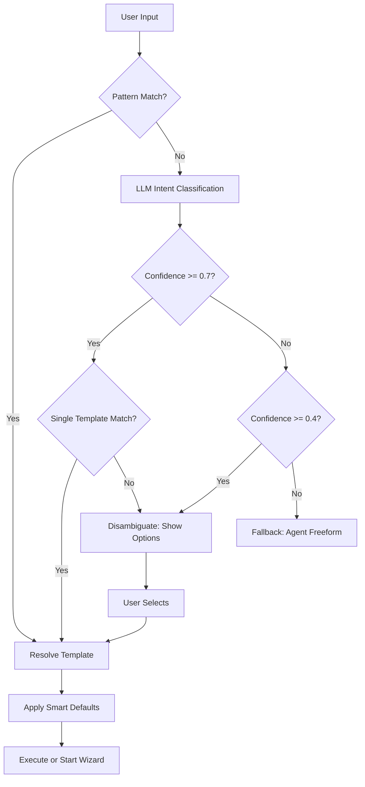
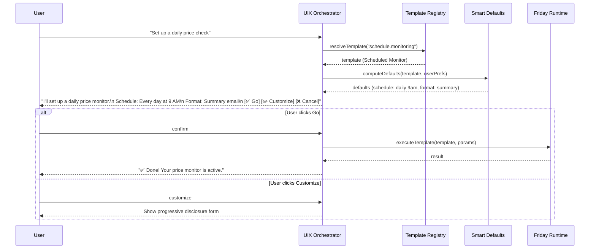
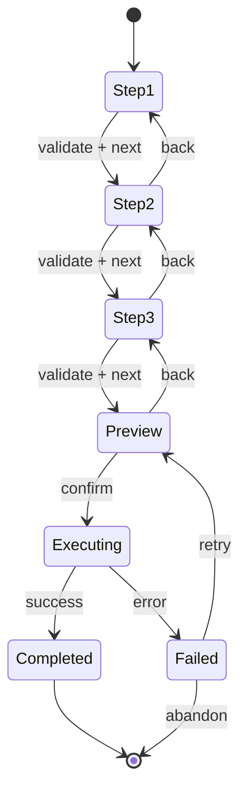

# RFC: Friday Non-Builder Product UX (UIX)

**Status:** Draft (baseline implemented)
**Author:** Friday Platform Team
**Created:** 2026-02-23
**Tickets:** FRI-PLAT-101, FRI-PLAT-102, FRI-PLAT-103

---

## 1. Summary

The Non-Builder Product UX (UIX) makes Friday accessible to non-technical users who will never open a workflow builder. It provides three interaction patterns: **conversational interfaces** (natural language → agent actions), **one-click operations** (pre-built action templates), and **guided workflow wizards** (step-by-step for complex tasks). Smart defaults and progressive disclosure ensure users see only what they need, when they need it.

### Implementation status (2026-03-07)

A baseline UIX product surface is now implemented:

- `/assistant` is the beginner-first web entry point
- `/v1/uix/*` serves intent resolution, templates, guided wizards, and issue inbox data
- `/v1/diagnosis/*` and `/v1/auto-fix/*` provide the beginner-visible self-healing surface
- direct skill generation now includes explicit self-test and evidence before save

This RFC remains draft because the broader template catalog, deeper wizard coverage, mobile parity, and product polish described below are not fully complete yet.

## 2. Motivation

Friday's VISION.md states: *"Users only see text steps and buttons — never code."* Today, Friday has a powerful workflow engine, skill generator, and agent runtime — but all require technical understanding to use effectively. Non-technical users face three barriers:

1. **Vocabulary gap** — Users think in outcomes ("monitor competitor prices") not in workflow primitives ("create a cron trigger → scrape node → email action").
2. **Configuration overload** — Even simple automations expose dozens of options (retry policies, timeout, output schemas, provider selection).
3. **No guided path** — There is no step-by-step experience that walks a user from intent to deployed automation.

The UIX layer bridges these gaps by:

1. Translating natural language intents to pre-built action templates or agent-driven workflows.
2. Offering one-click operations for the 80% of common tasks (with progressive disclosure for the 20%).
3. Providing guided wizards that decompose complex tasks into simple, sequential steps.
4. Remembering user preferences to improve smart defaults over time.

## 3. Goals and Non-Goals

### Goals

- Natural language intent → action template resolution with p95 < 500 ms for cached/rule-based paths; LLM best-effort with configurable timeout (default 5 s).
- One-click action templates covering the top 20 automation use cases.
- Guided wizards for complex flows (3–7 steps per wizard, no more).
- Smart defaults that reduce required user input by > 60% (measured against full-form configuration).
- User preference persistence across sessions.
- Integration with existing agent runtime, skill system, workflow engine, and channel plugins.
- Zero exposure of workflow builder concepts (DAG, node types, expressions) to UIX users.
- Progressive disclosure: simple view by default, advanced options on demand.

### Non-Goals (Out of Scope)

- Workflow builder UI (that is a separate workstream for power users).
- Custom action template authoring by end users (admin-only for v1).
- Multi-language NL processing (English only for v1).
- Voice-based interaction (future phase).
- Real-time collaborative editing of guided workflows (single-user for v1).
- AI-generated guided workflows (wizards are hand-authored for v1; agent handles freeform).

## 4. Architecture Overview

```
┌─────────────────────────────────────────────────────────────────┐
│                        Channel Layer                             │
│  (Discord, Telegram, Web UI, WhatsApp, API)                     │
│                                                                  │
│  User: "Monitor competitor prices daily"                         │
│         ──────────────────────────────────────────────┐          │
│                                                       │          │
│  ┌───────────────────────────────────────────────────▼────────┐ │
│  │                  UIX Orchestrator                           │ │
│  │                                                            │ │
│  │  ┌──────────────────┐  ┌──────────────┐  ┌─────────────┐  │ │
│  │  │ NL Intent Mapper │  │ Template     │  │ Guided      │  │ │
│  │  │ (classify intent,│  │ Registry     │  │ Workflow     │  │ │
│  │  │  extract params) │  │ (action      │  │ Engine       │  │ │
│  │  │                  │  │  templates)  │  │ (wizards)    │  │ │
│  │  └───────┬──────────┘  └──────┬───────┘  └──────┬──────┘  │ │
│  │          │                    │                  │          │ │
│  │  ┌───────▼────────────────────▼──────────────────▼──────┐  │ │
│  │  │              Smart Defaults Engine                    │  │ │
│  │  │  (user prefs + context + progressive disclosure)     │  │ │
│  │  └───────────────────────┬──────────────────────────────┘  │ │
│  │                          │                                  │ │
│  └──────────────────────────┼──────────────────────────────────┘ │
│                             │                                     │
│  ┌──────────────────────────▼──────────────────────────────────┐ │
│  │              Existing Friday Runtime                         │ │
│  │                                                              │ │
│  │  ┌─────────┐  ┌──────────┐  ┌────────┐  ┌──────────────┐   │ │
│  │  │ Agent   │  │ Workflow  │  │ Skill  │  │ Rules Engine │   │ │
│  │  │ Runtime │  │ Engine    │  │ System │  │              │   │ │
│  │  └─────────┘  └──────────┘  └────────┘  └──────────────┘   │ │
│  │                                                              │ │
│  └──────────────────────────────────────────────────────────────┘ │
└─────────────────────────────────────────────────────────────────┘
```

### Components

| Component | Responsibility |
|---|---|
| **NL Intent Mapper** | Classifies user natural language input into intents, extracts parameters, and resolves to action templates or guided workflows. Uses LLM for classification with a structured output schema. |
| **Template Registry** | Stores and indexes pre-built action templates. Each template wraps a complete automation (skill invocation, workflow creation, or agent task) behind a single-click interface. |
| **Guided Workflow Engine** | Manages multi-step wizard flows. Tracks user progress through steps, validates input at each step, and assembles the final configuration for execution. |
| **Smart Defaults Engine** | Computes default values for template and wizard fields using user preferences, recent context, and system-level defaults. Implements progressive disclosure rules. |
| **UIX Orchestrator** | Top-level coordinator that routes user input to the appropriate subsystem (NL mapper, template execution, or guided workflow) and manages the response lifecycle. |

## 5. Conversational Interface Design

### Intent Classification Pipeline

Natural language input goes through a three-stage pipeline:

1. **Pre-classification** — Pattern matching against known template trigger phrases (fast path, no LLM call).
2. **LLM Classification** — If no pattern matches, send the input to the agent runtime with a structured output schema requesting `{ intent, confidence, parameters, target }` where `target` is a discriminated union (`FridayIntentClassificationTarget`): `{ type: "template", templateId }`, `{ type: "workflow", workflowId }`, or `{ type: "ambiguous", templateIds, workflowIds }`.
3. **Disambiguation** — If confidence < 0.7 or multiple templates match, present the user with a choice of 2–3 options.



### Conversation Context

The UIX maintains a per-session conversation context (`FridayConversationContext`) that tracks:

- Recent intents and their resolutions (last 10).
- Extracted parameters from the current turn.
- Active guided workflow state (if any).
- User preference overrides for this session.

Context is scoped to the channel session and does not persist across sessions (user preferences persist separately).

### NL → Action Mapping Rules

| User says (examples) | Mapped intent | Resolved action |
|---|---|---|
| "Monitor X every day" | `schedule.monitoring` | Template: Scheduled Monitor |
| "Send me a summary of X" | `reporting.summary` | Template: Summary Report |
| "When X happens, do Y" | `trigger.conditional` | Guided Wizard: Trigger Builder |
| "Set up Notion integration" | `integration.setup` | Guided Wizard: Integration Setup |
| "Run my price checker" | `execution.run` | Direct skill/workflow execution |
| "Turn off the daily report" | `management.toggle` | Template: Toggle Automation |

## 6. One-Click Operation Patterns

### Action Template Structure

An action template (`FridayActionTemplate`) encapsulates:

- **Identity:** ID, name, description, icon, category.
- **Parameters:** A schema of required and optional parameters with smart defaults.
- **Execution Target:** What happens when the template is executed. A discriminated union with variants: `FridaySkillTarget` (invoke a skill), `FridayWorkflowTarget` (create/run a workflow), `FridayAgentTarget` (start an agent task), `FridayChannelTarget` (send a channel message).
- **Preview:** A human-readable preview of what will happen before execution.

### Template Categories

Templates are organized into categories (`FridayActionCategory`):

| Category | Examples |
|---|---|
| `monitoring` | Price monitor, uptime checker, social mention tracker |
| `reporting` | Daily digest, weekly summary, metric dashboard |
| `integration` | Connect Notion, sync Google Sheets, import RSS |
| `communication` | Send notification, schedule message, email digest |
| `data` | Transform CSV, merge datasets, export to spreadsheet |
| `management` | Toggle automation, pause workflow, update schedule |

### Execution Flow



### Progressive Disclosure

Each template parameter has a `minDisclosureLevel` (`FridayDisclosureLevel`: `basic | standard | advanced | expert`). The system compares the parameter's minimum level against the user's active disclosure level using `FRIDAY_DISCLOSURE_LEVEL_RANK`:

```
if FRIDAY_DISCLOSURE_LEVEL_RANK[param.minDisclosureLevel] <= FRIDAY_DISCLOSURE_LEVEL_RANK[userLevel]:
    show(param)
else:
    hide(param, useDefault: param.defaultValue)
```

| Level | Rank | Behavior |
|---|---|---|
| `basic` | 0 | Always shown. Core parameters that every user should see. |
| `standard` | 1 | Shown in the standard view. Has a smart default but user should review. |
| `advanced` | 2 | Hidden behind "Show advanced options." Has a smart default that works for most users. |
| `expert` | 3 | Hidden behind "Show expert options." Only shown if user has opted into expert mode in preferences. |

## 7. Guided Workflow Wizards

### Wizard Structure

A guided workflow (`FridayGuidedWorkflow`) is a linear sequence of steps. Each step (`FridayGuidedStep`) collects a small amount of information and provides immediate feedback.

### Design Constraints

- **3–7 steps maximum** per wizard. If more steps are needed, decompose into sub-wizards.
- **One concept per step.** Each step asks about exactly one thing (e.g., "What do you want to monitor?" not "What and how often?").
- **Immediate validation.** Each step validates input before allowing the user to proceed.
- **Backward navigation.** Users can go back to any previous step without losing data.
- **Contextual help.** Each step has a help text and optional examples.
- **Preview before commit.** The final step always shows a summary of all choices before execution.

### Step Types

| Step Type | Description | Example |
|---|---|---|
| `input` | Free-text or structured input | "What URL should we monitor?" |
| `select` | Choose from a list of options | "How often? [Hourly] [Daily] [Weekly]" |
| `multi-select` | Choose multiple options | "Which metrics? [Price] [Stock] [Reviews]" |
| `confirm` | Yes/no confirmation | "Enable email notifications?" |
| `preview` | Read-only summary before execution | "Here's your automation..." |
| `info` | Informational step (no input) | "We'll need API access. Here's how..." |

### Wizard Execution Flow



### Guided Context

The wizard maintains a `FridayGuidedContext` that accumulates validated data from each step:

```typescript
// Conceptual shape (actual types in FRI-PLAT-102)
{
  workflowId: "wiz-integration-setup",
  currentStepIndex: 2,
  completedSteps: [
    { stepId: "select-service", data: { service: "notion" } },
    { stepId: "provide-credentials", data: { apiKey: "***" } },
  ],
  pendingSteps: ["configure-sync", "preview"],
  sessionData: { /* merged from all completed steps */ },
}
```

## 8. Smart Defaults and Progressive Disclosure

### Smart Default Sources

Smart defaults are computed from multiple sources with a priority cascade:

| Priority | Source | Example |
|---|---|---|
| 1 (highest) | Explicit user input (current session) | User typed "9 AM" |
| 2 | User preferences (persisted) | User prefers email over Slack |
| 3 | Recent context (last 5 actions) | User's last monitor used daily schedule |
| 4 | Template-level defaults | Template default is "daily at 9 AM" |
| 5 (lowest) | System-level defaults | System default is "daily at midnight UTC" |

### User Preferences

Preferences (`FridayUserPreference`) are key-value pairs scoped to a user principal. They persist across sessions and are updated implicitly (learning from user choices) and explicitly (user settings page).

Categories of preferences:

| Category | Examples |
|---|---|
| `notification` | Preferred channel (email, Slack, Discord), quiet hours |
| `scheduling` | Default timezone, preferred schedule time, work hours |
| `formatting` | Summary format (brief, detailed), language, date format |
| `disclosure` | Disclosure level (standard, advanced, expert) |
| `provider` | Preferred AI provider, model selection |

### Progressive Disclosure Implementation

The Smart Defaults Engine evaluates each template parameter's `minDisclosureLevel` against the user's disclosure preference using `FRIDAY_DISCLOSURE_LEVEL_RANK` for numeric comparison:

```
if FRIDAY_DISCLOSURE_LEVEL_RANK[param.minDisclosureLevel] <= FRIDAY_DISCLOSURE_LEVEL_RANK[userPref.disclosureLevel]:
    show(param)
else:
    hide(param, useDefault: param.defaultValue)
```

This means an "expert" user (rank 3) sees all parameters, while a "basic" user (rank 0) sees only `basic`-level fields — with smart defaults filling the rest.

## 9. Integration with Existing Systems

### Agent Runtime Integration

The UIX orchestrator delegates complex or freeform requests to the existing agent runtime:

- **Freeform requests** (NL confidence < 0.4) are forwarded to the agent with enriched context from user preferences and recent actions.
- **Template execution** that involves workflow generation uses the existing `WorkflowGenerator` via the agent runtime.
- The agent runtime receives a `metadata.uixContext` field with the UIX conversation context for improved intent understanding.

### Skill System Integration

Action templates reference skills by ID:

- Template execution resolves the skill from the skill registry.
- If a template references a skill that doesn't exist, the UIX prompts the user to install it or offers to generate it via the skill generator.
- Skill permissions are evaluated through the existing Rules Engine pipeline.

### Channel Plugin Integration

The UIX renders differently per channel:

| Channel | Rendering |
|---|---|
| Web UI | Full interactive forms, buttons, dropdowns |
| Discord | Embeds with button components, select menus |
| Telegram | Inline keyboards, callback queries |
| WhatsApp | Text-based with numbered options |
| API | JSON request/response (headless) |

The UIX produces a channel-agnostic response model that channel plugins render into platform-native components.

### Workflow Engine Integration

- Guided wizards produce workflow configurations that are submitted to the workflow engine.
- The UIX never exposes workflow graph concepts (nodes, edges, expressions) to users.
- The translation from wizard output to workflow graph is handled by a `WizardToWorkflowMapper` that lives in the UIX layer.

### Rules Engine Integration

- All UIX-initiated actions pass through the Rules Engine before execution.
- Template execution builds a `FridayEvaluationContext` with `source: "api"` and `metadata.uixTemplateId`.
- Denied actions surface user-friendly messages (not raw rule denial messages).

## 10. Non-Functional Requirements

| Requirement | Target | Measurement |
|---|---|---|
| Intent classification latency (cached/rule-based) | p95 < 500 ms | Time from NL input to resolved template |
| Intent classification latency (LLM) | Best-effort with configurable timeout (default 5 s) | Time from NL input to resolved template |
| Intent classification latency (pattern match) | p95 < 10 ms | Time from NL input to resolved template |
| Template execution latency | p95 < 2 s | Time from confirm to completion (excluding external API calls) |
| Wizard step validation latency | p95 < 50 ms | Time from input to validation result |
| Smart default computation | p95 < 20 ms | Time to compute defaults for a template |
| User preference read | p95 < 5 ms | Time to load user preferences from store |
| Template registry lookup | p95 < 10 ms | Time to find a template by ID or intent |
| Disambiguation accuracy | > 85% | Correct template in top-3 suggestions |
| Default acceptance rate | > 60% | Users accepting smart defaults without modification |

## 11. Edge Cases

| Case | Handling |
|---|---|
| NL input is gibberish | LLM returns low confidence; fallback to "I didn't understand. Try one of these..." with popular templates |
| Template references deleted skill | Surface user-friendly error: "This automation needs [skill] which is no longer available." Offer alternatives. |
| Wizard step validation fails | Show inline error, keep user on current step, preserve all input |
| User abandons wizard mid-flow | Persist partial state for 24 hours; offer to resume on next interaction |
| Concurrent wizard sessions | Allow only one active wizard per user per channel; prompt to resume or discard existing |
| User preference conflict | Explicit input (priority 1) always wins; warn if overriding a strong preference |
| Template parameter type mismatch | Coerce if possible (string "9" → number 9); reject with clear error if not |
| Rate-limited external API during template execution | Surface retry option with estimated wait time; do not auto-retry without user consent |
| Channel does not support buttons | Degrade to numbered text options: "Reply 1 for Daily, 2 for Weekly" |
| User has no preferences yet | Fall through to template defaults, then system defaults; prompt to save choices after first use |

## 12. Security Considerations

- **Parameter injection:** All user-provided parameters are sanitized before being passed to skill/workflow execution. Template parameter schemas define allowed types and patterns.
- **Preference tampering:** User preferences are scoped by principal ID and protected by the existing auth system.
- **Privilege escalation via templates:** Templates execute with the user's existing permissions. A template cannot grant additional access.
- **Audit trail:** All template executions and wizard completions are logged with the user's principal ID, template/wizard ID, and parameters.

## 13. Out of Scope

- **Custom template authoring by end users:** Only admins can create action templates in v1.
- **Voice interaction:** NL processing is text-only for v1.
- **Multi-language support:** English only for v1.
- **Collaborative wizards:** Single-user, single-session for v1.
- **Template marketplace:** Sharing templates across Friday instances is future work.
- **Undo/rollback for executed templates:** Once confirmed and executed, rollback requires manual intervention.
- **Offline support:** UIX requires an active connection to the Friday hub.

## 14. Architectural Decision Records

### ADR-001: Three Interaction Patterns vs. Single Conversational Interface

**Decision:** Provide three distinct interaction patterns (conversational, one-click, guided) rather than a single conversational interface.

**Context:** A pure conversational interface (chatbot-style) could handle all interactions. However, non-technical users often prefer visual, structured interactions for known tasks. Conversational interfaces are best for novel or ambiguous requests.

**Rationale:**
- One-click templates eliminate the need for conversation for common tasks (faster, fewer errors).
- Guided wizards provide structure and validation for complex multi-step tasks.
- Conversational interface handles freeform and novel requests where templates/wizards don't exist.
- Users can choose their preferred interaction style per task.

**Consequences:** Three subsystems to build and maintain. The UIX orchestrator must route to the correct subsystem. Some overlap between template execution and wizard completion.

### ADR-002: Channel-Agnostic Response Model

**Decision:** The UIX produces a channel-agnostic response model; channel plugins handle platform-specific rendering.

**Context:** Each messaging platform has different UI capabilities (buttons, embeds, inline keyboards, plain text). Building platform-specific UIX logic would create tight coupling and duplication.

**Rationale:**
- Single source of truth for response content (text, options, buttons).
- Channel plugins already exist and know their platform's capabilities.
- Graceful degradation: channels that lack buttons fall back to text-based alternatives.
- New channels can be added without modifying UIX logic.

**Consequences:** The response model must be expressive enough to represent all interaction patterns (buttons, selects, forms, previews). Channel plugins need UIX-aware rendering extensions.

### ADR-003: Smart Defaults via Priority Cascade (Not ML)

**Decision:** Smart defaults use a deterministic priority cascade (explicit input > user prefs > recent context > template defaults > system defaults) rather than ML-based prediction.

**Context:** ML-based defaults could potentially be more accurate but introduce non-determinism, latency, and complexity. For v1, a simple cascade is sufficient and predictable.

**Rationale:**
- Deterministic: users can predict and understand why a default was chosen.
- Fast: no ML inference required (< 20 ms).
- Debuggable: the cascade is inspectable and overridable.
- Sufficient: template-level defaults + user preferences cover > 80% of cases.

**Consequences:** The system may miss patterns that ML could catch (e.g., "this user always picks X on Mondays"). Future phases can add ML as a source in the cascade.

### ADR-004: Wizard State is Session-Scoped with TTL Persistence

**Decision:** Active wizard state lives in the session context but is also persisted to SQLite with a 24-hour TTL for resume capability.

**Context:** Users may start a wizard, get interrupted, and come back later. Pure session state would be lost. Pure persistence adds complexity for the common case (completing a wizard in one sitting).

**Rationale:**
- Session context is the primary state holder (fast reads/writes during active wizard).
- SQLite persistence enables "resume where you left off" for interrupted wizards.
- 24-hour TTL prevents stale wizard state from accumulating.
- Only one active wizard per user per channel avoids state conflicts.

**Consequences:** Need to sync session state to persistence on each step completion. Resumption requires loading persisted state back into session context.

### ADR-005: NL Intent Classification Uses Existing Agent Runtime

**Decision:** Reuse the existing agent runtime (LLM provider chain) for intent classification rather than building a dedicated NLU service.

**Context:** A dedicated NLU service (e.g., Rasa, Dialogflow) would provide structured intent classification but adds an external dependency. The existing agent runtime already supports structured output schemas and has provider BYOK.

**Rationale:**
- No new infrastructure: uses the user's existing LLM provider configuration.
- Structured output support: the agent runtime already handles JSON schema outputs.
- Provider flexibility: intent classification benefits from the same BYOK model selection.
- Simpler deployment: no additional service to manage.

**Consequences:** Intent classification quality depends on the user's chosen LLM provider. Pattern-matching fast path reduces LLM dependency for common cases. Classification prompt must be carefully designed and tested.

## 15. Migration and Rollout

### Phase 1 (FRI-PLAT-101/102/103 — Current)
- Architecture RFC, domain model, API contract.
- No runtime code; types and interfaces only.

### Phase 2 (Future)
- Smart Defaults Engine implementation.
- Template Registry with 10 seed templates.
- Guided Workflow Engine with 3 seed wizards.
- SQLite persistence for preferences and wizard state.

### Phase 3 (Future)
- NL Intent Mapper with pattern matching + LLM classification.
- UIX Orchestrator integration with agent runtime.
- Channel-specific rendering for Discord and Web UI.

### Phase 4 (Future)
- Additional templates and wizards based on usage data.
- User preference learning (implicit preference updates).
- Advanced analytics on template usage and default acceptance rates.
