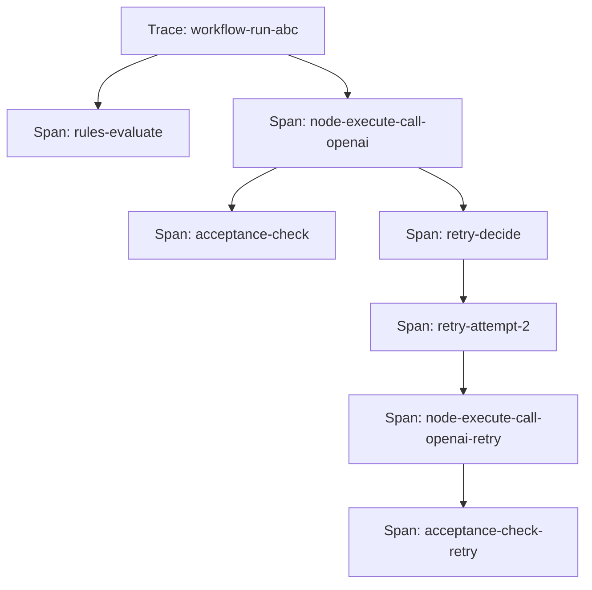

# RFC: Friday Observability, Audit, and Ops

**Status:** Implemented Baseline  
**Author:** Friday Platform Team  
**Created:** 2026-02-23  
**Tickets:** FRI-PLAT-111, FRI-PLAT-112, FRI-PLAT-113

---

## 1. Summary

The Observability workstream introduces full-chain distributed tracing, tamper-evident audit logging, SLO monitoring with error budgets, and an alerting pipeline across all Friday platform modules (Rules Engine, NodeRunner, Acceptance, Retry, UIX). It provides operators with the ability to trace any request end-to-end, audit who did what and when, define service-level objectives with burn-rate alerts, and route alert notifications through configurable channels with escalation.

Current steady-state implementation status:

- wired hub bootstrap composition for trace, audit, metrics, health checks, alert evaluation, and dashboard aggregation
- active `/v1/observability/*` route surface, including `/v1/observability/overview` and `/v1/observability/time-series`
- operator-facing `/observability` web surface
- product correlation for self-healing, skill generation, and `/assistant`
- SLO definitions remain optional and may be unconfigured in a given runtime

## 2. Motivation

Today, Friday's operational visibility is limited:

1. **No distributed tracing.** Requests traverse Rules Engine → NodeRunner → Acceptance → Retry → UIX, but there is no unified trace model. Debugging a failed workflow run requires manual log correlation across modules.
2. **No audit log.** Security-sensitive actions (rule changes, policy updates, credential access, workflow modifications) are not recorded in a structured, queryable, tamper-evident format.
3. **No SLO monitoring.** There are no defined service-level indicators or error budgets. Operators cannot answer "are we meeting our latency/availability targets?" without ad-hoc queries.
4. **No alerting pipeline.** When SLOs are breached or critical events occur, there is no structured path from detection to notification to escalation.
5. **No dashboard data model.** Metrics are scattered; there is no canonical schema for time-series aggregation and visualization.

The Observability workstream addresses all five gaps:

- Trace every request across all modules with context propagation.
- Audit every security-sensitive mutation with tamper-evident hashing.
- Define SLOs with error budgets and multi-window burn-rate alerting.
- Route alerts through configurable channels (webhook, email, Slack, PagerDuty) with tiered escalation.
- Provide a canonical dashboard data model for metrics aggregation.

## 3. Goals and Non-Goals

### Goals

- **Trace coverage: 100%** of cross-module requests carry a trace context.
- **Audit completeness: 100%** of security-sensitive mutations produce an audit entry.
- **SLO accuracy:** Error budget calculations within 0.1% of actual.
- **Alert latency:** p95 < 30 seconds from SLO breach to alert dispatch.
- **Tamper evidence:** Every audit entry includes a chained SHA-256 hash for integrity verification, using canonical serialization (sorted keys, no whitespace, UTF-8).
- Distributed tracing model inspired by OpenTelemetry conventions (trace ID, span ID, parent span, attributes).
- Cursor-based pagination on all search/list endpoints, consistent with Friday API conventions.
- SQLite persistence for all observability data.
- Integration with all existing modules: Rules Engine, NodeRunner, Acceptance, Retry, UIX.

### Non-Goals (Out of Scope)

- OpenTelemetry SDK export (OTLP) — future phase; the data model is inspired by OTel but export is deferred.
- Real-time streaming dashboards (WebSocket push) — future phase.
- Log aggregation (stdout/stderr capture) — separate concern; observability focuses on structured events.
- APM-style code instrumentation (function-level profiling) — out of scope for v1.
- Cross-instance federation (multi-hub tracing) — deferred to multi-tenant phase.
- Non-ratio and lower-is-better SLI types (error_rate, latency_percentile, throughput, saturation) — deferred to Phase 2 (see §7.5).

## 4. Architecture Overview

```
┌──────────────────────────────────────────────────────────────────────────┐
│                           Friday Hub                                      │
│                                                                          │
│  ┌────────────┐ ┌────────────┐ ┌────────────┐ ┌──────┐ ┌─────┐         │
│  │Rules Engine│ │ NodeRunner │ │ Acceptance │ │Retry │ │ UIX │         │
│  └─────┬──────┘ └─────┬──────┘ └─────┬──────┘ └──┬───┘ └──┬──┘         │
│        │              │              │            │        │             │
│        └──────────────┴──────────────┴────────────┴────────┘             │
│                                   │                                      │
│                        ┌──────────▼──────────┐                           │
│                        │ Observability Layer  │                           │
│                        │                      │                           │
│                        │  ┌───────────────┐   │                           │
│                        │  │  Trace        │   │                           │
│                        │  │  Collector    │   │                           │
│                        │  └───────┬───────┘   │                           │
│                        │          │           │                           │
│                        │  ┌───────▼───────┐   │                           │
│                        │  │  Audit        │   │                           │
│                        │  │  Logger       │   │                           │
│                        │  └───────┬───────┘   │                           │
│                        │          │           │                           │
│                        │  ┌───────▼───────┐   │                           │
│                        │  │  SLO          │   │                           │
│                        │  │  Monitor      │   │                           │
│                        │  └───────┬───────┘   │                           │
│                        │          │           │                           │
│                        │  ┌───────▼───────┐   │                           │
│                        │  │  Alert        │   │                           │
│                        │  │  Pipeline     │   │                           │
│                        │  └───────┬───────┘   │                           │
│                        │          │           │                           │
│                        │  ┌───────▼───────┐   │                           │
│                        │  │  SQLite       │   │                           │
│                        │  │  Persistence  │   │                           │
│                        │  └───────────────┘   │                           │
│                        └──────────────────────┘                           │
│                                   │                                      │
│                        ┌──────────▼──────────┐                           │
│                        │   REST API          │                           │
│                        │   /api/observability │                           │
│                        └─────────────────────┘                           │
└──────────────────────────────────────────────────────────────────────────┘
```

### Components

| Component | Responsibility |
|---|---|
| **Trace Collector** | Creates and manages traces and spans; propagates context across module boundaries |
| **Audit Logger** | Records security-sensitive mutations with tamper-evident chained hashing (canonical serialization) |
| **SLO Monitor** | Evaluates higher-is-better ratio-style SLI metrics against SLO targets; computes error budgets and burn rates |
| **Alert Pipeline** | Evaluates alert rules against SLO breaches and events; dispatches to channels with tiered escalation |
| **SQLite Persistence** | Stores traces, audit entries, retention checkpoints, SLO state, alert rules, and alert events |
| **REST API** | Exposes search/query endpoints for traces, audit entries, SLO status, and alerts |

## 5. Distributed Tracing Design

### 5.1 Trace/Span Model

The tracing model is inspired by OpenTelemetry conventions with Friday-specific extensions:

- **Trace:** A complete end-to-end request (e.g., a workflow run, an API request). Identified by a globally unique `traceId`.
- **Span:** A unit of work within a trace (e.g., "rules-evaluate", "node-execute", "acceptance-check"). Each span has a `spanId`, optional `parentSpanId`, timing, status, and attributes.
- **Span Context:** The propagation token (`traceId` + `spanId` + `traceFlags` + optional `tracestate`) that is threaded through all module calls. Inspired by OTel conventions but not W3C traceparent compatible.

> **Note:** The span context format is inspired by OpenTelemetry conventions but is **not** W3C Trace Context (`traceparent`) compatible. It uses a Friday-specific propagation format. Future phases may add W3C-compatible export via OTLP.



### 5.2 Span Kinds

| Kind | Description | Example |
|---|---|---|
| `internal` | In-process function call | Rules Engine evaluation |
| `server` | Inbound API request | REST API handler |
| `client` | Outbound call to external service | LLM provider call |
| `producer` | Asynchronous message send | Job queue enqueue |
| `consumer` | Asynchronous message receive | Job queue dequeue |

### 5.3 Context Propagation

Span context is propagated through:

1. **In-process calls:** Passed as a `FridaySpanContext` parameter to module APIs (Rules Engine, NodeRunner, Acceptance, Retry).
2. **HTTP headers:** `x-friday-trace-id` and `x-friday-span-id` on internal API calls.
3. **Job queue metadata:** Embedded in job payloads for async processing.

Every existing module interface that accepts a "context" object (e.g., `FridayEvaluationContext`, `FridayNodeExecutionContext`) will be extended to include an optional `spanContext?: FridaySpanContext` field. This is backward-compatible — callers that do not provide it get a new root trace.

### 5.4 Trace Attributes

Traces and spans carry structured attributes for filtering and correlation. Attribute values follow OTel constraints: primitives (`string | number | boolean`) and homogeneous arrays (`string[] | number[] | boolean[]`). Nested JSON objects are **not** permitted in attributes.

| Attribute | Type | Description |
|---|---|---|
| `friday.module` | string | Source module (rules, node-runner, acceptance, retry, uix) |
| `friday.workflow.id` | string | Workflow definition ID |
| `friday.workflow.run_id` | string | Workflow run ID |
| `friday.node.id` | string | Node ID within workflow graph |
| `friday.principal.id` | string | Acting principal ID |
| `friday.rule.id` | string | Rule ID (for Rules Engine spans) |
| `friday.retry.attempt` | number | Retry attempt number |
| `friday.acceptance.test_id` | string | Acceptance test ID |

### 5.5 Attribute Value Constraints

```typescript
type FridayAttributeValue = string | number | boolean | string[] | number[] | boolean[];
```

This matches the [OpenTelemetry attribute value specification](https://opentelemetry.io/docs/specs/otel/common/#attribute). Nested objects and mixed-type arrays are not permitted. Span events also use the same attribute type.

## 6. Audit Logging

### 6.1 Design Principles

- **Who, what, when, where, outcome:** Every audit entry records the actor, the action, the resource, the timestamp, and the outcome.
- **Tamper-evident:** Each entry includes a SHA-256 hash of (`previousHash` + canonicalized entry content), creating a hash chain. Any modification breaks the chain.
- **Canonical serialization:** Entry content is serialized with sorted JSON keys, no whitespace, UTF-8 encoding before hashing (see §6.6).
- **Append-only:** Audit entries are never updated or deleted (except via retention policy, which records checkpoints).
- **Structured:** All entries follow a canonical schema for querying and export.

### 6.2 Auditable Actions

| Module | Auditable Actions |
|---|---|
| **Rules Engine** | Rule created/updated/deleted, policy bundle imported, evaluation denied |
| **NodeRunner** | Node execution started/completed/failed, credential accessed |
| **Acceptance** | Test created/updated/deleted, verdict rendered |
| **Retry** | Policy created/updated/deleted, escalation acknowledged |
| **UIX** | Template created/updated/deleted, preference changed |
| **Workflows** | Workflow created/updated/deleted, run started/completed/failed |
| **Auth** | Login, token issued, permission changed, role changed |

### 6.3 Tamper-Evident Hash Chain

```
Entry₁: hash₁ = SHA-256(GENESIS_HASH + canonicalize(entry₁))
Entry₂: hash₂ = SHA-256(hash₁ + canonicalize(entry₂))
Entry₃: hash₃ = SHA-256(hash₂ + canonicalize(entry₃))
...
```

The genesis hash is `SHA-256("FRIDAY_AUDIT_GENESIS")` = `ccfe2250e941cefae29cad430af1a3a6e60d632b2ea9e69767cf1c8d9a124e36`.

Verification traverses the chain and recomputes each hash using canonical serialization. If any entry is modified or deleted, the chain breaks at that point.

### 6.4 Audit Actor Model

An audit actor is identified by:

- **Actor type:** `user`, `system`, `api_key`, `workflow`, `agent`
- **Actor ID:** The principal ID, workflow ID, or system component name
- **Actor display name:** Human-readable name for UI display
- **IP address and user agent:** For API-originated actions

### 6.5 Audit Resource Model

The resource being acted upon:

- **Resource type:** `rule`, `policy`, `workflow`, `node`, `template`, `preference`, `credential`, `alert_rule`, `slo`
- **Resource ID:** The entity ID
- **Resource display name:** Human-readable name
- **Snapshot:** Optional serialized snapshot of the resource before and/or after the change (for diff)

### 6.6 Canonical Serialization Specification

To ensure deterministic hash computation across implementations, audit entry content is canonicalized before hashing:

1. **Sorted keys:** All JSON object keys are sorted lexicographically (recursive — nested objects are also sorted).
2. **No whitespace:** No spaces or newlines between tokens (equivalent to `JSON.stringify` with no space argument, but with sorted keys).
3. **UTF-8 encoding:** The resulting string is encoded as UTF-8 bytes before hashing.
4. **Null preservation:** `null` values are preserved in the output (not stripped).
5. **Array order preservation:** Array elements maintain their original order (not sorted).
6. **Excluded field:** The `integrityHash` field itself is excluded from the canonical form (it would be circular).

Example:

```json
// Input (unsorted):
{ "name": "test", "actor": { "type": "user", "id": "u1" }, "tags": ["b", "a"] }

// Canonical form:
{"actor":{"id":"u1","type":"user"},"name":"test","tags":["b","a"]}
```

The `FridayCanonicalizeAuditEntry` function type signature is provided in the model types for implementors.

### 6.7 Retention Checkpoints

When audit entries are deleted by a retention policy, a `FridayRetentionCheckpoint` is recorded at the deletion boundary. This checkpoint contains:

- The sequence number and integrity hash of the last deleted entry (the **boundary hash**)
- The sequence number of the first retained entry

This allows verification of entries after the boundary even though earlier entries are no longer available. The boundary hash serves as the new chain anchor — verification starts from the checkpoint's boundary hash instead of the genesis hash.

## 7. SLO Monitoring

### 7.1 Service Level Indicators (SLIs)

SLIs are the raw metrics that feed SLO calculations. **Phase 1 supports higher-is-better ratio-style SLIs only** (`success_rate`, `availability`), where the measurement is a percentage (0–100) and the error budget formula `errorBudget = 100% - target`, `remaining = errorBudget - (100% - actual)` is mathematically valid.

`error_rate` is intentionally excluded from Phase 1: it is a lower-is-better metric where the budget formula would need to be inverted (`remaining = errorBudget - actual`). Mixing polarities in one formula is error-prone. `error_rate` moves to Phase 2 alongside a polarity-aware SLO model.

| SLI | Module | Measurement | Phase |
|---|---|---|---|
| `rules.evaluation_success_rate` | Rules Engine | (successful evaluations / total evaluations) × 100 | 1 |
| `node_runner.execution_success_rate` | NodeRunner | (successful executions / total executions) × 100 | 1 |
| `acceptance.check_success_rate` | Acceptance | (passed checks / total checks) × 100 | 1 |
| `retry.auto_recovery_rate` | Retry | (resolved retries / attempted retries) × 100 | 1 |
| `uix.template_execution_success_rate` | UIX | (successful template executions / total) × 100 | 1 |
| `api.error_rate` | API | (5xx responses / total responses) × 100 | **2** |
| `rules.evaluation_latency_p99` | Rules Engine | p99 evaluation latency over a rolling window | **2** |
| `node_runner.execution_latency_p99` | NodeRunner | p99 execution latency | **2** |
| `api.request_latency_p99` | API | p99 API request latency | **2** |
| `retry.cost_overhead` | Retry | Mean cost overhead percentage | **2** |

### 7.2 SLO Definition

An SLO binds a ratio-style SLI to a percentage target over a compliance window:

```yaml
id: slo-node-runner-availability
name: NodeRunner Availability
sliMetric: node_runner.execution_success_rate
target: 99.5
unit: percent
complianceWindowDays: 30
```

### 7.3 Error Budget

The error budget is the allowable margin of failure. This formula applies to **higher-is-better ratio-style SLIs only** (`success_rate`, `availability`):

```
errorBudget = 100% - target
remaining = errorBudget - (100% - actual)
consumedPercent = ((errorBudget - remaining) / errorBudget) × 100
```

For the example above (target 99.5%):
- Error budget: 0.5%
- If actual is 99.3%, remaining = 0.5% - 0.7% = -0.2% (budget exhausted)
- Consumed: 140% → triggers burn-rate alert

### 7.4 Burn Rate

Burn rate measures how fast the error budget is being consumed:

```
burnRate = (errorRateInWindow / errorBudgetRate)
```

Where `errorBudgetRate = errorBudget / complianceWindowDays`.

Multi-window burn-rate alerting uses two windows (short and long) to distinguish between sustained degradation and transient spikes:

| Alert Level | Short Window | Long Window | Burn Rate Threshold |
|---|---|---|---|
| Page (critical) | 5 min | 1 hour | 14.4× |
| Ticket (warning) | 30 min | 6 hours | 6× |
| Log (info) | 6 hours | 3 days | 1× |

An alert fires only when **both** windows exceed their burn-rate threshold, reducing false positives from transient spikes.

### 7.5 Phase 2: Non-Ratio SLI Types

The following SLI types are deferred to Phase 2 because they require different error budget formulas or inverted polarity handling:

| SLI Type | Description | Why Deferred |
|---|---|---|
| `error_rate` | Error ratio (lower-is-better) | Requires inverted budget math (`remaining = errorBudget - actual`); Phase 2 adds a `polarity` field |
| `latency_percentile` | p99/p95 latency thresholds | Requires threshold-based SLO (e.g., "p99 < 200ms") — error budget is not `100% - target` |
| `throughput` | Request/operation count thresholds | Requires count-based SLO — different budget math |
| `saturation` | Resource utilization thresholds | Requires capacity-based SLO — different budget math |

Phase 2 will introduce a polymorphic SLO model where the error budget formula varies by SLI type and polarity. The `FridaySliMetricTypePhase2` type alias reserves these type names.

## 8. Alerting Pipeline

### 8.1 Alert Rules

Alert rules define when and how to fire alerts:

- **Condition type (discriminated union):** `threshold`, `absence`, `anomaly`, `slo_burn_rate` — each variant carries only the fields relevant to that type
- **Evaluation interval:** How often the rule is checked (e.g., every 60 seconds)
- **Firing conditions:** Metric thresholds, burn-rate multipliers, absence duration, or anomaly sensitivity
- **Notification channels:** Where to send initial alerts (webhook, email, Slack, PagerDuty)
- **Escalation tiers:** Up to 3 time-based escalation tiers, each with its own timeout and channels

#### Alert Condition Types

| Type | Fields | Description |
|---|---|---|
| `threshold` | `metricName`, `threshold`, `operator` | Fires when a metric crosses a threshold |
| `absence` | `metricName`, `absenceMinutes` | Fires when a metric stops reporting |
| `anomaly` | `metricName`, `sensitivity` | Fires on anomalous metric behavior |
| `slo_burn_rate` | `sloId`, `burnRateThreshold`, `shortWindowMinutes`, `longWindowMinutes` | Fires when SLO burn rate exceeds threshold across both windows |

### 8.2 Alert Lifecycle

```mermaid
statechart
    [*] --> Pending : rule evaluation triggers
    Pending --> Firing : sustained across evaluation window
    Firing --> Acknowledged : operator acknowledges
    Firing --> Resolved : condition clears
    Acknowledged --> Resolved : condition clears
    Firing --> Escalated : tier 1 timeout
    Escalated --> Escalated : tier 2/3 timeout
    Escalated --> Acknowledged : operator acknowledges
    Resolved --> [*]
```

States:
1. **Pending:** Condition met but not yet sustained across the evaluation window.
2. **Firing:** Condition sustained; alert dispatched to initial channels.
3. **Acknowledged:** Operator has acknowledged; no further escalation.
4. **Escalated:** Escalation tier timeout reached; dispatched to tier's channels. Tracks `currentEscalationTier` (1–3).
5. **Resolved:** Condition cleared; alert closed.

### 8.3 Alert Channels

Alert channels are themselves a discriminated union (`FridayAlertChannel`) keyed by `type`. Each variant bundles the channel type with its type-specific fields inline, making invalid type/config combinations (e.g., `type: "email"` with Slack-specific fields) **unrepresentable at the type level**.

| Channel Type (`type`) | Inline Fields | Description |
|---|---|---|
| `webhook` | `url`, `headers?` | HTTP POST to a configured URL with JSON payload |
| `email` | `recipients` | Email notification to configured recipients |
| `slack` | `webhookUrl`, `channel?` | Slack message via incoming webhook |
| `pagerduty` | `routingKey`, `severityMapping?` | PagerDuty incident via Events API |

All variants share common fields: `id`, `name`, `enabled`, `createdAt`, `updatedAt`.

### 8.4 Escalation Tiers

Escalation uses up to 3 tiers (`FridayEscalationTier`), each specifying:

- **`tier`:** `1 | 2 | 3` — the escalation level
- **`timeoutMinutes`:** Minutes to wait after the previous tier (or after initial alert for tier 1) before activating
- **`channelIds`:** Channel IDs to notify when this tier activates

Example escalation configuration:

```yaml
escalationTiers:
  - tier: 1
    timeoutMinutes: 15
    channelIds: [slack-oncall]
  - tier: 2
    timeoutMinutes: 30
    channelIds: [pagerduty-primary]
  - tier: 3
    timeoutMinutes: 60
    channelIds: [pagerduty-management, email-vp-eng]
```

If the alert is not acknowledged within 15 minutes, tier 1 channels are notified. If still not acknowledged after another 30 minutes, tier 2 fires. Tier 3 is the final escalation.

## 9. Dashboard Data Model

### 9.1 Metrics Aggregation

Metrics are aggregated into time-series buckets for dashboard queries:

- **Bucket sizes:** 1 minute, 5 minutes, 1 hour, 1 day
- **Aggregation functions:** count, sum, avg, min, max, p50, p95, p99
- **Dimensions:** module, workflow ID, node ID, principal ID, status

### 9.2 Time-Series Query Model

Dashboard queries specify:

- **Metric name:** The SLI or custom metric to query
- **Time range:** Start and end timestamps
- **Bucket size:** Aggregation granularity
- **Filters:** Dimension filters (module, workflow, etc.)
- **Group by:** Dimension to group results by

The API returns an array of `(timestamp, value)` pairs for charting.

## 10. Integration with Existing Modules

### 10.1 Rules Engine

- Every `evaluateRule()` call creates a span under the active trace.
- Denied evaluations produce an audit entry.
- Evaluation success rate feeds the `rules.*` SLIs (Phase 1). Evaluation latency feeds Phase 2 SLIs.

### 10.2 NodeRunner

- Every `executeNode()` call creates a span.
- Credential access produces an audit entry.
- Execution success rate feeds the `node_runner.*` SLIs (Phase 1). Execution latency feeds Phase 2 SLIs.

### 10.3 Acceptance

- Every acceptance check creates a span.
- Test creation/modification produces an audit entry.
- Check success rate feeds the `acceptance.*` SLI.

### 10.4 Retry

- Every retry decision and attempt creates spans under the parent node's span.
- Policy changes and escalation acknowledgements produce audit entries.
- Recovery rate feeds the `retry.*` SLIs (Phase 1). Cost overhead feeds Phase 2 SLIs.

### 10.5 UIX

- Template execution creates a span.
- Template/preference changes produce audit entries.
- Template execution success rate feeds the `uix.*` SLI.

### 10.6 Trace Context Threading

All module context types (`FridayEvaluationContext`, `FridayNodeExecutionContext`, `FridayRetryDecisionContext`, etc.) will accept an optional `spanContext?: FridaySpanContext`. The observability layer auto-creates child spans when `spanContext` is present.

## 11. Non-Functional Requirements

| NFR | Target | Measurement |
|---|---|---|
| Trace coverage | 100% of cross-module requests | Sampled verification: requests without traceId = 0 |
| Audit completeness | 100% of security-sensitive mutations | Sampled verification: mutations without audit entry = 0 |
| Audit integrity | Hash chain verifiable (canonical serialization) | Automated chain verification job |
| SLO accuracy | Error budget within 0.1% of actual | Comparison with raw event counts |
| Alert dispatch latency | p95 < 30 seconds | Timer from condition detection to channel dispatch |
| Trace query latency | p95 < 100 ms for last-24h queries | Timer on trace search endpoint |
| Audit query latency | p95 < 100 ms for last-24h queries | Timer on audit search endpoint |
| Trace storage overhead | < 5% of total DB size | Periodic measurement |
| Audit retention | 90 days minimum (configurable) | Retention policy enforcement with checkpoints |
| Trace retention | 30 days minimum (configurable) | Retention policy enforcement |

## 12. Edge Cases

### 12.1 Clock Skew

Span timestamps use monotonic offsets relative to the trace start time where possible. Wall-clock timestamps are recorded for display but not used for ordering. Span parent-child relationships are explicit (via `parentSpanId`), not inferred from timestamps.

### 12.2 Orphaned Spans

If a span's parent trace is not found (e.g., due to retention expiry or a bug), the span is still persisted but flagged as `orphaned`. Orphaned spans appear in search results but cannot be displayed in a trace waterfall.

### 12.3 High Cardinality

Span attributes are limited to 32 keys per span. Attribute values follow OTel constraints: primitives and homogeneous arrays only (no nested JSON). String values are truncated at 1024 characters. This prevents unbounded storage growth from high-cardinality attributes.

### 12.4 Audit Hash Chain Gaps

If audit entries are deleted by a retention policy, the chain is broken at the deletion boundary. A **retention checkpoint** (`FridayRetentionCheckpoint`) is recorded at each retention boundary, containing the boundary hash (hash of the last deleted entry). This allows verification of entries after the boundary — the boundary hash serves as the new chain anchor. Entries before the boundary are no longer verifiable.

### 12.5 Alert Storm

When many alert rules fire simultaneously (e.g., during a major outage), alerts are grouped by module and deduplicated within a configurable grouping window (default: 5 minutes). Only one notification per group per channel is dispatched within the window.

### 12.6 SLO Window Boundaries

SLO compliance windows use calendar-aligned boundaries (midnight UTC). When the compliance window rolls over, the previous window's final state is snapshotted for historical reporting.

### 12.7 Concurrent Audit Writes

Audit entries are assigned monotonically increasing sequence numbers within a single hub instance. For multi-instance deployments (future), a coordination mechanism will be needed; for v1 (single hub), SQLite's write serialization guarantees ordering.

## 13. Architecture Decision Records

### ADR-111-01: OTel-Inspired Data Model (Not W3C Compatible)

**Decision:** Use a trace/span data model inspired by OpenTelemetry conventions (trace ID, span ID, parent span, attributes, events) but with a Friday-specific propagation format. The model is **not** W3C Trace Context (`traceparent`) compatible.

**Rationale:** OTel-inspired conventions ensure conceptual compatibility and future export capability (OTLP, Jaeger, Zipkin) without claiming wire-level compatibility that we don't actually implement. Not depending on the SDK in v1 keeps the dependency footprint minimal. Attribute values are restricted to OTel-compatible types (`string | number | boolean | string[] | number[] | boolean[]`) to ensure future export compatibility.

**Alternatives considered:**
- Full OTel SDK integration — too heavy for a single-process app; adds ~15 dependencies.
- Custom non-OTel model — would require a migration when OTel export is added later.
- W3C traceparent wire format — claims compatibility we don't need to maintain in v1; can be added in the OTLP export phase.

### ADR-111-02: Tamper-Evident Hash Chain with Canonical Serialization

**Decision:** Use a SHA-256 hash chain where each audit entry's hash includes the previous entry's hash and a canonically serialized entry (sorted keys, no whitespace, UTF-8).

**Rationale:** Canonical serialization ensures deterministic hash computation across different implementations, runtimes, and serialization libraries. Without it, equivalent JSON objects with different key ordering would produce different hashes, making verification fragile. The `FridayCanonicalizeAuditEntry` function type is provided for implementors.

**Retention checkpoints** (`FridayRetentionCheckpoint`) record boundary hashes when entries are purged, allowing chain verification to resume after retention deletions.

**Alternatives considered:**
- Merkle tree — more complex, O(log n) verification, but overkill for an append-only log.
- Digital signatures per entry (asymmetric crypto) — requires key management; deferred to future phase.
- No tamper evidence — unacceptable for audit logs in a security-sensitive platform.
- Non-canonical serialization — fragile; different JSON.stringify implementations may order keys differently.

### ADR-111-03: Multi-Window Burn-Rate Alerting

**Decision:** Use Google's multi-window burn-rate alerting model (short + long window, both must exceed threshold) for SLO alerts.

**Rationale:** Single-window alerting produces excessive false positives from transient spikes. Multi-window burn-rate alerting is the industry standard (Google SRE book) and balances detection speed with noise reduction.

**Alternatives considered:**
- Single-window threshold alerting — too noisy.
- Machine learning anomaly detection — too complex and opaque for v1.

### ADR-111-04: SQLite Persistence for All Observability Data

**Decision:** Store all traces, audit entries, retention checkpoints, SLO state, and alert events in SQLite, consistent with Friday's existing persistence pattern.

**Rationale:** Friday uses SQLite for all module persistence (rules, retry policies, UIX templates). Using the same storage engine for observability maintains operational simplicity. Retention policies and periodic compaction manage growth. Retention checkpoints are stored in a dedicated `obs_retention_checkpoints` table.

**Alternatives considered:**
- Separate time-series database (e.g., InfluxDB, TimescaleDB) — operational overhead of an additional database; deferred to future phase if SQLite cannot handle volume.
- In-memory only — data loss on restart; unacceptable for audit logs.

### ADR-111-05: Alert Channel and Condition Discriminated Unions

**Decision:** Both alert conditions and alert channels use discriminated unions (tagged by `type`). Alert channels (`FridayAlertChannel`) are themselves the union — each variant inlines both common fields (`id`, `name`, `enabled`, timestamps) and type-specific config fields (e.g., `url` for webhook, `recipients` for email). This eliminates the possibility of a mismatched `type`/`config` pair (e.g., `type: "email"` with `config.type: "slack"`).

**Rationale:** An earlier design used a separate `config` discriminated union nested inside a wrapper interface. While the inner config was type-safe on its own, the outer `type` and inner `config.type` could diverge — nothing in the type system prevented `{ type: "email", config: { type: "slack", ... } }`. Making the channel itself the discriminated union removes the redundant discriminant and makes invalid combinations unrepresentable.

**Alternatives considered:**
- Single flat interface with optional fields — no type safety across condition/channel types.
- Wrapper interface with nested config union — allows type/config mismatch (previous design; fixed).
- Separate unrelated interfaces — no common discriminant for pattern matching.

### ADR-111-06: Phase 1 SLO Restricted to Higher-Is-Better Ratio SLIs

**Decision:** Phase 1 restricts SLO definitions to higher-is-better ratio-style SLI types (`success_rate`, `availability`) where the error budget formula `errorBudget = 100% - target` and `remaining = errorBudget - (100% - actual)` apply directly.

**Rationale:** The error budget formula `remaining = errorBudget - (100% - actual)` assumes higher-is-better polarity: when `actual` drops below target, the budget decreases. For lower-is-better metrics like `error_rate`, the formula must be inverted (`remaining = errorBudget - actual`). Mixing polarities in a single formula is a correctness risk. Phase 2 will add a `polarity` field to `FridaySliMetric` and polarity-aware budget/burn-rate math, at which point `error_rate` can be safely supported.

**Alternatives considered:**
- Support `error_rate` in Phase 1 with a polarity field — adds complexity to the initial implementation for one SLI type; simpler to defer.
- Support all SLI types in Phase 1 with a single formula — mathematically incorrect for lower-is-better and non-ratio types.
- Separate error budget formulas per type in Phase 1 — too much complexity; ship the correct subset first.

## 14. Migration Path

1. **Phase 1 (this RFC):** Architecture spec, domain model, and API contract. Ratio-style SLOs only. No runtime changes.
2. **Phase 2:** Implement Trace Collector and span context propagation. Wire into Rules Engine and NodeRunner. Add non-ratio SLI types (latency_percentile, throughput, saturation) with type-specific error budget formulas.
3. **Phase 3:** Implement Audit Logger with hash chain and canonical serialization. Wire into all modules.
4. **Phase 4:** Implement SLO Monitor with error budgets. Define initial SLIs for all modules.
5. **Phase 5:** Implement Alert Pipeline with channels and tiered escalation.
6. **Phase 6:** Dashboard data model and time-series aggregation. REST API for dashboard queries.
7. **Phase 7:** OpenTelemetry OTLP export and W3C Trace Context compatibility (future).

## 15. API Overview

The observability API provides the following endpoints:

| Method | Path | Description |
|---|---|---|
| `GET` | `/api/observability/traces` | Search traces with filters |
| `GET` | `/api/observability/traces/:traceId` | Get full trace detail with spans |
| `GET` | `/api/observability/audit` | Search audit entries with filters |
| `GET` | `/api/observability/audit/:entryId` | Get single audit entry |
| `GET` | `/api/observability/slos` | List SLO definitions with current status |
| `GET` | `/api/observability/slos/:sloId` | Get SLO detail with error budget |
| `GET` | `/api/observability/alerts` | List alert events with filters |
| `GET` | `/api/observability/alerts/:alertId` | Get alert event detail |
| `POST` | `/api/observability/alerts/:alertId/acknowledge` | Acknowledge an alert |
| `GET` | `/api/observability/alert-rules` | List alert rule configurations |
| `POST` | `/api/observability/alert-rules` | Create an alert rule |
| `PUT` | `/api/observability/alert-rules/:ruleId` | Update an alert rule |
| `DELETE` | `/api/observability/alert-rules/:ruleId` | Delete an alert rule |

All list/search endpoints use cursor-based pagination (`FridayPaginationQuery` / `FridayPage<T>`) consistent with the shared API model.

## 16. Open Questions

1. Should trace sampling be configurable (e.g., sample 10% in production) or always 100%? Proposed: 100% for v1 (single hub); sampling deferred to multi-hub phase.
2. What is the maximum span depth before auto-truncation? Proposed: 64 levels.
3. Should audit entries support attachments (e.g., before/after snapshots of large documents)? Proposed: Yes, via optional `snapshotBefore`/`snapshotAfter` JSON fields, capped at 64 KB each.
4. Should SLO definitions be YAML-based (like retry policies) or API-only? Proposed: API-only for v1; YAML import in a future phase.
5. Should canonical serialization use a library (e.g., `json-canonicalize` / RFC 8785) or a custom implementation? Proposed: Custom implementation matching the spec in §6.6 (simpler, no external dependency).
