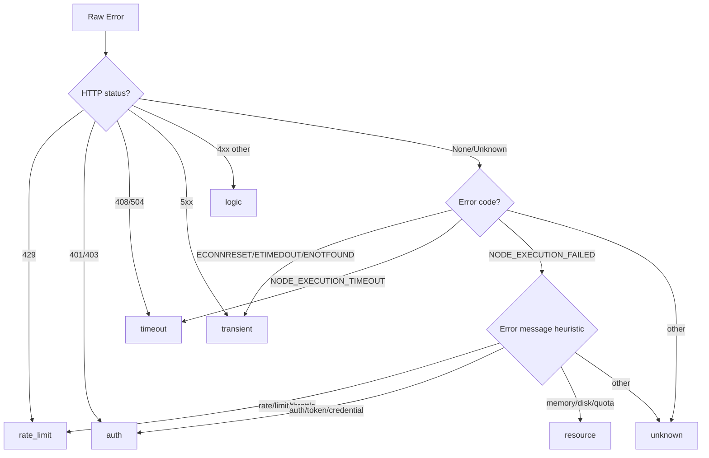
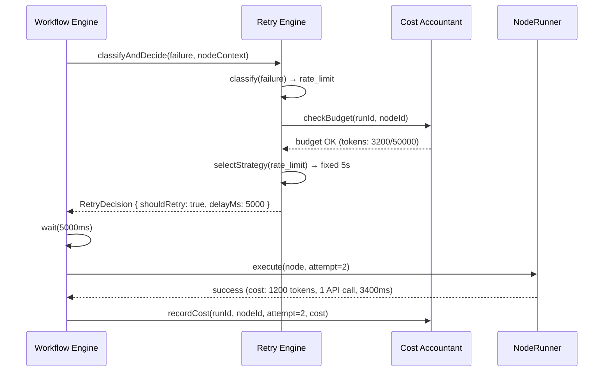
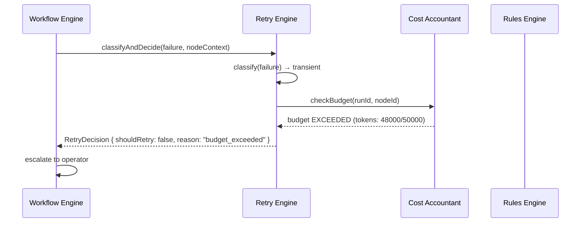
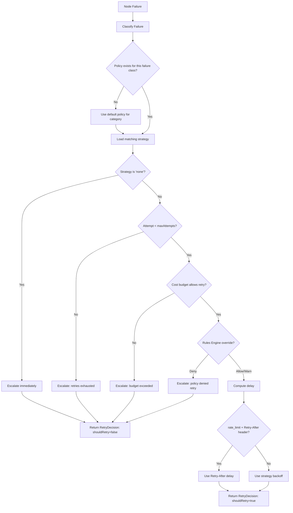
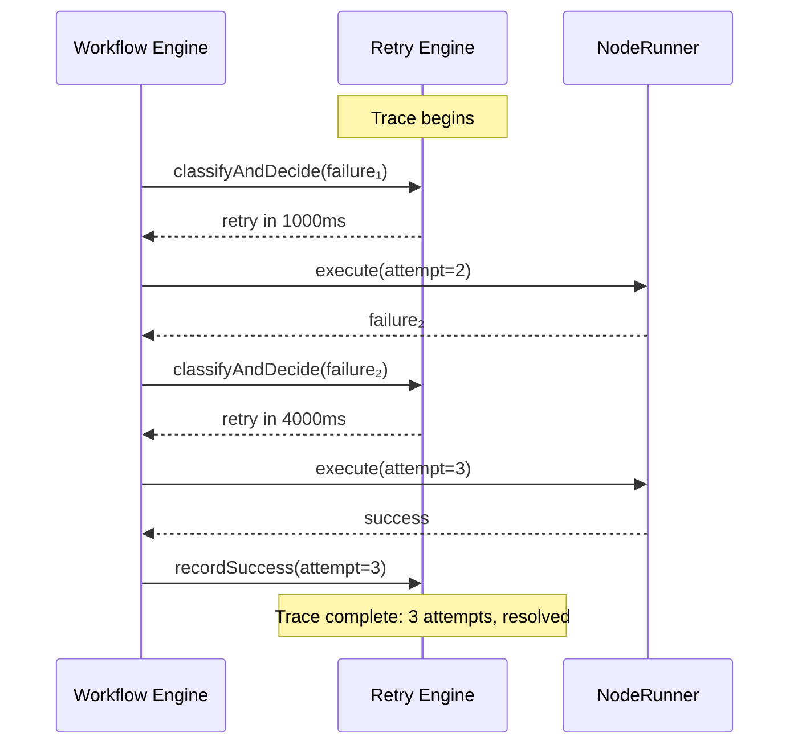

# RFC: Friday Retry Engine — Failure Taxonomy and Cost-Aware Retry Trees

**Status:** Draft  
**Author:** Friday Platform Team  
**Created:** 2026-02-23  
**Tickets:** FRI-PLAT-031, FRI-PLAT-032, FRI-PLAT-033

---

## 1. Summary

The Retry Engine is a classification and recovery runtime that sits between the NodeRunner and Workflow Engine. When a node execution fails, the Retry Engine classifies the failure into a taxonomy, selects a cost-aware retry strategy from a decision tree, and either executes an automatic retry or escalates to a human operator. The engine tracks all retry costs (API calls, compute time, token usage) and enforces per-workflow and per-node cost budgets to prevent runaway retries.

## 2. Motivation

Today, retry logic in Friday is handled by `FridayWorkflowRetryManager` — a simple backoff calculator that uses `FridayNodeRetryPolicy` (maxAttempts, backoff strategy, retryOn error codes). This works for basic cases but has significant limitations:

1. **No failure classification.** The retry manager treats all errors identically; a rate-limit 429 and a logic bug both get exponential backoff.
2. **No cost tracking.** Retries of LLM calls consume tokens; retries of API calls hit rate limits. There is no budget enforcement.
3. **Static policies.** Retry policies are defined per-node in the workflow graph. There is no way for the Rules Engine to override retry decisions at runtime.
4. **No observability.** Retry history is embedded in workflow run logs; there is no first-class retry trace for debugging.
5. **Manual escalation is ad-hoc.** When retries are exhausted, the workflow simply fails. There is no structured escalation path.

The Retry Engine addresses all five gaps:

- Classify failures into 7 categories with type-specific strategies.
- Track retry costs against per-node and per-workflow budgets.
- Integrate with the Rules Engine so policies can override retry decisions.
- Emit structured retry traces for observability.
- Reduce manual escalations by 40% through smarter retry selection.

## 3. Goals and Non-Goals

### Goals

- **Auto-recovery rate > 60%** for retryable failure classes (transient, rate-limit, timeout).
- **Retry cost overhead < 25%** of the original operation cost.
- **Manual escalation reduction ≥ 40%** vs. current retry manager.
- Classify every failure into one of 7 taxonomy categories.
- YAML-based retry policy DSL, consistent with the Rules Engine pattern.
- Cost budgets (token, API call, compute time) per node and per workflow run.
- Full retry trace with per-attempt detail for debugging.
- Rules Engine integration: policies can force-deny OR force-allow retries (within the retry resource scope only).
- Backward compatibility with existing `FridayNodeRetryPolicy` and `FridayRetryHint`.

### Non-Goals (Out of Scope)

- Automatic failure-pattern learning via ML (future phase).
- Cross-workflow retry budget federation (single workflow scope for v1).
- Retry UI dashboard (frontend work is separate).
- Cross-hub retry replay federation (single-hub replay evidence is in scope; multi-hub correlation is future work).

## 4. Architecture Overview

```
┌──────────────────────────────────────────────────────────────────┐
│                        Workflow Engine                            │
│  ┌────────────────┐     ┌──────────────────┐                     │
│  │ Workflow Runner │────▶│ Retry Manager v1 │  (existing; calls   │
│  └───────┬────────┘     │ (backoff only)   │   into Retry Engine │
│          │              └────────┬─────────┘   when available)    │
│          │                       │                                │
│          ▼                       ▼                                │
│  ┌──────────────────────────────────────────┐                    │
│  │            Retry Engine Runtime           │                    │
│  │  ┌──────────────┐  ┌──────────────────┐  │                    │
│  │  │  Failure      │  │  Retry Decision  │  │                    │
│  │  │  Classifier   │  │  Tree            │  │                    │
│  │  └──────┬───────┘  └────────┬─────────┘  │                    │
│  │         │                   │             │                    │
│  │  ┌──────▼───────────────────▼─────────┐  │                    │
│  │  │        Cost Accountant             │  │                    │
│  │  └──────────────┬────────────────────┘  │                    │
│  │                 │                        │                    │
│  │  ┌──────────────▼──────────────┐        │                    │
│  │  │   Rules Engine Integration  │        │                    │
│  │  └──────────────┬──────────────┘        │                    │
│  │                 │                        │                    │
│  │  ┌──────────────▼──────────────┐        │                    │
│  │  │   SQLite Persistence        │        │                    │
│  │  └─────────────────────────────┘        │                    │
│  └──────────────────────────────────────────┘                    │
│          │                                                       │
│          ▼                                                       │
│  ┌──────────────────┐                                            │
│  │   NodeRunner      │  (re-executes node on retry)              │
│  └──────────────────┘                                            │
└──────────────────────────────────────────────────────────────────┘
```

### Components

| Component | Responsibility |
|---|---|
| **Retry Engine Runtime** | Top-level facade; created at hub bootstrap, injected into workflow engine |
| **Failure Classifier** | Maps raw error codes, HTTP status codes, and error messages to a `FridayFailureClass` |
| **Retry Decision Tree** | Selects retry strategy (backoff type, delay, max attempts) based on failure class + policy |
| **Cost Accountant** | Tracks per-attempt costs (tokens, API calls, compute ms) and enforces budgets |
| **Rules Engine Integration** | Queries Rules Engine before executing a retry; policies can override the decision |
| **SQLite Persistence** | Stores retry policies, retry traces, cost records, and escalation log |

## 5. Failure Taxonomy

All failures are classified into one of seven categories. Each category has a default retry strategy.

| Category | Description | Default Strategy | Default Max Attempts |
|---|---|---|---|
| `transient` | Network errors, DNS failures, connection resets, 5xx responses | Exponential backoff | 3 |
| `rate_limit` | HTTP 429, provider rate-limit errors | Fixed delay (respect `Retry-After`) | 5  |
| `auth` | HTTP 401/403, expired tokens, revoked credentials | No retry (escalate) | 0 |
| `logic` | Application bugs, invalid input, assertion failures | No retry (escalate) | 0 |
| `resource` | Out of memory, disk full, quota exhausted | Linear backoff (wait for capacity) | 2 |
| `timeout` | Execution timeout, gateway timeout (504) | Exponential backoff (longer base) | 2 |
| `unknown` | Unclassified errors | Single immediate retry, then escalate | 1 |

### Classification Algorithm



The classifier is deterministic: given the same error input, it always produces the same `FridayFailureClass`. Custom classification rules can be registered to handle provider-specific errors (e.g., OpenAI `rate_limit_exceeded`).

### Strategy Type Contract

`FridayRetryStrategy` is a **discriminated union** on the `strategy` field. Each variant carries only the fields that apply to its backoff model:

| Strategy | Delay Fields | `customHandlerRef` | Notes |
|---|---|---|---|
| `exponential` | `baseDelayMs`, `maxDelayMs`, `jitterPercent` | ✗ | Delay doubles per attempt |
| `linear` | `baseDelayMs`, `maxDelayMs`, `jitterPercent` | ✗ | Delay increases linearly |
| `fixed` | `baseDelayMs`, `maxDelayMs`, `jitterPercent` | ✗ | Constant delay between attempts |
| `immediate` | ✗ (never) | ✗ | Zero-delay retry |
| `custom` | optional | **required** | Delegates to a registered handler |
| `none` | ✗ (never) | ✗ | No retry; escalate immediately |

Fields marked ✗ (never) use TypeScript `never` to prevent accidental assignment.

All variants share `FridayRetryStrategyBase` (common fields). Backoff variants (`exponential`, `linear`, `fixed`) additionally extend `FridayRetryBackoffStrategyBase`.

## 6. Retry Policy DSL

Retry policies use YAML, consistent with the Rules Engine pattern.

```yaml
apiVersion: friday/retry/v1
kind: RetryPolicy
metadata:
  id: default-retry-policy
  name: Default Retry Policy
  description: Standard retry policy for all workflow nodes
  version: 1
  priority: 100
  enabled: true
  tags:
    - default
    - production

costBudget:
  maxTotalTokens: 50000
  maxTotalApiCalls: 20
  maxTotalComputeMs: 300000
  maxCostPerAttempt:
    tokens: 10000
    apiCalls: 5
    computeMs: 60000

strategies:
  - failureCategory: transient
    strategy: exponential
    baseDelayMs: 1000
    maxDelayMs: 30000
    maxAttempts: 3
    jitterPercent: 25

  - failureCategory: rate_limit
    strategy: fixed
    baseDelayMs: 5000
    maxDelayMs: 60000
    maxAttempts: 5
    respectRetryAfter: true

  - failureCategory: auth
    strategy: none
    escalate: true
    escalationChannel: operator

  - failureCategory: logic
    strategy: none
    escalate: true
    escalationChannel: developer

  - failureCategory: resource
    strategy: linear
    baseDelayMs: 10000
    maxDelayMs: 120000
    maxAttempts: 2

  - failureCategory: timeout
    strategy: exponential
    baseDelayMs: 5000
    maxDelayMs: 60000
    maxAttempts: 2
    timeoutMultiplier: 1.5

  - failureCategory: unknown
    strategy: immediate
    maxAttempts: 1
    escalateOnExhaustion: true
```

## 7. Cost Accounting Model

Every retry attempt records its cost across three dimensions:

| Dimension | Unit | Source |
|---|---|---|
| **Tokens** | count | LLM provider response metadata (`usage.total_tokens`) |
| **API calls** | count | Incremented per external HTTP request |
| **Compute time** | milliseconds | Wall-clock duration of the node execution |

### Budget Enforcement

Cost budgets can be set at two levels:

1. **Per-node policy** — `FridayRetryPolicy.costBudget` limits costs for a single node within a run.
2. **Per-workflow run** — Aggregated across all nodes in a run; configured on the workflow definition.

When a budget is exceeded, the Retry Engine emits a `budget_exceeded` decision and escalates.

**Cost overhead formula:**

```
overheadPercent(dimension) = (totalRetryCost[dimension] / originalOperationCost[dimension]) × 100
```

`originalOperationCost` is captured from the first (non-retry) execution. The `FridayRetryCostSummary` exposes `overheadPercent` per dimension so callers can evaluate the NFR target (< 25%) without recomputing.



### Cost Tracking Per Attempt



## 8. Retry Decision Tree

The decision tree combines failure classification, policy lookup, cost budget check, and Rules Engine override into a single decision.



## 9. Integration Points

### 9.1 Workflow Retry Manager (Existing)

The existing `FridayWorkflowRetryManager` remains the entry point for the workflow engine. When the Retry Engine is available, the retry manager delegates to it for classification and decision-making. When the Retry Engine is not available (e.g., during bootstrap), the retry manager falls back to its current backoff-only logic.

```typescript
// Conceptual integration (not a code contract)
// WorkflowRetryManager.evaluateRetry() will:
// 1. Call RetryEngine.classifyFailure() to get FridayClassifiedFailure
// 2. Call RetryEngine.getRetryDecision() to get FridayRetryDecision
// 3. Fall back to existing backoff logic if RetryEngine is unavailable
```

### 9.2 NodeRunner

The NodeRunner's `FridayRetryHint` (from the API contract) is consumed by the Retry Engine as an input signal. When a node execution returns a `retryHint`, the classifier uses it as a strong signal for classification:

- `retryHint.retryable = false` → override to escalate.
- `retryHint.retryAfterMs` → use as minimum delay.
- `retryHint.backoff` → use as strategy hint (maps to `exponential`, `linear`, or `fixed`; can be overridden by policy).

### 9.3 Backward-Compatibility Sync Adapter

The existing `FridayWorkflowRetryManager` is synchronous. To avoid a disruptive rewrite, a **`FridayRetryEngineSyncAdapter`** bridges the two worlds:

- **`decideSync(classifiedFailure, context)`** — returns a cached `FridayRetryDecision` instantly (no I/O). Falls back to legacy backoff logic if no cached decision is available.
- **`refreshAsync()`** — runs the full async pipeline (Rules Engine evaluation, cost budget check) and updates the local cache.

The adapter is refreshed on a regular cadence (e.g., every 30 s) and after policy or rule changes. This allows the synchronous retry manager to benefit from the Retry Engine's classification and cost awareness without blocking on async I/O.

### 9.4 Rules Engine

Before executing any retry, the Retry Engine evaluates a Rules Engine context:

```yaml
resource: "retry"
action: "execute"
args:
  failureCategory: "rate_limit"
  nodeId: "call-openai"
  attemptNumber: 3
  totalCostTokens: 3200
  workflowId: "wf-123"
```

The Rules Engine can **deny** a retry the engine would allow, or **force-allow** a retry the engine would deny (within the `retry` resource scope only). This bidirectional override allows operators to define rules like:

- "Never retry auth failures in production."
- "Limit retries to 2 for workflows tagged 'cost-sensitive'."
- "Deny retries after 10 PM for non-critical workflows."

## 10. Retry Trace

Every retry sequence (from first failure to final resolution) is captured as a `FridayRetryTrace`. Each trace contains ordered `FridayRetryAttempt` records.



Traces are persisted to SQLite and queryable via the API for debugging and metrics.

## 11. Non-Functional Requirements

| NFR | Target | Measurement |
|---|---|---|
| Auto-recovery rate | > 60% for retryable classes | `(retries_resolved / retries_attempted) × 100` over rolling 7d |
| Retry cost overhead | < 25% | `FridayRetryCostSummary.overheadPercent` per dimension per workflow run |
| Manual escalation reduction | ≥ 40% | Compared to baseline (current retry manager) over 30d |
| Classification latency | p95 < 5 ms | Timer on `classifyFailure()` |
| Decision latency | p95 < 15 ms (including Rules Engine call) | Timer on `getRetryDecision()` |
| Trace query latency | p95 < 50 ms | Timer on `listRetryTraces()` |
| Budget enforcement accuracy | 100% | No retry should execute when budget is exhausted |

## 12. Edge Cases

### 12.1 Cascading Failures

When multiple nodes fail simultaneously (e.g., shared provider outage), each node evaluates its own retry independently. The per-workflow cost budget acts as a global circuit breaker: if total retry cost across all nodes exceeds the budget, all subsequent retries are denied.

### 12.2 Retry During Shutdown

If the hub is shutting down during a retry delay, the pending retry is cancelled and the trace is marked `cancelled`. On restart, the workflow engine can resume from the last checkpoint (separate concern).

### 12.3 Clock Skew

Retry delays use monotonic timestamps (not wall-clock) to avoid issues with system clock adjustments.

### 12.4 Idempotency

Each retry attempt uses a deterministic idempotency key: `retry:{runId}:{nodeId}:{attemptNumber}`. This ensures that duplicate retry requests (e.g., from message replay) are safely deduplicated.

### 12.5 Classification Ambiguity

When an error matches multiple categories (e.g., a 503 with "rate limit" in the body), the classifier uses a priority order: `rate_limit > timeout > transient > resource > auth > logic > unknown`. The highest-priority match wins.

### 12.6 Zero-Cost Retries

Some retries have no additional cost (e.g., retrying a failed file write). The cost accountant still records the attempt but with zero cost, so it does not consume budget.

## 13. Architecture Decision Records

### ADR-031-01: Taxonomy Size

**Decision:** 7 failure categories (transient, rate_limit, auth, logic, resource, timeout, unknown).

**Rationale:** Fewer categories (3–4) would conflate errors that need different strategies. More categories (10+) would make policy configuration burdensome. Seven provides a balance: each category maps to a distinct retry strategy.

**Alternatives considered:**
- 3 categories (retryable, non-retryable, unknown) — too coarse, no strategy differentiation.
- Provider-specific categories (openai_rate_limit, anthropic_overloaded) — too granular, not portable.

### ADR-031-02: Cost Budget at Two Levels

**Decision:** Cost budgets are enforced at per-node and per-workflow-run levels.

**Rationale:** Per-node budgets prevent a single node from consuming disproportionate resources. Per-workflow budgets act as a global circuit breaker. Both are needed because a workflow with 20 nodes could exhaust its budget even if each node individually stays within limits.

**Alternatives considered:**
- Per-node only — no global protection.
- Per-workflow only — one expensive node could starve others.
- Global (cross-workflow) — too complex for v1; deferred to future phase.

### ADR-031-03: Rules Engine Integration as Bidirectional Override

**Decision:** The Rules Engine is consulted after the Retry Engine's own decision, as a **bidirectional** override layer scoped to the `retry` resource. It can **deny** a retry that the engine would allow, or **force-allow** a retry that the engine would deny.

**Rationale:** The Retry Engine has domain-specific knowledge (failure class, cost budget) that the Rules Engine lacks. However, operators need the ability to override in both directions for production flexibility — e.g., force-allowing a retry for a known-flaky provider even when the budget is nominally exhausted. Scoping to the `retry` resource ensures this power does not leak into other domains.

### ADR-031-04: Backward Compatibility with FridayNodeRetryPolicy

**Decision:** The existing `FridayNodeRetryPolicy` on workflow nodes is treated as a base configuration. The Retry Engine merges it with its own policies: node-level policy sets maxAttempts and backoff, while the Retry Engine adds classification, cost tracking, and Rules Engine integration on top.

**Rationale:** Existing workflows should continue to work without modification. The Retry Engine enhances, not replaces, the current retry path.

### ADR-031-05: Trace Granularity

**Decision:** One `FridayRetryTrace` per (runId, nodeId) pair. Each attempt within the trace is a `FridayRetryAttempt` with its own cost record, classification, and decision.

**Rationale:** Grouping by (runId, nodeId) matches the workflow engine's retry scope. Per-attempt granularity enables debugging individual retries and computing aggregate metrics.

## 14. Migration Path

1. **Phase 1 (this RFC):** Domain model, API contract, and architecture. No runtime changes.
2. **Phase 2:** Implement Failure Classifier and Retry Decision Tree. Wire into `FridayWorkflowRetryManager` as an optional delegate.
3. **Phase 3:** Implement Cost Accountant and budget enforcement. Add retry traces persistence.
4. **Phase 4:** Rules Engine integration. Add retry policy YAML DSL parser.
5. **Phase 5:** Metrics, alerting, and operator escalation channels.

## 15. API Flow

The retry API follows a **two-step** contract:

1. **Classify** — `POST /api/retry/classify` accepts a `FridayClassifyFailureError` (at least one of `errorCode`, `errorMessage`, `httpStatusCode`) and returns a `FridayClassifiedFailure`.
2. **Decide** — `POST /api/retry/decide` accepts the `FridayClassifiedFailure` from step 1 (required) and returns a `FridayRetryDecision`.

This separation ensures that classification and decisioning can be tested, audited, and cached independently. Callers must classify before deciding — the decide endpoint no longer accepts raw error fields.

## 16. Open Questions

1. Should the cost budget include a "soft limit" (warn) vs "hard limit" (deny)? Currently only hard limits are modeled.
2. Should retry policies be inheritable (workflow-level defaults overridden at node level)?
3. What is the retention period for retry traces? Proposed: 30 days, matching the audit log.
