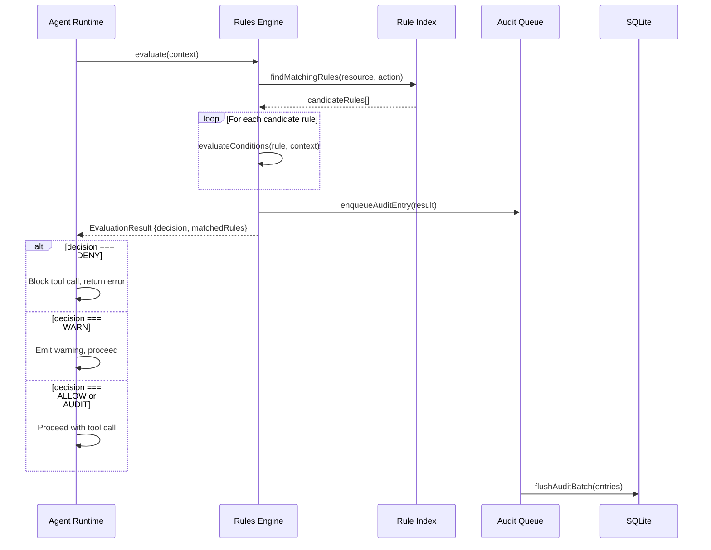
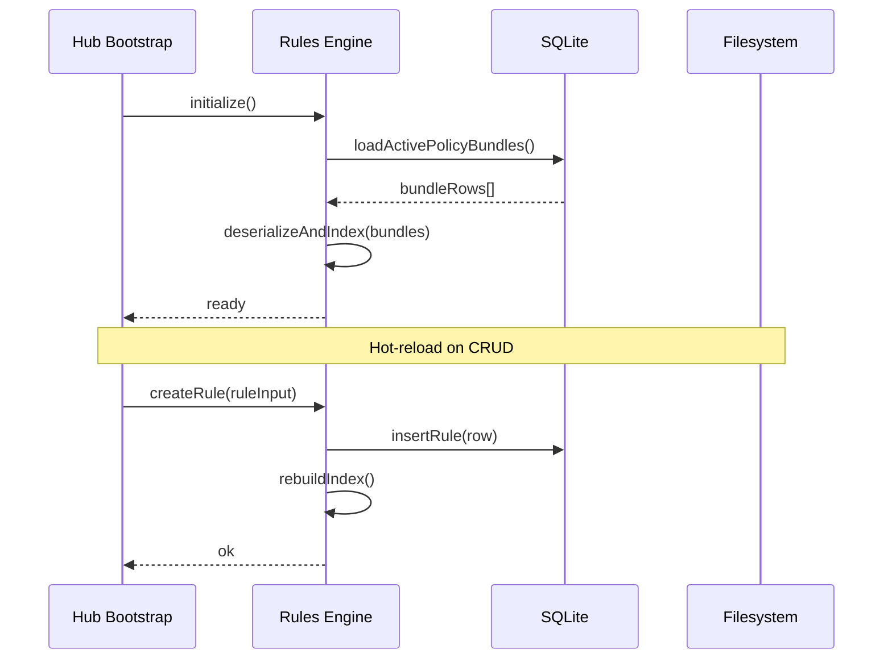
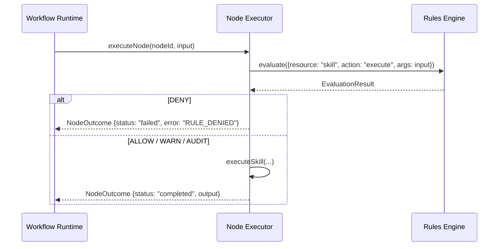

# RFC: Friday Rules Engine Core

**Status:** Draft  
**Author:** Friday Platform Team  
**Created:** 2026-02-23  
**Tickets:** FRI-PLAT-001, FRI-PLAT-002, FRI-PLAT-003

---

## 1. Summary

The Rules Engine Core is a deterministic policy/rule runtime that gates all agent execution steps in Friday. Every action an agent or workflow takes passes through the rules engine for pre-execution evaluation. The engine applies user-defined policy bundles (YAML-based rule DSL) and returns a decision: **allow**, **deny**, **warn**, or **audit**. This provides a safety layer that is transparent, auditable, and configurable without code changes.

## 2. Motivation

Friday agents can execute arbitrary tools (shell, filesystem, network, browser, messaging). Today, safety is enforced via:

- **Permission grants** on skills (`PermissionPolicyV2`)
- **RBAC scopes** on API routes (`FridayScope`)
- **SSRF guard** for network calls
- **readOnly constraint** on agent runs

These mechanisms are effective but **scattered, static, and not user-configurable at runtime**. The rules engine centralizes policy enforcement into a single evaluation pipeline that:

1. Blocks 100% of unsafe actions matching deny rules.
2. Provides audit trails for every evaluation decision.
3. Allows operators to define custom rules without code deployment.
4. Supports pre- and post-execution hooks for complex gating logic.

## 3. Goals and Non-Goals

### Goals

- Deterministic rule evaluation with p95 latency < 20 ms.
- False-positive rate < 2% (measured against a golden test suite).
- 100% block rate for actions matching deny rules.
- YAML-based policy bundles loadable at runtime.
- Pre-execution and post-execution evaluation hooks.
- Four decision actions: allow, deny, warn, audit.
- Integration with agent runtime, workflow runtime, and hub bootstrap.
- Versioned rules with rollback capability.
- Audit log for every evaluation.

### Non-Goals (Out of Scope)

- Machine-learning-based anomaly detection (future phase).
- Real-time rule editing UI (frontend work is separate).
- Cross-hub rule federation (single-hub only for v1).
- Natural language rule authoring (future phase).
- Rule marketplace or sharing (future phase).

## 4. Architecture Overview

```
┌─────────────────────────────────────────────────────────┐
│                     Hub Bootstrap                        │
│  ┌──────────────┐  ┌──────────────┐  ┌───────────────┐  │
│  │ Agent Runtime │  │ Workflow RT  │  │  API Runtime   │  │
│  └──────┬───────┘  └──────┬───────┘  └───────┬───────┘  │
│         │                 │                   │          │
│         └────────┬────────┘                   │          │
│                  ▼                             │          │
│  ┌──────────────────────────────┐             │          │
│  │     Rules Engine Runtime     │◄────────────┘          │
│  │  ┌────────┐  ┌───────────┐  │                         │
│  │  │Evaluator│  │ Rule Index│  │                         │
│  │  └────┬───┘  └─────┬─────┘  │                         │
│  │       │            │         │                         │
│  │  ┌────▼────────────▼─────┐  │                         │
│  │  │   Policy Bundle Cache  │  │                         │
│  │  └────────────┬──────────┘  │                         │
│  │               │              │                         │
│  │  ┌────────────▼──────────┐  │                         │
│  │  │    SQLite Persistence  │  │                         │
│  │  └───────────────────────┘  │                         │
│  └──────────────────────────────┘                         │
└─────────────────────────────────────────────────────────┘
```

### Components

| Component | Responsibility |
|---|---|
| **Rules Engine Runtime** | Top-level facade; created at hub bootstrap and injected into agent/workflow runtimes |
| **Evaluator** | Evaluates an `EvaluationContext` against loaded rules; returns `EvaluationResult` |
| **Rule Index** | In-memory index of active rules grouped by resource/action for O(1) lookup |
| **Policy Bundle Cache** | Caches deserialized policy bundles; invalidated on rule CRUD |
| **SQLite Persistence** | Stores rules, rule versions, rule sets, policy bundles, evaluation audit log |

## 5. Rule DSL Design (YAML Policy Bundles)

Policy bundles are YAML files that declare rules. Each bundle has metadata and a list of rules.

```yaml
# policy-bundle: agent-safety-defaults
apiVersion: friday/rules/v1
kind: PolicyBundle
metadata:
  id: agent-safety-defaults
  name: Agent Safety Defaults
  description: Default safety rules for all agent executions
  version: 1
  priority: 100          # Lower number = higher priority
  enabled: true
  tags:
    - safety
    - default

rules:
  - id: deny-rm-rf
    name: Block recursive force delete
    description: Prevents agents from running destructive rm -rf commands
    enabled: true
    resource: shell
    action: execute
    conditions:
      all:
        - field: args.command
          operator: matches
          value: "rm\\s+(-[a-zA-Z]*r[a-zA-Z]*f|--recursive)\\s"
    decision: deny
    message: "Blocked destructive command: rm -rf is not allowed"

  - id: warn-network-external
    name: Warn on external network access
    resource: network
    action: connect
    conditions:
      none:
        - field: args.host
          operator: matches
          value: "^(localhost|127\\.0\\.0\\.1|10\\.|172\\.(1[6-9]|2[0-9]|3[01])\\.|192\\.168\\.)"
    decision: warn
    message: "External network access detected"

  - id: audit-file-write
    name: Audit all file writes
    resource: filesystem
    action: write
    decision: audit
    message: "File write operation recorded"
```

### Condition Operators

| Operator | Description |
|---|---|
| `equals` | Exact string/number match |
| `not_equals` | Negated exact match |
| `contains` | Substring match |
| `matches` | Regular expression match |
| `in` | Value is in a list |
| `not_in` | Value is not in a list |
| `gt`, `gte`, `lt`, `lte` | Numeric comparisons |
| `exists` | Field is present and non-null |
| `not_exists` | Field is absent or null |

### Condition Groups

- `all`: All conditions must match (AND).
- `any`: At least one condition must match (OR).
- `none`: No condition may match (NOT ANY).

### Regex Safety Contract

- Engine uses RE2-compatible regex only.
- Validate on rule write/import, not at evaluation time.
- Max pattern length: 256 chars.
- Runtime uses precompiled validated regex objects.

### Audit Context Redaction Policy

- Redact keys/paths matching `(password|passphrase|secret|token|authorization|cookie|api[_-]?key|credential)` (case-insensitive).
- Replace redacted value with `"[REDACTED]"`.
- Truncate non-redacted strings to max 256 chars.
- Persist only redacted context (never raw args/headers).

### Idempotency Contract

- Scope: `(principalId, operationId, key)`.
- Keys expire after 24 hours.
- Same payload hash returns the original response.
- Different payload hash returns HTTP 409 with code `IDEMPOTENCY_KEY_CONFLICT`.

## 6. Pre/Post Evaluation Hooks Architecture

The rules engine supports two hook points in the execution lifecycle:

### Pre-Evaluation Hooks

Fired **before** the agent/workflow executes a tool or action. This is the primary gating point.

```
Agent requests tool call → Build EvaluationContext → Pre-evaluate rules
  → ALLOW: proceed with execution
  → DENY: block execution, return error to agent
  → WARN: proceed but emit warning event
  → AUDIT: proceed and log to audit trail
```

### Post-Evaluation Hooks

Fired **after** the tool/action completes, with the result available. Used for audit-only rules that inspect outcomes.

```
Tool execution completes → Build PostEvaluationContext (includes result)
  → Post-evaluate rules → Log audit entries
```

### Hook Registration

Hooks are registered during hub bootstrap. The agent runtime and workflow runtime each register their own hook adapters:

```typescript
// In hub bootstrap
rulesEngine.registerPreHook("agent", agentPreEvaluationAdapter);
rulesEngine.registerPostHook("agent", agentPostEvaluationAdapter);
rulesEngine.registerPreHook("workflow", workflowPreEvaluationAdapter);
```

## 7. Sequence Diagrams

### Pre-Evaluation (Agent Tool Call)



### Policy Bundle Loading



### Workflow Node Evaluation



## 8. Decision Actions

| Decision | Behavior | Audit Logged | Blocks Execution |
|---|---|---|---|
| `allow` | Permit the action | Configurable | No |
| `deny` | Block the action | Always | Yes |
| `warn` | Permit with warning event | Always | No |
| `audit` | Permit, log to audit trail | Always | No |

### Decision Priority

When multiple rules match, the highest-priority decision wins. Priority order:

1. **deny** — always wins over other decisions.
2. **warn** — wins over allow and audit.
3. **audit** — wins over allow.
4. **allow** — default when no rules match.

Rule-level short-circuiting is not used; all candidates are evaluated for deterministic matched-rules output.

Within the same decision type, the rule with the lowest `priority` number (highest priority) determines the message.

## 9. Integration Points

### Agent Runtime (`src/agent/runtime/friday-agent-runtime.ts`)

The agent runtime calls `rulesEngine.evaluate()` before every tool execution in the `executeToolCall` function. The evaluation context includes:

- `resource`: Mapped from tool name (e.g., `shell.execute`, `filesystem.write`)
- `action`: The specific action being taken
- `args`: Tool arguments (command, path, URL, etc.)
- `principal`: The agent's auth principal
- `runId`: Current agent run ID
- `constraints`: Any run-level constraints (readOnly, etc.)

Integration point: inject `rulesEngine` into `CreateFridayAgentRuntimeDeps`.

### Workflow Runtime (`src/workflows/runtime/friday-workflow-runtime.ts`)

The workflow node executor calls `rulesEngine.evaluate()` before invoking each skill node. Context includes:

- `resource`: `"skill"`
- `action`: `"execute"`
- `args`: Node input payload
- `workflowId`, `runId`, `nodeId`: Execution context

Integration point: inject `rulesEngine` into `CreateFridayWorkflowRuntimeDeps`.

### Hub Bootstrap (`src/hub/friday-hub-bootstrap.ts`)

The hub bootstrap:

1. Creates the rules engine runtime during startup (after state init, before agent/workflow runtimes).
2. Loads policy bundles from SQLite and optional YAML files.
3. Injects the rules engine into agent and workflow runtimes.
4. Registers CRUD API routes for rules management.

Integration point: add `rulesEngine` creation between provider service and executor creation.

## 10. Non-Functional Requirements

| Requirement | Target | Measurement |
|---|---|---|
| **Evaluation latency (p95)** | < 20 ms | Benchmark with 100 active rules, 10K evaluations |
| **False-positive rate** | < 2% | Golden test suite of 500+ evaluation scenarios |
| **Unsafe action block rate** | 100% | Fuzz testing with known-dangerous payloads |
| **Rule load time** | < 100 ms | Cold load of 1000 rules from SQLite |
| **Memory overhead** | < 10 MB | In-memory index for 1000 rules |
| **Concurrent evaluations** | Thread-safe | Node.js single-thread; no mutex needed |

### Performance Strategy

- **In-memory index**: Rules indexed by `(resource, action)` tuple for O(1) bucket lookup.
- **Compiled regexes**: Regex patterns compiled once at load time, cached in rule objects.
- **Lazy condition evaluation**: Short-circuit on first failing condition in `all` groups.
- **No I/O in hot path**: Audit entries are enqueued in-memory (max queue size 10,000) and flushed by a background worker every 50 ms or 100 entries, whichever comes first, in a single SQLite transaction.

## 11. Edge Cases

| Edge Case | Handling |
|---|---|
| No rules loaded | Default to ALLOW — engine is permissive by default |
| Malformed rule condition | Skip rule, log warning, do not block |
| Unsafe/invalid regex pattern | Reject create/update/import with regex validation error; rule is not persisted |
| Circular rule dependencies | Not possible — rules are flat, no rule-to-rule references |
| Concurrent rule CRUD during evaluation | Evaluation uses snapshot of current index; CRUD rebuilds index atomically |
| Empty evaluation context | Return ALLOW — no context means nothing to evaluate |
| Rule with no conditions | Matches all contexts for that resource/action pair |
| Policy bundle version conflict | Last-write-wins with optimistic concurrency (etag) |

## 12. SQLite Schema (Migration)

```sql
-- Policy bundles
CREATE TABLE IF NOT EXISTS rule_policy_bundles (
  id            TEXT PRIMARY KEY,
  name          TEXT NOT NULL,
  description   TEXT,
  version       INTEGER NOT NULL DEFAULT 1,
  priority      INTEGER NOT NULL DEFAULT 100,
  enabled       INTEGER NOT NULL DEFAULT 1,
  tags_json     TEXT NOT NULL DEFAULT '[]',
  source        TEXT NOT NULL DEFAULT 'user',
  etag          TEXT NOT NULL,
  created_at    TEXT NOT NULL,
  updated_at    TEXT NOT NULL,
  deleted_at    TEXT
);

-- Individual rules
CREATE TABLE IF NOT EXISTS rules (
  id              TEXT PRIMARY KEY,
  policy_bundle_id TEXT NOT NULL REFERENCES rule_policy_bundles(id),
  name            TEXT NOT NULL,
  description     TEXT,
  enabled         INTEGER NOT NULL DEFAULT 1,
  resource        TEXT NOT NULL,
  action          TEXT NOT NULL,
  conditions_json TEXT NOT NULL DEFAULT '{}',
  decision        TEXT NOT NULL CHECK(decision IN ('allow','deny','warn','audit')),
  message         TEXT,
  priority        INTEGER NOT NULL DEFAULT 100,
  version         INTEGER NOT NULL DEFAULT 1,
  etag            TEXT NOT NULL,
  created_at      TEXT NOT NULL,
  updated_at      TEXT NOT NULL,
  deleted_at      TEXT
);

CREATE INDEX IF NOT EXISTS idx_rules_resource_action
  ON rules(resource, action) WHERE deleted_at IS NULL AND enabled = 1;

CREATE INDEX IF NOT EXISTS idx_rules_policy_bundle
  ON rules(policy_bundle_id) WHERE deleted_at IS NULL;

-- Rule version history
CREATE TABLE IF NOT EXISTS rule_versions (
  id              TEXT PRIMARY KEY,
  rule_id         TEXT NOT NULL REFERENCES rules(id),
  version         INTEGER NOT NULL,
  snapshot_json   TEXT NOT NULL,
  changed_by      TEXT,
  change_note     TEXT,
  created_at      TEXT NOT NULL,
  UNIQUE(rule_id, version)
);

CREATE INDEX IF NOT EXISTS idx_rule_versions_rule_created
  ON rule_versions(rule_id, created_at DESC);

-- Rule evaluation audit log
CREATE TABLE IF NOT EXISTS rule_evaluation_log (
  id              TEXT PRIMARY KEY,
  rule_id         TEXT,
  policy_bundle_id TEXT,
  decision        TEXT NOT NULL,
  resource        TEXT NOT NULL,
  action          TEXT NOT NULL,
  context_redacted_json TEXT NOT NULL,
  redaction_applied     INTEGER NOT NULL DEFAULT 0,
  redacted_fields_json  TEXT NOT NULL DEFAULT '[]',
  matched_rules_json TEXT NOT NULL DEFAULT '[]',
  duration_ms     REAL NOT NULL,
  run_id          TEXT,
  workflow_id     TEXT,
  principal_id    TEXT,
  created_at      TEXT NOT NULL
);

CREATE INDEX IF NOT EXISTS idx_rule_eval_log_created
  ON rule_evaluation_log(created_at);
```

## 13. Architecture Decision Records (ADRs)

### ADR-001: In-Memory Rule Index vs. Per-Evaluation DB Query

**Context:** Rules must be evaluated on every tool call. SQLite queries per evaluation would add 1–5 ms latency.

**Decision:** Maintain an in-memory index (`Map<string, FridayRule[]>`) keyed by `resource:action`. Rebuild index on rule CRUD operations.

**Consequences:**
- (+) Sub-millisecond rule lookup.
- (+) No SQLite I/O in the evaluation hot path.
- (−) Memory usage scales with rule count (acceptable for < 10K rules).
- (−) Index rebuild on every CRUD operation (acceptable — CRUD is rare vs. evaluation).

### ADR-002: YAML Policy Bundles vs. JSON vs. Custom DSL

**Context:** Rules need a human-readable, version-controllable format.

**Decision:** YAML with a `friday/rules/v1` apiVersion schema. YAML is parsed at load time into TypeScript types.

**Consequences:**
- (+) Human-readable, git-friendly.
- (+) Well-tooled (IDE support, linters).
- (+) Familiar to operators (Kubernetes-style).
- (−) YAML parsing adds ~1 ms per bundle (acceptable at load time, not in hot path).

### ADR-003: Deterministic Evaluation Order

**Context:** Multiple rules can match the same context. The evaluation result must be deterministic.

**Decision:** Rules are evaluated in priority order (lowest number first). Evaluator scans all candidate rules, then computes final decision by decision priority: deny > warn > audit > allow.

**Consequences:**
- (+) Predictable, testable behavior.
- (+) deny rules cannot be overridden by lower-priority allow rules.
- (−) Operators must understand priority semantics (documented in policy bundle schema).

### ADR-004: Audit Log via Bounded Queue + Batch Flusher

**Context:** Audit logging must not add latency to the evaluation hot path.

**Decision:** Enqueue is O(1) in evaluation path. Worker batch flush (size=100, interval=50ms). On queue full: drop newest entry, increment metric `rules.audit.queue_dropped_total`, do not block evaluation.

**Consequences:**
- (+) Evaluation latency unaffected by audit log I/O.
- (+) Batch writes amortize SQLite transaction overhead.
- (−) Audit entries could be lost on crash or queue overflow (acceptable — not a compliance system).

### ADR-005: No Rule-to-Rule Dependencies

**Context:** Some rule engines support rule chaining (rule A triggers rule B).

**Decision:** Rules are flat — no rule references other rules. Complex logic is expressed via condition groups (`all`, `any`, `none`).

**Consequences:**
- (+) Simple mental model, no circular dependency risk.
- (+) Easier to reason about evaluation order.
- (−) Very complex policies require multiple rules rather than chained logic (acceptable for v1).

### ADR-006: Default-Allow Policy

**Context:** When no rules match, the engine must decide.

**Decision:** Default to ALLOW. The engine is permissive by default; safety is opt-in via deny rules.

**Consequences:**
- (+) Non-breaking introduction — existing deployments continue to work with zero rules.
- (+) Operators add restrictions incrementally.
- (−) Requires operators to explicitly define deny rules for unsafe actions (mitigated by shipping default policy bundles).

---

## 14. Future Work (Phase 2+)

- **Rule templates**: Pre-built rule sets for common safety patterns.
- **Rule testing framework**: Dry-run evaluations against historical contexts.
- **UI for rule management**: Visual rule builder in the Friday dashboard.
- **Webhook notifications**: Fire webhooks on deny/warn decisions.
- **Cross-bundle conflict detection**: Warn when bundles have contradictory rules.
- **ML-assisted rule suggestions**: Analyze audit logs to suggest new rules.
