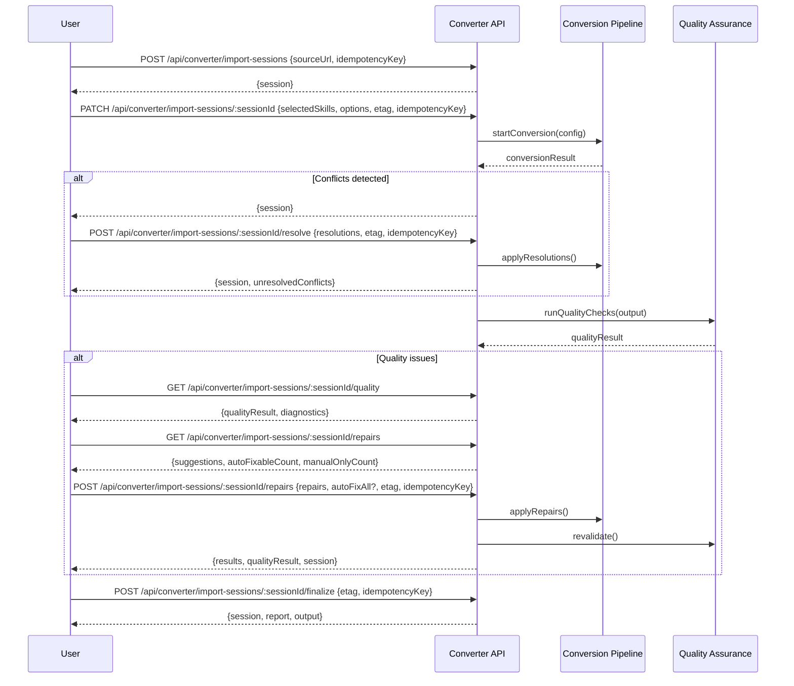

# RFC: Universal Converter Platform

**Status:** Draft
**Author:** Friday Platform Team
**Created:** 2026-02-23
**Tickets:** FRI-PLAT-081, FRI-PLAT-082, FRI-PLAT-083

---

## 1. Summary

The Universal Converter Platform (CNV) is a pipeline-based system that converts external sources — GitHub repositories, REST APIs, web flows/scraping targets, and open-source skills (MCP servers, LangChain tools) — into Friday-native skill packages. The platform provides source detection, multi-stage transformation, quality assurance, an interactive import wizard, and an iterative repair flow, producing output compatible with the Packaging (PKG) system.

## 2. Motivation

Friday's skill ecosystem grows fastest when external knowledge can be reliably imported. Today, adding capabilities requires manual skill authoring. The converter platform automates this by:

1. Detecting source type automatically from a URL (local filesystem paths are restricted to trusted internal callers with an allowlisted root directory).
2. Parsing source artifacts into a normalized intermediate representation.
3. Transforming the IR into Friday skill definitions.
4. Validating output through schema checks, runtime dry-runs, and compatibility gates.
5. Guiding users through conflict resolution and repair when issues arise.

This reduces the barrier to entry for skill creation and accelerates ecosystem growth while maintaining quality standards.

## 3. Goals and Non-Goals

### Goals

- Conversion success rate > 80% on supported source types.
- Post-conversion runtime pass rate > 90% (skills execute successfully after import).
- Manual patch rate < 30% of conversions after 3 releases (baseline measured at GA).
- End-to-end conversion latency < 60 seconds for typical sources (< 50 files).
- Interactive import wizard with preview, conflict resolution, and repair suggestions.
- Iterative repair flow with auto-fix for common issues and manual patch interface.
- Integration with Packaging (PKG) for output format and Rules Engine for validation policies.
- Idempotent API operations (including PATCH) with cursor-based pagination.
- Full diagnostic tracing for every conversion attempt.

### Non-Goals (Out of Scope)

- Live synchronization with upstream sources (future phase — one-shot import only).
- UI implementation for the import wizard (API contract only; frontend is separate).
- Authentication with private GitHub repos requiring OAuth flows (assumes token is provided).
- Conversion of binary/compiled artifacts (source code and config files only).
- Automatic publishing to the package registry (output is a local package; publishing is a separate step).

## 4. Architecture Overview

```
┌──────────────────────────────────────────────────────────────────┐
│                       Converter Platform                          │
│                                                                   │
│  ┌───────────┐   ┌─────────┐   ┌──────────────┐   ┌──────────┐ │
│  │  Source    │──▶│ Parser  │──▶│ Transformer  │──▶│ Validator│ │
│  │ Detector  │   │         │   │              │   │          │ │
│  └───────────┘   └─────────┘   └──────────────┘   └────┬─────┘ │
│                                                          │       │
│                                        ┌─────────────────▼─────┐ │
│                                        │     Output Emitter    │ │
│                                        │  (PKG-compatible)     │ │
│                                        └─────────┬─────────────┘ │
│                                                  │               │
│  ┌──────────────────────────────────────────────▼──────────────┐ │
│  │                    Quality Assurance                         │ │
│  │  ┌──────────┐  ┌─────────────┐  ┌────────────────────────┐ │ │
│  │  │ Schema   │  │ Runtime     │  │ Compatibility          │ │ │
│  │  │ Validate │  │ Dry-Run     │  │ Check (Rules Engine)   │ │ │
│  │  └──────────┘  └─────────────┘  └────────────────────────┘ │ │
│  └─────────────────────────────────────────────────────────────┘ │
│                                                                   │
│  ┌──────────────────────────────────────────────────────────────┐ │
│  │                  Import Wizard                                │ │
│  │  Preview → Conflict Resolution → Repair Suggestions → Apply  │ │
│  └──────────────────────────────────────────────────────────────┘ │
│                                                                   │
│  ┌──────────────────────────────────────────────────────────────┐ │
│  │                  Repair Flow                                  │ │
│  │  Auto-Fix → Manual Patch → Re-validate → Accept/Iterate     │ │
│  └──────────────────────────────────────────────────────────────┘ │
│                                                                   │
│  ┌──────────────────┐                                            │
│  │ SQLite Persistence│                                            │
│  └──────────────────┘                                            │
└──────────────────────────────────────────────────────────────────┘
```

### Components

| Component | Responsibility |
|---|---|
| **Source Detector** | Analyzes a URL (or, for trusted internal callers, an allowlisted local path) to determine source type and extract metadata |
| **Parser** | Reads source artifacts into a normalized intermediate representation (IR) per source type |
| **Transformer** | Applies conversion rules and mappings to convert IR into Friday skill definitions |
| **Validator** | Runs schema validation, runtime dry-run, and compatibility checks against output |
| **Output Emitter** | Produces PKG-compatible skill package from validated output |
| **Quality Assurance** | Three-gate quality pipeline: schema → dry-run → compatibility |
| **Import Wizard** | User-guided import session with preview, conflict detection, and resolution |
| **Repair Flow** | Auto-fix common issues, manual patch interface, iterative re-validation |
| **SQLite Persistence** | Stores conversion pipelines, import sessions, quality results, repair history |

## 5. Converter Pipeline Architecture

The conversion pipeline is a five-stage state machine:

```
  ┌──────────┐     ┌─────────┐     ┌──────────────┐     ┌────────────┐     ┌────────┐
  │ detecting │────▶│ parsing │────▶│ transforming │────▶│ validating │────▶│ output │
  └──────────┘     └─────────┘     └──────────────┘     └────────────┘     └────────┘
       │                │                 │                    │                │
       └────────────────┴─────────────────┴────────────────────┘                │
                        │ (on error)                                            │
                   ┌────▼────┐                                            ┌────▼─────┐
                   │ failed  │                                            │ completed│
                   └─────────┘                                            └──────────┘
                                                                          ┌──────────┐
                                                                          │ cancelled│
                                                                          └──────────┘
```

### Stage Details

| Stage | Input | Output | Failure Mode |
|---|---|---|---|
| **detecting** | Source URL (public API) or allowlisted local path (internal only) | `FridayConverterSource` discriminated union | Unrecognized source type |
| **parsing** | Source descriptor | Normalized IR (files, endpoints, skills) | Malformed source, rate limiting, timeout |
| **transforming** | Parsed IR + conversion rules | Friday skill definitions + mappings | Unmappable constructs, circular deps |
| **validating** | Skill definitions | Quality gate results (pass/fail per gate) | Schema errors, runtime failures, incompatibilities |
| **output** | Validated skills | PKG-compatible skill package | File system errors |

Each stage records entry/exit timestamps, diagnostics, and artifacts for traceability.

## 6. Supported Source Types

### 6.1 GitHub Repository (`github_repo`)

- **Detection:** URL matches `github.com/<owner>/<repo>` or git remote URL.
- **Parsing:** Clone/fetch repo (respecting rate limits), scan for skill-like patterns:
  - `package.json` with tool/skill metadata
  - OpenAPI/Swagger specs
  - README with usage patterns
  - Source files with function exports matching skill signatures
- **Transformation:** Map exported functions → skill definitions, README → skill descriptions, tests → validation fixtures.
- **Constraints:** Max repo size 500 MB; max files scanned 10,000; shallow clone (depth=1) by default.

### 6.2 REST API (`rest_api`)

- **Detection:** URL serves OpenAPI/Swagger spec, or responds to common API discovery endpoints.
- **Parsing:** Fetch and parse OpenAPI 3.x / Swagger 2.0 spec; extract endpoints, parameters, response schemas.
- **Transformation:** Map each endpoint → skill definition with input/output schemas derived from OpenAPI.
- **Constraints:** Max 500 endpoints per spec; authentication config must be provided separately.

### 6.3 Web Flow (`web_flow`)

- **Detection:** URL is a standard web page with interactive elements.
- **Parsing:** Headless browser snapshot; extract forms, navigation flows, data extraction patterns.
- **Transformation:** Map identified flows → skill definitions with browser automation steps.
- **Constraints:** Max 20 pages per flow; max 60s per page load; JavaScript rendering supported.

### 6.4 Open-Source Skill (`open_source_skill`)

- **Detection:** Recognized framework markers:
  - MCP: `mcp.json`, `@modelcontextprotocol` imports
  - LangChain: `langchain` imports, tool decorators
  - Other: Anthropic tool-use format, OpenAI function-calling format
- **Parsing:** Extract tool/skill definitions, parameter schemas, descriptions from framework-specific metadata.
- **Transformation:** Map framework-specific tool format → Friday skill definition with parameter alignment.
- **Constraints:** Single framework per import; mixed frameworks require multiple passes.

## 7. Quality Assurance Stages

Quality assurance is a three-gate pipeline. Each gate produces a pass/fail result with diagnostics.

### 7.1 Schema Validation

- Validates output skill definitions against the Friday skill JSON schema.
- Checks required fields, type constraints, naming conventions.
- Reports per-field validation errors with JSON path locations.
- **Gate:** All skills must pass schema validation.

### 7.2 Runtime Dry-Run

- Instantiates each converted skill in a sandboxed runtime.
- Executes with synthetic/mock inputs derived from the skill's parameter schema.
- Verifies the skill can be loaded, parsed, and executed without runtime errors.
- **Gate:** ≥ 90% of skills must pass dry-run (configurable threshold).

### 7.3 Compatibility Check

- Evaluates output against Rules Engine policies for the target environment.
- Checks dependency compatibility with installed packages.
- Validates Friday platform version range compatibility.
- Checks for naming conflicts with existing skills.
- **Gate:** All compatibility checks must pass (no blocking conflicts).

### Quality Gate Aggregation

The overall quality result is the minimum of all gates:
- All gates pass → `passed`
- Any gate fails with auto-fixable issues → `passed_with_warnings`
- Any gate hard-fails → `failed`

## 8. Import Wizard Flow

The import wizard provides a user-guided, multi-step import experience:

```
1. Source Input       → User provides URL (public API accepts URLs only; local paths require internal `FridayConverterLocalSourceInput`)
2. Detection          → System identifies source type, shows preview
3. Configuration      → User selects which skills to import, sets options
4. Conversion         → Pipeline runs, progress shown
5. Conflict Review    → User resolves naming conflicts, dependency issues
6. Quality Review     → User reviews QA results, accepts or requests repair
7. Repair (optional)  → Auto-fix or manual patch, re-validate
8. Finalize           → Output package produced, ready for install
```

### Import Session States

```
created → detecting → previewing → configuring → converting →
  reviewing_conflicts → reviewing_quality → repairing → finalizing → completed
                                                                     │
Any state ──────────────────────────────────────────────────────────▶ cancelled
Any active state ──────────────────────────────────────────────────▶ failed
```

### Conflict Resolution

Conflicts are detected during the conversion and quality stages:

| Conflict Type | Description | Resolution Options |
|---|---|---|
| `name_collision` | Skill name already exists | Rename, skip, overwrite, accept, replace |
| `version_mismatch` | Dependency version incompatible | Upgrade dependency, use alternate version, skip, accept |
| `schema_incompatible` | Output schema doesn't match target | Transform schema, skip field, manual edit, accept |
| `permission_escalation` | Skill requests elevated permissions | Accept, restrict, skip |
| `duplicate_capability` | Capability already provided by installed package | Skip, replace, keep both, accept |

> **Resolution Strategies:** `accept` leaves the conflict as-is (no modification), `replace` overwrites the existing resource with user-provided replacement data. Strategies requiring data (`rename`, `upgrade`, `use_alternate`, `transform`, `manual_edit`, `replace`) are modeled as discriminated union variants with typed payloads; data-free strategies (`skip`, `overwrite`, `restrict`, `keep_both`, `accept`) carry no extra fields.

## 9. Repair Flow

The repair flow handles conversion issues through a combination of auto-fix and manual intervention:

### Auto-Fix Strategies

| Issue Category | Auto-Fix Strategy |
|---|---|
| Missing required fields | Infer from context or apply sensible defaults |
| Invalid naming | Sanitize to Friday naming conventions |
| Type mismatches | Apply coercion rules where safe |
| Missing descriptions | Generate from function signatures and parameter names |
| Deprecated API usage | Map to current API equivalents |

### Manual Patch Interface

When auto-fix is insufficient:

1. System presents the specific issue with typed, redacted context (`FridayConverterDiagnosticContext` — known-safe fields only; secrets are never included).
2. User provides a patch (field value override, code snippet, or skip directive).
3. System applies patch and re-validates the affected skill.
4. Repeat until all issues resolved or user accepts remaining warnings.

### Repair Loop

```
Issue Detected → Classify (auto-fixable | manual-required)
  → Auto-fixable: Apply fix → Re-validate → Pass? Done : Escalate to manual
  → Manual-required: Present to user → User patches → Re-validate → Pass? Done : Loop
```

### Repair Apply Payload Contract

Each repair item in `POST /import-sessions/:id/repairs` is a discriminated union:
- `{mode: 'suggestion', suggestionId: string}` — applies a pre-existing repair suggestion by ID.
- `{mode: 'manual', action: FridayRepairActionDto}` — applies a user-defined repair action.

Invalid shapes (e.g., `suggestion` mode with an `action` payload, or `manual` mode without an `action`) are rejected with `CONVERTER_VALIDATION_FAILED` (HTTP 400).

## 10. Integration Points

### Packaging (PKG)

- Output emitter produces `FridayPackageManifest`-compatible artifacts.
- `FridayConversionPackageMeta` includes all required PKG manifest fields: structured author object, capabilities, dependencies, peerDependencies, fridayVersionRange, and assets. This ensures type-safe mapping to `FridayPackageManifest` without information loss.
- Converted skills are packaged using the PKG archive format (`.fridaypkg`).
- Dependencies declared in output reference PKG registry entries.
- Integration point: converter calls PKG manifest builder and archive creator.

### Rules Engine

- Compatibility check gate evaluates converted skills against active rule policies.
- Rules can define conversion-specific policies (e.g., "deny skills requesting shell access from untrusted sources").
- Integration point: converter calls `rulesEngine.evaluate()` during the compatibility check stage.
- Compatibility check results use typed `FridayConverterCompatibilityDetail` (not generic `JsonObject`) containing: policy bundle IDs, individual rule evaluation results (ruleId, passed, message, severity), blocking rule references, and summary counts. This provides an explicit integration contract between the converter and Rules Engine.

### Agent Runtime

- Runtime dry-run gate uses the agent runtime's sandboxed skill loader.
- Integration point: converter creates a temporary agent runtime context for dry-run execution.

## 11. Edge Cases

| Edge Case | Handling |
|---|---|
| **Malformed source** | Detect in parsing stage; report specific parse errors; offer partial import of valid portions |
| **Partial imports** | Allow importing a subset of detected skills; track which were skipped and why |
| **Version conflicts** | Surface in conflict resolution; provide upgrade/downgrade/skip options |
| **Rate limiting during import** | Exponential backoff with jitter; configurable max retries (default 3); report as transient failure |
| **Large repos (> 500 MB)** | Reject with diagnostic; suggest filtering to subdirectory or using sparse checkout URL |
| **Circular dependencies** | Detect during transformation; break cycle by extracting shared dependency; report in diagnostics |
| **Source unavailable mid-conversion** | Checkpoint pipeline state; allow retry from last successful stage |
| **Concurrent imports of same source** | Idempotency key deduplication via `(principal_id, operation, key)` composite; second request returns existing session |
| **Empty source** | Fail at parsing stage with `NO_SKILLS_DETECTED` diagnostic |
| **Mixed frameworks in single source** | Detect primary framework; warn about secondary; suggest separate imports |
| **Authentication required** | Fail at parsing with `AUTH_REQUIRED` code; user provides credentials in retry |
| **Source with > 500 endpoints** | Paginate detection results; require user selection in configuration step |
| **Non-UTF-8 source files** | Skip with diagnostic; report encoding issue |

## 12. Non-Functional Requirements

| Requirement | Target | Measurement |
|---|---|---|
| **Conversion success rate** | > 80% on supported sources | Track pass/fail across all conversion attempts per source type |
| **Post-conversion runtime pass** | > 90% | Dry-run pass rate for successfully converted skills |
| **Manual patch rate** | < 30% after 3 releases | Track patches per conversion over time; baseline at GA, target < 30% by release 3 |
| **Pipeline latency (p95)** | < 60 s for sources < 50 files | End-to-end timer per conversion pipeline |
| **Detection latency (p95)** | < 5 s | Source detection stage timer |
| **Concurrent conversions** | ≥ 4 simultaneous | Load test with parallel conversion requests |
| **Import session TTL** | 24 hours | Inactive sessions auto-expire and transition to `cancelled` |
| **Diagnostic retention** | 30 days | Diagnostics purged after retention period |
| **Idempotency key TTL** | 24 hours | Keys expire after retention window |

## 13. Sequence Diagrams

### Full Conversion Pipeline

```mermaid
sequenceDiagram
    participant Client
    participant API as Converter API
    participant Det as Source Detector
    participant Par as Parser
    participant Xfm as Transformer
    participant Val as Validator
    participant Out as Output Emitter
    participant DB as SQLite

    Client->>API: POST /api/converter/conversions {source, idempotencyKey}
    API->>DB: createPipeline(pending)
    API->>Det: detect(source)
    Det-->>API: FridayConverterSource
    API->>DB: updateStage(detecting → parsing)
    API->>Par: parse(source)
    Par-->>API: intermediateRepresentation
    API->>DB: updateStage(parsing → transforming)
    API->>Xfm: transform(ir, rules)
    Xfm-->>API: conversionOutput
    API->>DB: updateStage(transforming → validating)
    API->>Val: validate(output)
    Val-->>API: qualityResult
    API->>DB: updateStage(validating → output)
    API->>Out: emit(output)
    Out-->>API: packageArtifact
    API->>DB: updateStage(output → completed)
    API-->>Client: {pipeline}
```

### Import Wizard Session



## 14. SQLite Schema (Migration)

```sql
-- Conversion pipelines
CREATE TABLE IF NOT EXISTS converter_pipelines (
  id                TEXT PRIMARY KEY,
  source_type       TEXT NOT NULL,
  -- SECURITY: Must store encrypted credential references or vault pointers,
  -- never raw secrets. The API layer redacts secrets on read (response DTOs
  -- expose `hasAccessToken: boolean` / `authConfigured: boolean` instead of
  -- raw values). See source input vs response DTO split in API types.
  source_config_json TEXT NOT NULL,
  state             TEXT NOT NULL DEFAULT 'pending',
  current_stage     TEXT,
  stages_json       TEXT NOT NULL DEFAULT '[]',
  output_json       TEXT,
  quality_result_json TEXT,
  error_message     TEXT,
  error_code        TEXT,
  started_at        TEXT,
  completed_at      TEXT,
  duration_ms       INTEGER,
  etag              TEXT NOT NULL,
  idempotency_key   TEXT,
  created_by        TEXT,
  tenant_id         TEXT,
  created_at        TEXT NOT NULL,
  updated_at        TEXT NOT NULL,
  deleted_at        TEXT
);

CREATE INDEX IF NOT EXISTS idx_converter_pipelines_state
  ON converter_pipelines(state) WHERE deleted_at IS NULL;

CREATE INDEX IF NOT EXISTS idx_converter_pipelines_tenant
  ON converter_pipelines(tenant_id, created_at DESC) WHERE deleted_at IS NULL;

-- NOTE: Idempotency is NOT enforced via a single-column unique index on
-- converter_pipelines.idempotency_key. Instead, it is enforced via the
-- dedicated converter_idempotency_keys table using a composite primary key
-- of (principal_id, operation, key). This avoids cross-user/cross-operation
-- collisions. See the converter_idempotency_keys table definition below.

-- Import sessions
CREATE TABLE IF NOT EXISTS converter_import_sessions (
  id                TEXT PRIMARY KEY,
  pipeline_id       TEXT REFERENCES converter_pipelines(id),
  state             TEXT NOT NULL DEFAULT 'created',
  source_url        TEXT,
  source_type       TEXT,
  preview_json      TEXT,
  selected_skills_json TEXT,
  options_json      TEXT NOT NULL DEFAULT '{}',
  conflicts_json    TEXT NOT NULL DEFAULT '[]',
  resolutions_json  TEXT NOT NULL DEFAULT '[]',
  quality_result_json TEXT,
  repair_history_json TEXT NOT NULL DEFAULT '[]',
  final_report_json TEXT,
  expires_at        TEXT NOT NULL,
  etag              TEXT NOT NULL,
  idempotency_key   TEXT,
  created_by        TEXT,
  tenant_id         TEXT,
  created_at        TEXT NOT NULL,
  updated_at        TEXT NOT NULL,
  deleted_at        TEXT
);

CREATE INDEX IF NOT EXISTS idx_converter_import_sessions_state
  ON converter_import_sessions(state) WHERE deleted_at IS NULL;

CREATE INDEX IF NOT EXISTS idx_converter_import_sessions_tenant
  ON converter_import_sessions(tenant_id, created_at DESC) WHERE deleted_at IS NULL;

CREATE INDEX IF NOT EXISTS idx_converter_import_sessions_expires
  ON converter_import_sessions(expires_at) WHERE state NOT IN ('completed', 'cancelled', 'failed') AND deleted_at IS NULL;

-- Quality check results
CREATE TABLE IF NOT EXISTS converter_quality_checks (
  id                TEXT PRIMARY KEY,
  pipeline_id       TEXT NOT NULL REFERENCES converter_pipelines(id),
  gate              TEXT NOT NULL,
  status            TEXT NOT NULL,
  score             REAL,
  details_json      TEXT NOT NULL DEFAULT '{}',
  diagnostics_json  TEXT NOT NULL DEFAULT '[]',
  duration_ms       INTEGER,
  created_at        TEXT NOT NULL
);

CREATE INDEX IF NOT EXISTS idx_converter_quality_checks_pipeline
  ON converter_quality_checks(pipeline_id);

-- Conversion diagnostics
CREATE TABLE IF NOT EXISTS converter_diagnostics (
  id                TEXT PRIMARY KEY,
  pipeline_id       TEXT REFERENCES converter_pipelines(id),
  import_session_id TEXT REFERENCES converter_import_sessions(id),
  severity          TEXT NOT NULL,
  code              TEXT NOT NULL,
  message           TEXT NOT NULL,
  source_location   TEXT,
  suggestion        TEXT,
  -- SECURITY: context_json MUST conform to FridayConverterDiagnosticContext
  -- (typed, known-safe fields only). Mandatory secret-scrubbing before write.
  -- Never store raw environment variables, credentials, or stack traces.
  context_json      TEXT NOT NULL DEFAULT '{}',
  created_at        TEXT NOT NULL
);

CREATE INDEX IF NOT EXISTS idx_converter_diagnostics_pipeline
  ON converter_diagnostics(pipeline_id) WHERE pipeline_id IS NOT NULL;

CREATE INDEX IF NOT EXISTS idx_converter_diagnostics_session
  ON converter_diagnostics(import_session_id) WHERE import_session_id IS NOT NULL;

CREATE INDEX IF NOT EXISTS idx_converter_diagnostics_severity
  ON converter_diagnostics(severity, created_at DESC);

-- Repair actions
CREATE TABLE IF NOT EXISTS converter_repairs (
  id                TEXT PRIMARY KEY,
  import_session_id TEXT NOT NULL REFERENCES converter_import_sessions(id),
  suggestion_id     TEXT,
  action_type       TEXT NOT NULL,
  target_path       TEXT NOT NULL,
  before_json       TEXT,
  after_json        TEXT,
  auto_applied      INTEGER NOT NULL DEFAULT 0,
  status            TEXT NOT NULL DEFAULT 'pending',
  error_message     TEXT,
  applied_at        TEXT,
  created_at        TEXT NOT NULL
);

CREATE INDEX IF NOT EXISTS idx_converter_repairs_session
  ON converter_repairs(import_session_id);

-- Idempotency keys
CREATE TABLE IF NOT EXISTS converter_idempotency_keys (
  principal_id      TEXT NOT NULL,
  operation         TEXT NOT NULL,
  key               TEXT NOT NULL,
  payload_hash      TEXT NOT NULL,
  response_json     TEXT NOT NULL,
  created_at        TEXT NOT NULL,
  expires_at        TEXT NOT NULL,
  PRIMARY KEY (principal_id, operation, key)
);

CREATE INDEX IF NOT EXISTS idx_converter_idempotency_expires
  ON converter_idempotency_keys(expires_at);
```

## 15. Architecture Decision Records (ADRs)

### ADR-001: Five-Stage Pipeline vs. Plugin-Based Architecture

**Context:** The converter needs to handle multiple source types with different parsing and transformation logic.

**Decision:** Five fixed stages (detect → parse → transform → validate → output) with source-type-specific implementations per stage, rather than a fully plugin-based architecture.

**Consequences:**
- (+) Predictable pipeline behavior; every conversion follows the same stages.
- (+) Easier to reason about state transitions and error handling.
- (+) Quality gates are always applied in the same order.
- (−) Adding a new source type requires implementing all five stage handlers (mitigated by shared base implementations).
- (−) Cannot skip stages (mitigated by stages being fast no-ops when not applicable).

### ADR-002: Import Session as Stateful Entity vs. Stateless Request Chain

**Context:** The import wizard requires multi-step user interaction with state between steps.

**Decision:** Model the import wizard as a stateful `FridayImportSession` entity persisted in SQLite, with a defined state machine and 24-hour TTL.

**Consequences:**
- (+) Users can pause and resume imports.
- (+) Conflict resolution and repair are naturally modeled as session state transitions.
- (+) Session TTL prevents abandoned sessions from accumulating.
- (−) Requires session cleanup (handled by TTL-based expiration).
- (−) More complex than stateless approach (justified by the multi-step nature of imports).

### ADR-003: Three Quality Gates vs. Single Validation Pass

**Context:** Output quality can be checked at multiple levels — structural, runtime, and environmental.

**Decision:** Three separate quality gates (schema validation, runtime dry-run, compatibility check), each producing independent results. The overall quality result is the minimum pass level.

**Consequences:**
- (+) Granular feedback — users know exactly which level failed.
- (+) Gates can be run independently for targeted re-validation after repairs.
- (+) Compatibility check leverages the existing Rules Engine.
- (−) Three gates take longer than one (mitigated by parallelizing schema and compatibility checks).

### ADR-004: Repair Flow with Auto-Fix First

**Context:** Many conversion issues follow common patterns that can be fixed automatically.

**Decision:** Auto-fix is attempted first for all issues classified as auto-fixable. Manual intervention is only requested for issues that cannot be auto-fixed or where auto-fix failed.

**Consequences:**
- (+) Reduces manual patch rate over time as auto-fix patterns are expanded.
- (+) Faster turnaround for common issues.
- (+) Auto-fix patterns are tracked, enabling measurement of the "manual patch rate trending down" NFR.
- (−) Auto-fix might introduce subtle issues (mitigated by mandatory re-validation after any fix).

### ADR-005: Source Detection by URL/Content Heuristics vs. Explicit Type Declaration

**Context:** Users provide a URL; the system must determine the source type. Local filesystem paths are restricted to trusted internal callers.

**Decision:** The public API accepts URLs only (`FridayDetectSourceRequest.input`, `FridayCreateImportSessionRequest.sourceUrl`). Automatic detection uses URL pattern matching and content heuristics (e.g., presence of `openapi.json`, `mcp.json`, GitHub URL patterns). Users can override with an explicit type hint. For internal/CLI callers that require local filesystem access, a separate `FridayConverterLocalSourceInput` type enforces a `rootAllowlist` constraint and is never exposed via the REST API.

**Consequences:**
- (+) Better UX — users don't need to know the technical classification.
- (+) Override available for edge cases where heuristics fail.
- (+) No path-traversal attack surface in the public API.
- (+) Internal callers retain local path support with explicit allowlist enforcement.
- (−) Heuristics may misclassify ambiguous sources (mitigated by preview step where user confirms before conversion proceeds).

### ADR-006: SQLite Persistence vs. In-Memory Pipelines

**Context:** Conversion pipelines can take 10–60 seconds. State must survive process restarts.

**Decision:** All pipeline state is persisted in SQLite. Each stage transition is a write. Recovery on restart reads incomplete pipelines and resumes from last checkpoint.

**Consequences:**
- (+) Crash-safe — no conversion progress lost.
- (+) Queryable history for diagnostics and metrics.
- (+) Import sessions survive across user interactions.
- (−) SQLite write overhead per stage (~1 ms per write, acceptable for multi-second stages).

### ADR-007: Credential Redaction in API Responses

**Context:** Source configuration may contain secrets (GitHub access tokens, API auth credentials). Returning these in API responses would expose secrets to any client that can read pipeline state.

**Decision:** Split source DTOs into input vs. response variants. Input DTOs (`*InputDto`) accept raw credentials on write. Response DTOs replace secret fields with boolean indicators (`hasAccessToken`, `authConfigured`). The `source_config_json` column in SQLite must store encrypted credential references or vault pointers — never raw secrets.

**Consequences:**
- (+) Secrets are never returned in API responses — eliminates credential exposure.
- (+) Clients can still display whether auth is configured without seeing actual values.
- (+) Storage layer is explicitly documented as requiring encryption/vault integration.
- (−) Two DTO variants per source type that contains secrets (acceptable trade-off for security).
- (−) Updating credentials requires re-submitting the full value (no partial patching of redacted fields).

---

## 16. Future Work (Phase 2+)

- **Live sync:** Watch upstream sources for changes and re-import automatically.
- **Conversion templates:** Pre-built transformation rules for popular frameworks.
- **Batch import:** Import multiple sources in a single operation.
- **Conversion analytics dashboard:** Visualize success rates, common failure patterns, repair trends.
- **Community conversion rules:** Shared transformation rules for popular API patterns.
- **ML-assisted transformation:** Use LLM to improve mapping accuracy for ambiguous constructs.
- **Private repo OAuth:** Integrated OAuth flow for GitHub/GitLab private repositories.
- **Webhook notifications:** Notify on conversion completion or failure.
