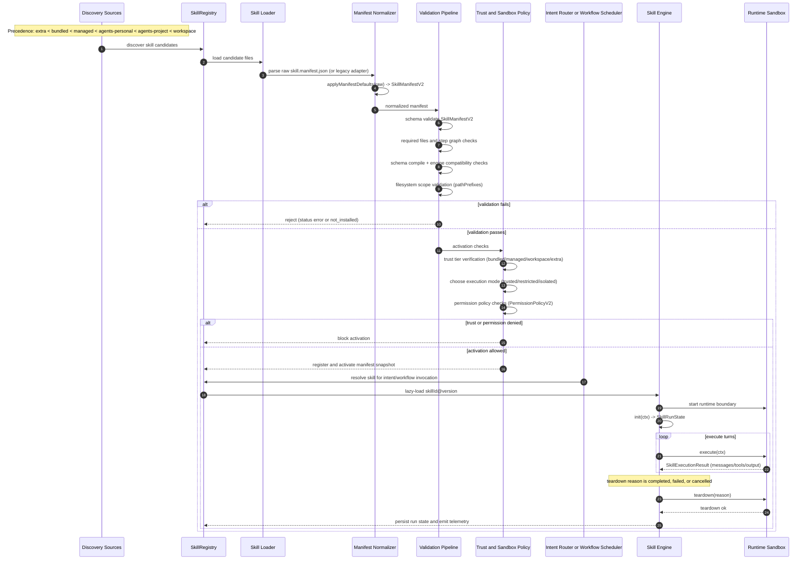
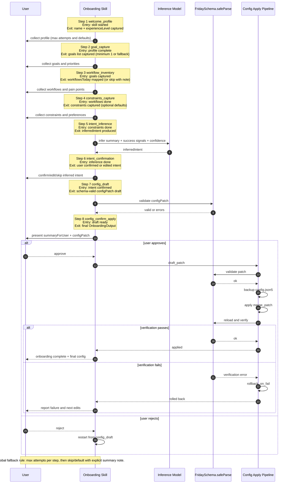
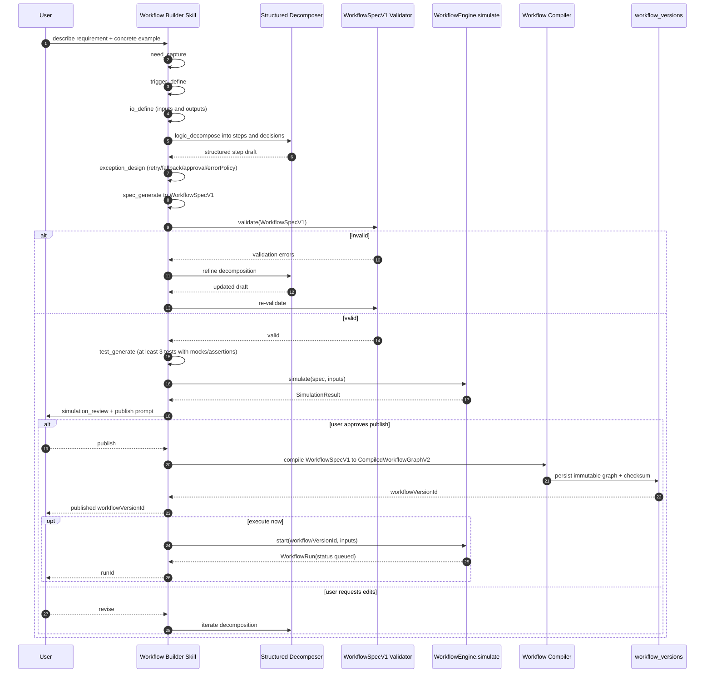
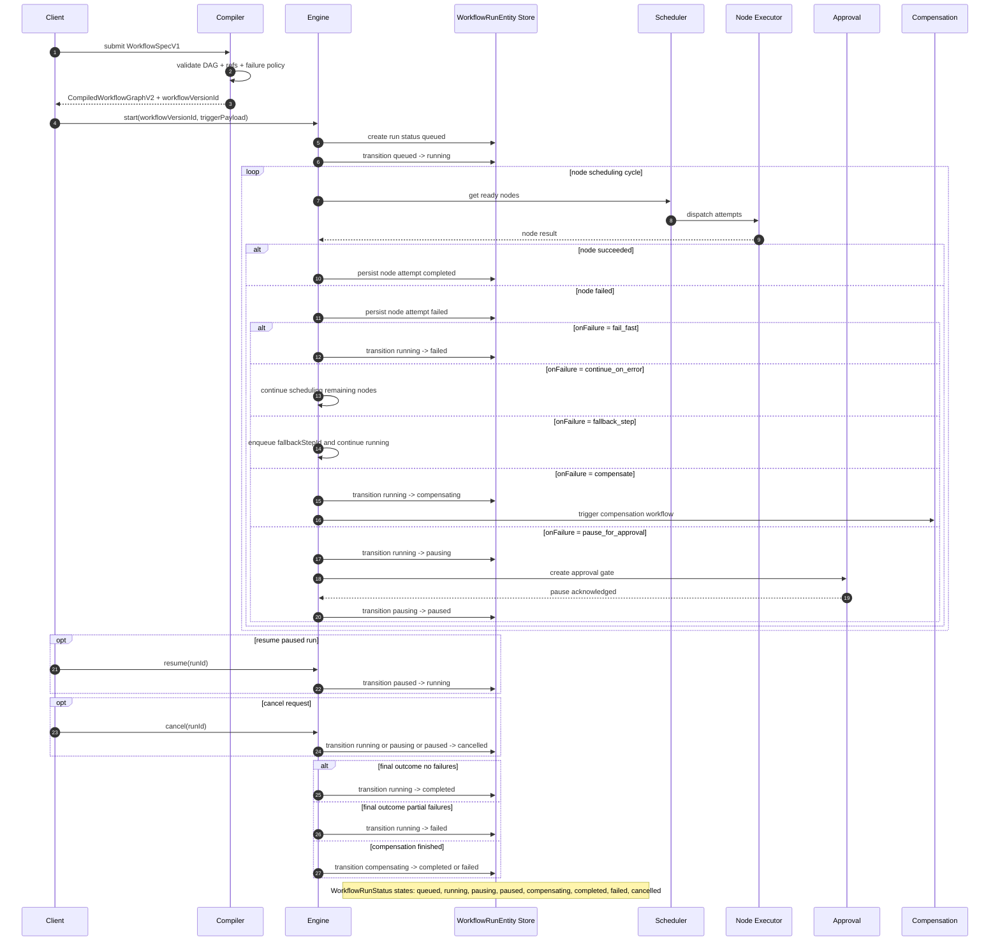
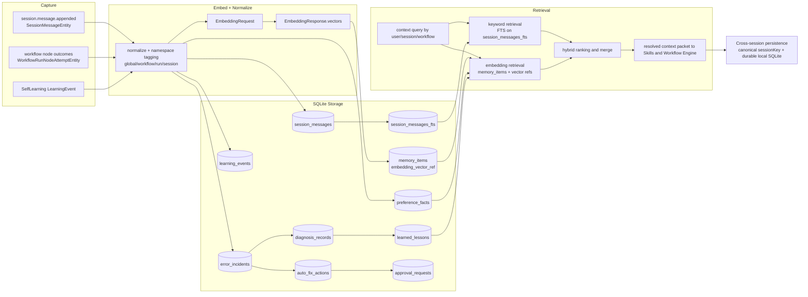
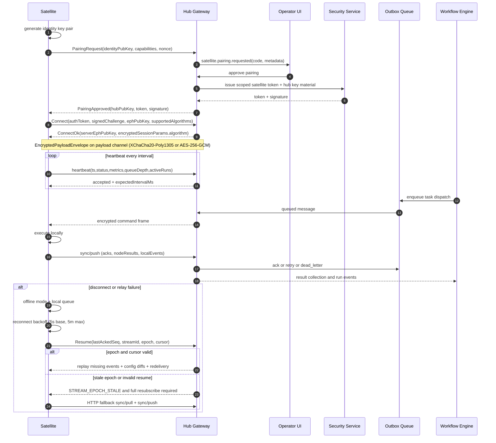
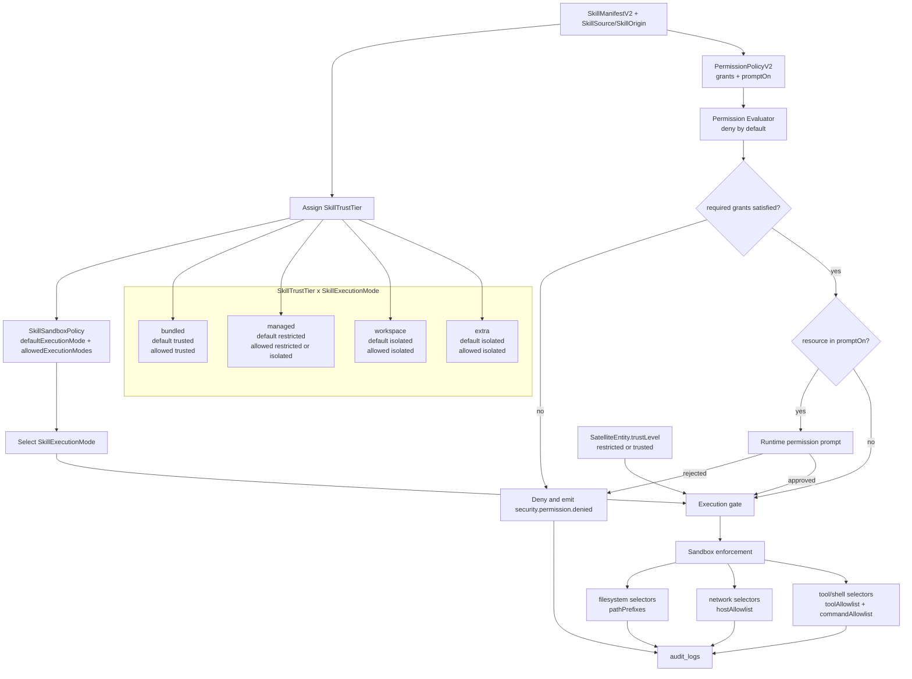
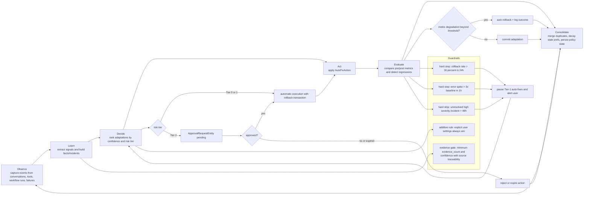

1. **System Architecture Overview**
```mermaid
flowchart LR
  User[User UI<br/>Desktop / Browser / Mobile]
  Marketplace[Marketplace Sources<br/>MarketplaceSourceEntity]

  subgraph Hub[Friday Hub]
    APILayer[API Layer<br/>Gateway Service<br/>REST /v1 + WS /v1/ws]
    HubCore[Hub Core<br/>AuthN/AuthZ + Session Management + Dispatch]
    SkillRegistry[Skill Registry and Skill Store Service<br/>SkillManifestV2 + install/update/verify]
    WorkflowEngine[Workflow Engine<br/>Compile and Validate DAG + Scheduler]
    MemorySystem[Memory and State Service<br/>sessions + memory + diagnosis + audit]
    ConfigSystem[Config Manager<br/>HubSettingsEntity + ConfigRevisionEntity]
    ExtensionSystem[Extension System<br/>Plugin Runtime + Signed UI Modules]
    Queue[Dispatch and Outbox Queue<br/>OutboxMessageEntity]
    SQLite[(SQLite friday.db)]
  end

  subgraph Satellites[Satellites]
    Phone[phone]
    Desktop[desktop]
    RPi[rpi]
    Cloud[cloud-vm]
  end

  User <-->|commands and events| APILayer

  APILayer <--> HubCore
  APILayer <--> SkillRegistry
  APILayer <--> WorkflowEngine
  APILayer <--> MemorySystem
  APILayer <--> ConfigSystem
  APILayer <--> ExtensionSystem

  WorkflowEngine <--> SkillRegistry
  WorkflowEngine <--> MemorySystem
  WorkflowEngine <--> Queue
  ConfigSystem --> Queue
  ExtensionSystem --> SkillRegistry

  APILayer <-->|control + sync (WS/HTTP)| Phone
  APILayer <-->|control + sync (WS/HTTP)| Desktop
  APILayer <-->|control + sync (WS/HTTP)| RPi
  APILayer <-->|control + sync (WS/HTTP)| Cloud

  Queue <--> Phone
  Queue <--> Desktop
  Queue <--> RPi
  Queue <--> Cloud

  Marketplace --> SkillRegistry

  HubCore --> SQLite
  SkillRegistry --> SQLite
  WorkflowEngine --> SQLite
  MemorySystem --> SQLite
  ConfigSystem --> SQLite
  Queue --> SQLite
```
Shows the Hub-centered architecture with all required core systems, extension system, and satellite relationships.

2. **Skill Lifecycle Sequence Diagram**

Shows discovery through teardown, including manifest defaulting, schema validation, trust checks, and runtime execution.

3. **Onboarding Skill Flow**

Shows all onboarding steps with entry/exit criteria and the final config generation/apply/rollback pipeline.

4. **Self-Learning Skill Flow**
```mermaid
flowchart TD
  Event[LearningEvent received] --> Ingest[ingest_event<br/>normalize + dedupe by eventId]
  Ingest --> Extract[signal_extract<br/>deterministic extractSignals(event)]
  Extract --> Route{signal type}

  subgraph Learn["Learn"]
    Route -->|preference or correction| FactUpdate[fact_update<br/>UPSERT preference_facts]
    Route -->|error| Incident[incident_classify<br/>create error_incidents with signature]
    Incident --> Pattern[pattern detection<br/>computeIncidentSignature + recurrence]
    Incident --> Diagnosis[diagnosis_records and learned_lessons update]
  end

  subgraph Fix["Fix"]
    Pattern --> Plan[autofix_plan<br/>create AutoFixAction with riskTier]
    Plan --> Tier{riskTier}
    Tier -->|0 or 1| ExecLow[autofix_execute<br/>auto apply with rollback guard]
    Tier -->|2| Approval[create ApprovalRequestEntity<br/>status pending]
    Approval --> UserGate{approve?}
    UserGate -->|approved| ExecHigh[execute Tier-2 action]
    UserGate -->|rejected or expired| Reject[mark action rejected or expired]
  end

  subgraph Memory["Memory"]
    FactUpdate --> Persist[memory_persist<br/>transactional durable write]
    Diagnosis --> Persist
    ExecLow --> Persist
    ExecHigh --> Persist
    Reject --> Persist
    Persist --> Tables[(SQLite: learning_events, preference_facts, error_incidents, diagnosis_records, learned_lessons, auto_fix_actions, approval_requests)]
    Persist --> Score[quality_score_update<br/>learning_metrics]
  end

  Score --> Loop[Learn/Fix/Memory cycle continues]
  Loop --> Event
```
Shows the end-to-end learning cycle from event ingestion through risk-tiered auto-fix and persistence.

5. **Workflow Builder Skill Flow**

Shows requirement capture to `WorkflowSpecV1`, compilation to `CompiledWorkflowGraphV2`, validation loops, and execution handoff.

6. **Workflow Engine Sequence Diagram**

Shows compile/validate/execute flow, all eight `WorkflowRunStatus` states, and failure policy branching.

7. **Memory System Data Flow**

Shows event capture to embedding/storage and hybrid retrieval, with explicit SQLite tables and cross-session persistence.

8. **Hub-Satellite Communication**

Shows registration, encrypted channel setup, heartbeat, dispatch/result loops, and reconnect/failover behavior.

9. **Permission and Trust Model**

Shows trust tier assignment, permission evaluation, sandbox enforcement, and the trust tier/execution mode matrix.

10. **Self-Evolution Loop**

Shows the full observe-learn-decide-act-evaluate cycle with approval gates and hard-stop guardrails.
