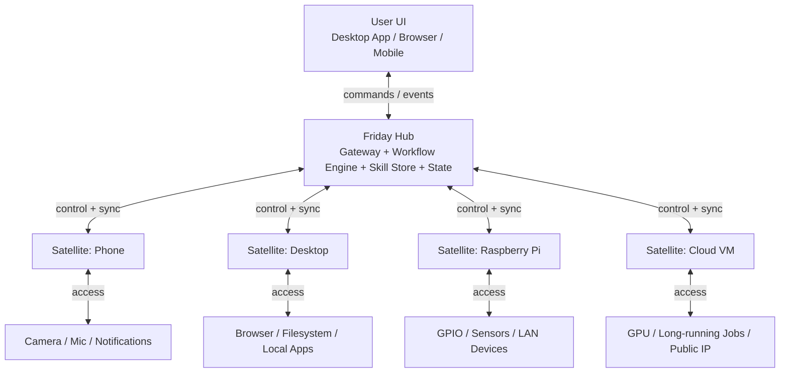
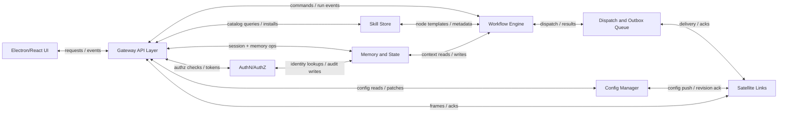
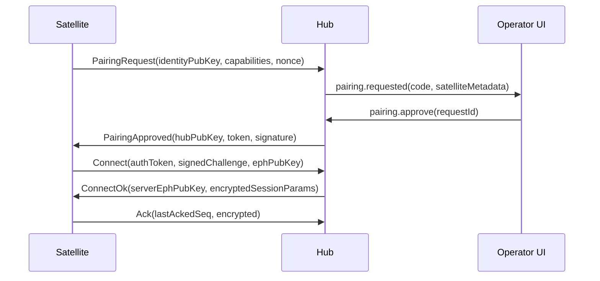
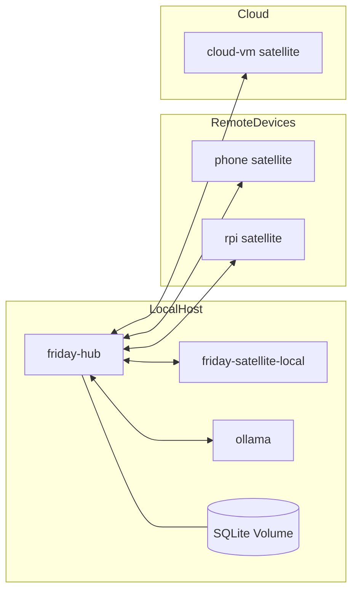

# Friday Distributed Architecture

**Version:** v2.0.2 (CX18 compliance fixes: phantom features, type fidelity, status markers)  
**Date:** 2026-02-20  
**Status:** Design reference — current runtime behavior is bounded by `docs/current-source-of-truth.md`. Items marked `[Planned]` are target behavior not yet implemented; some older sections are retained as historical or deferred design.

> **Authority note:** This document is no longer the active delivery contract by itself. When it conflicts with current runtime behavior, [current-source-of-truth.md](./current-source-of-truth.md) wins.

---

## 0.1 Documentation Authority Matrix

This section defines which document is authoritative for each concept shared between `distributed-architecture.md` and `skill-system-design.md`. When the two documents cover the same topic, the authoritative document's definition takes precedence.

| Concept | Authoritative Doc | Reason |
| --- | --- | --- |
| Hub/satellite topology, transport, auth, deployment | `distributed-architecture.md` | System-level runtime architecture belongs in platform spec. |
| Runtime entity model and SQLite core schema | `distributed-architecture.md` | Single runtime DB/API contract must be centralized. |
| Skill package layout and legacy `SKILL.md` migration flow | `skill-system-design.md` | Authoring/discovery workflow is defined there with concrete migration steps. |
| Canonical skill manifest schema (post-merge) | `distributed-architecture.md` | Manifest is consumed by runtime, scheduler, marketplace, UI. |
| Manifest defaulting and legacy adapters | `skill-system-design.md` | This doc already defines loader/defaulting behavior in detail. |
| Manifest filename/versioning policy | `skill-system-design.md` | Loader, watcher, migration CLI behavior is already explicit there. |
| Skill invocation runtime (intent + workflow dual-mode) | `distributed-architecture.md` | Runtime dispatch semantics belong in execution architecture. |
| Permission canonical IR | `distributed-architecture.md` | Security enforcement must be owned by runtime/security model. |
| Workflow authoring DSL (`WorkflowSpecV1`) | `skill-system-design.md` | Builder skill and simulation contract are authoring-side. |
| Compiled workflow graph IR and scheduler contract | `distributed-architecture.md` | Executor/scheduler consumes compiled graph. |
| Workflow run statuses and lifecycle transitions | `distributed-architecture.md` | Status enums drive API/UI/runtime state machines. |
| Workflow version/run identity model | `distributed-architecture.md` | Immutable version pinning is storage/runtime concern. |
| Unified failure policy semantics | `distributed-architecture.md` | Execution behavior must be normalized where scheduling occurs. |
| DAG validation contract (including cycle detection) | `distributed-architecture.md` | Engine validation rules are runtime guarantees. |
| Learning data semantics (events/facts/incidents/autofix) | `skill-system-design.md` | Domain behavior and governance are specified there. |
| Learning/approval persistence DDL (post-merge) | `distributed-architecture.md` | Final DB schema authority must be singular. |
| Skill source taxonomy + precedence crosswalk | `skill-system-design.md` | Source precedence/discovery details already live there. |
| Trust tiers + sandbox execution modes | `distributed-architecture.md` | Enforcement and policy execution belong to runtime doc. |
| Unified implementation roadmap | `distributed-architecture.md` | Cross-team phase plan should be owned by platform roadmap. |
| Extension/plugin terminology glossary | `distributed-architecture.md` | Global naming standard should live in platform glossary. |
| Formatting standards for design docs | `distributed-architecture.md` | One style authority for all design specs. |
| Agent runtime architecture and API surface | `distributed-architecture.md` | Runtime execution belongs in platform spec. |
| Channel system registry and adapters | `distributed-architecture.md` | Runtime plugin lifecycle belongs in platform spec. |
| Subagent orchestration and guardrails | `distributed-architecture.md` | Execution constraints belong in runtime spec. |
| Browser automation runtime | `distributed-architecture.md` | Runtime resource management belongs in platform spec. |
| XHS automation integration | `distributed-architecture.md` | Platform-specific integration module. |
| Plugin system (distinct from skills) | `distributed-architecture.md` | Runtime plugin lifecycle belongs in platform spec. |
| Skill authoring/conversion runtime | `distributed-architecture.md` | Runtime tooling belongs in platform spec. |
| Memory guard and PII scanning | `distributed-architecture.md` | Security enforcement belongs in runtime spec. |
| Path and input safety utilities | `distributed-architecture.md` | Security enforcement belongs in runtime spec. |

---

## 0.2 Terminology Glossary

| Term | Definition |
| --- | --- |
| **Extension** | An installable package that adds capabilities to Friday (skills, channels, providers). This is the user-facing distribution term. |
| **Plugin runtime** | The internal loader/runtime module that discovers, validates, and activates extensions. Code paths like `src/plugins/*` and config keys like `openclaw.plugin.json` refer to the internal runtime, not the user-facing concept. |

> **Convention:** All user-facing documentation, UI labels, and CLI output use "extension." Internal code paths and config file names may retain "plugin" where renaming would break compatibility.

---

## 0.3 Implementation Status Markers

This SSD uses explicit implementation markers:

- `[Implemented]` — behavior exists in the current codebase.
- `[Partial]` — some behavior exists, but not the full design intent.
- `[Planned]` — intentionally documented target behavior that is not currently implemented.

Rule: all endpoint rows in §11 and all major subsystem bullets in §2–§10 must include one of these markers.

---

## 1. System Overview

### 1.1 Hub and Satellite Architecture

Friday uses a **Hub + Satellite** topology:

- **Hub (Center):** coordination brain, state authority, workflow orchestration, API surface, UI backend.
- **Satellites (Execution Nodes):** execute tasks close to local resources (phone sensors, desktop apps, GPIO, cloud compute).
- **Design rule:** planning and global state live in Hub; execution happens where the required capability exists.



### 1.2 How Friday Differs from Clawdbot Architecturally

| Area | Clawdbot (base) | Friday target architecture |
| --- | --- | --- |
| Primary interface | CLI-first | Visual-first (React Flow + Electron) |
| Runtime model | Single gateway process with channels/tools | Distributed Hub + multiple Satellites |
| Orchestration | Agent-turn oriented | Persistent DAG workflow engine |
| Skill metadata | `SKILL.md` text-centric | `skill.manifest.json` (schemaVersion: "2.0") with UI + execution + permission metadata |
| Config model | File-driven config + runtime overrides | Config service with SQLite authority + versioned updates |
| State storage | Mixed JSON/JSON5/session files | Unified SQLite event/state model (local-first) |
| Connectivity | Gateway-centric transport | Real-time WS + fallback HTTP sync + offline queueing |
| Device trust | Pairing primitives exist | Strong paired-device trust + role/scoped tokens + E2E satellite channel |
| Learning loop | Ad-hoc logs and errors | Structured diagnosis + lesson memory + routing feedback |

> **Note:** Filename is always `skill.manifest.json`; versioning is only via the `schemaVersion` field inside the file.

### 1.3 Design Principles

| Principle | Architectural implications |
| --- | --- |
| Local-first | Hub state in local SQLite, offline operation, cloud optional |
| Privacy by default | Data minimization, local model routing first, encrypted links and secrets |
| Visual-first | Workflow graph is first-class model, API mirrors graph semantics |
| Extensible core | Skills, providers, channels, and satellite capability extensions |
| Deterministic orchestration | Workflow version pinning, immutable run records, idempotent execution |
| Failure-tolerant | Retry policy, lease recovery, outbox queues, reconnect diff sync |

---

## 2. Hub (Center) Architecture

### 2.1 Core Services Breakdown

[Implemented]

| Service | Responsibility | Input | Output | Persistence |
| --- | --- | --- | --- | --- |
| Gateway Service | Unified API ingress, session transport, auth gate, event fanout | REST/WS traffic, satellite link frames | Validated commands/events | SQLite + in-memory connection maps |
| Workflow Engine | Compile/validate DAG, schedule nodes, manage run state | Workflow definitions, triggers, events | Run plans, node dispatches, run events | SQLite (`workflow_*` tables) |
| Skill Store Service | Skill catalog, install/update/uninstall, manifest validation | Marketplace metadata, local packages | Installed skill artifacts + node templates | SQLite + local skill artifact dir |
| Config Manager | Typed config CRUD, versioning, rollout to satellites | UI/API config changes | Versioned config snapshots + patches | SQLite (`hub_settings`, `config_revisions`) |
| Memory and State Service | Sessions, messages, embeddings, diagnosis lessons, audit logs | Runtime events and AI outcomes | Queryable context and learning memory | SQLite (`sessions`, `memory`, `diagnosis`, `audit`) |
| Security Service | Identity, pairing, token issuance, policy checks | Auth headers, signatures, scopes | Access decisions + signed session keys | SQLite (`users`, `tokens`, `pairing`, `secrets`) |

### 2.2 Hub Internal Component Topology

[Implemented]



### 2.3 API Layer Design (REST + Realtime Pull/Ack)

`[Implemented]` REST API (`/v1/*`) is the active transport for CRUD, orchestration, and realtime pull/ack flows.

`[Implemented]` Realtime delivery currently uses:
- `POST /v1/realtime/subscriptions`
- `POST /v1/realtime/pull`
- `POST /v1/realtime/ack`
- `GET /v1/agent/runs/:runId/events` (SSE stream for agent runs)

`[Implemented]` `/v1/ws` now exists as a compatibility websocket alias over `/v1/realtime/ws`; it is not the canonical transport contract.

`[Historical design]` Active `req/res/event` gateway transport as the primary runtime transport. Current steady-state transport uses `/v1/realtime/*`, with `/v1/realtime/ws` as the canonical websocket bridge and `/v1/ws` retained only for compatibility.

### 2.4 Database Architecture (SQLite local-first)

[Partial]

- Engine: SQLite 3.45+.
- Journal mode: WAL.
- Sync mode: `NORMAL` by default, `FULL` for explicit backup checkpoints.
- DB path: `${resolveStateDir()}/friday.db` (resolved at runtime; defaults to `~/.friday/state` but respects `FRIDAY_STATE_DIR` env and platform conventions).
- Read model: one write connection + read pool.
- Consistency model: Hub is single-writer authority; satellites sync through event + outbox protocol.
- Backup model: [Planned] incremental snapshots + encrypted export bundle.

### 2.5 Session Management Across Satellites

**Session key format (canonical):** `[Implemented]`

- Conversation session key: `<channel>:<accountId>:<chatId>`
- Subagent session key: `subagent:<parentKey>:<taskId>`

> The canonical parser (`parseFridaySessionKey`) and builder (`buildFridaySubagentSessionKey`) both use the `subagent:<parentKey>:<taskId>` format (constant: `FRIDAY_SESSION_SUBAGENT_PREFIX = "subagent"`). No `:sub:` prefixed keys are emitted by current code.

Examples:
- `telegram:default:123456`
- `discord:acct-1:889977`
- `subagent:discord:acct-1:889977:task-abc`

Normalization rules:
- Keys are lowercased and segment-sanitized.
- DM collapsing is supported by mapping DM user identity into `chatId` when `chatKind=dm`.

**Ownership model:** `[Deferred]`

> Lease reassignment, lease epochs, and the richer ownership model below remain deferred architectural design. The current runtime does not enforce them as a steady-state session authority.

- Session has `owner_satellite_id` lease.
- Lease TTL default: 60s.
- Each lease assignment increments a monotonic `lease_epoch` (integer, persisted in `sessions` table).
- Owner satellite renews lease via heartbeat, including current `lease_epoch`.
- All writes and acks on the session **must** include the holder's `lease_epoch`; the Hub rejects operations bearing a stale epoch.
- If lease expires, Hub reassigns based on capability and affinity, bumping `lease_epoch` and invalidating the prior holder.

**Conflict rules:**

- Hub assigns final sequence numbers to session messages.
- Offline satellites may append provisional messages with `client_local_seq`.
- `idempotency_key` is enforced unique per session: `UNIQUE(session_id, idempotency_key)` in DDL.
- On insert, if the unique constraint fires the Hub returns the existing message (idempotent 200), preventing duplicates.
- Reconcile on reconnect:
  - if `idempotency_key` matches existing message, dedupe (guaranteed by unique index).
  - if payload differs with same key, mark `conflict` and emit operator event.
  - order is finalized by Hub sequence.

### 2.6 Authentication and Authorization Model

**Principal types:**

- `user` (human operator)
- `satellite` (paired device runtime)
- `service` (internal job or extension service)
- `workflow-runner` (ephemeral scoped execution principal)

**Auth mechanisms:**

- User: local password/session token + optional OS biometric unlock in UI.
- Satellite: pairing code + key proof + scoped device token.
- Service: signed internal token with short TTL.

**Brute-force and rate-limit policy:**

- `[Implemented]` Per-IP throttle: max 10 failed auth attempts per 5-minute window; exceeded → 429 + `Retry-After` header.
- `[Deferred]` Per-principal throttle: max 5 failed auth attempts per 5-minute window; exceeded → temporary lockout (15 min). (Code currently implements per-IP rate limiting only; no per-principal lockout state machine.)
- `[Deferred]` Lockout escalation: 3 consecutive lockout windows → 1-hour lockout + `security.auth.lockout_escalated` audit event. (Not implemented; no lockout state machine or escalation policy.)
- `[Implemented]` Pairing code attempts: max 5 per pairing request; exceeded → request auto-expired.
- `[Planned]` Failed auth and lockout audit logging: events written to `audit_logs` with `action = 'security.auth.failed'` / `'security.auth.lockout'`. (Not yet implemented; no audit writes in auth flow.)
- Rate-limit counters are held in-memory with periodic flush; Hub restart resets counters (acceptable for local-first single-user model).

**Scopes:** `[Implemented]`

- `hub.admin`
- `workflow.read`, `workflow.write`, `workflow.run`, `workflow.conflict.resolve`
- `satellite.read`, `satellite.write`
- `fleet.read`
- `security.read`, `security.write`
- `session.read`, `session.write`
- `diagnosis.read`, `diagnosis.write`
- `skill.read`, `skill.write`
- `plugin.read`, `plugin.write`, `plugin.install`

`[Planned]` dedicated `secrets.*` scopes.

### 2.7 Agent Runtime

`[Implemented]` `src/agent/*` provides a persisted agent execution runtime with phases:
`pending -> planning -> executing -> testing -> completed|failed|cancelled`.

> `fixing` and `failed_tests` are declared in the `FridayAgentRunStatus` type union but are never set by the runtime. `[Planned]`

`[Implemented]` Core capabilities:
- LLM streaming client integration
- tool orchestration (exec/filesystem/web-fetch/browser/skills/workflows/memory/xhs/subagent)
- review gate support
- self-test service
- `[Partial]` self-fix service — `FridayAgentSelfFixService` exists (`src/agent/testing/`) but is not wired into the agent runtime retry loop.
- artifact writing to disk
- durable run/event persistence (`friday_agent_runs`, `friday_agent_run_events`)
- automation persistence/execution (`friday_agent_automations`)

`[Implemented]` API surface is under `/v1/agent/*`, with SSE stream at `/v1/agent/runs/:runId/events`.

### 2.8 Channel System

`[Implemented]` Channel registry/runtime exists in `src/channels/*`:
- plugin lifecycle register/start/stop/send
- allowlist filtering by user/chat
- inbound text sanitization (control char + zero-width stripping)

`[Implemented]` Channel adapters currently include:
- QQ
- Lark
- Feishu (Lark variant)

`[Implemented]` Hub bootstrap wires channel inbound messages to agent runtime and writes replies back through channel plugins.

---

## 3. Satellite Architecture

### 3.1 Satellite Types

[Partial]

| Type | Typical host | Strengths | Constraints |
| --- | --- | --- | --- |
| `phone` | iOS/Android companion | camera, mic, push notifications, location | battery, background limits |
| `desktop` | macOS/Windows/Linux | browser automation, file workflows, local apps | not always online |
| `rpi` | Raspberry Pi / edge Linux | GPIO/sensors, always-on home automation | limited CPU/RAM |
| `cloud-vm` | VPS/K8s node | uptime, high compute, public connectivity | lower privacy, network dependency |

### 3.2 Registration and Discovery Protocol

`[Implemented]` Satellite pairing/handshake services exist in runtime services (pairing request, approval/rejection, token issuance, handshake algorithm negotiation). (`src/satellites/services/friday-satellite-pairing-service.ts`)

`[Implemented]` API-exposed satellite registration, pairing, heartbeat, sync, command, and event endpoints now exist in the HTTP route set.

`[Deferred]` mDNS, Tailscale/private mesh discovery, and relay rendezvous patterns.

`[Implemented]` Current discovery baseline is: static peers, registered satellites, and the trust-scored fleet directory. Anything richer than that is deferred.

`[Implemented]` Fleet read APIs exist at `/v1/fleet/*` for dashboard/inspection.

**NAT traversal and outbound-only connections (`[Historical design]` for richer discovery/federation paths):**

- All satellite-to-Hub connections are **outbound-initiated** (satellite dials Hub), so satellites behind NAT/firewall require no port forwarding.
- `[Deferred]` If Hub is also behind NAT, richer rendezvous/relay patterns are future design options rather than part of today's product boundary:
  1. **Tailscale / WireGuard mesh**: both Hub and satellite join same private mesh; connection uses stable mesh IPs.
  2. **Cloud relay**: a lightweight relay service on a public VPS forwards encrypted frames between Hub and satellite (relay sees only ciphertext).
  3. **TURN-style relay**: satellites connect to a TURN-like relay endpoint; Hub registers as listener; relay brokers the bidirectional channel.
- `[Deferred]` Relay/rendezvous fallback behavior described below is target behavior only. Today's active fleet baseline is limited to static peers, registered satellites, the trust-scored fleet directory, and bounded recovery of already-dispatched work.

**Registration flow (`[Historical design]` reference):**

1. Satellite generates long-term identity key pair.
2. Satellite opens WS to Hub and requests pairing.
3. Hub creates pending pairing request + short pairing code.
4. Operator approves pairing in UI.
5. Hub issues scoped satellite token + initial config revision.
6. Satellite enters `paired` then `online` state and begins heartbeat + capability reporting.

### 3.3 Local Execution Engine

`[Implemented]` Current satellite runtime covers:
- pairing lifecycle
- capability reporting
- heartbeat recording/status computation
- outbox leasing/ack checkpointing
- sync pull/push services

`[Planned]`:
- full satellite-side workflow task runner
- dedicated security agent/telemetry agent modules as described in earlier target architecture

### 3.4 Capability Reporting

[Partial]

Capabilities are structured and versioned so scheduling can be deterministic.

```ts
export interface SatelliteCapabilityReport {
  satelliteId: string;
  revision: number;
  generatedAt: string;
  runtime: {
    os: string;
    arch: string;
    appVersion: string;
    nodeVersion: string;
  };
  capabilities: Array<{
    key: string;
    available: boolean;
    metadata?: Record<string, unknown>;
    limits?: {
      maxConcurrency?: number;
      timeoutMs?: number;
      maxPayloadBytes?: number;
    };
  }>;
}
```

### 3.5 Offline Autonomy

`[Planned]` Autonomous satellite workflow execution while disconnected (`offline_allowed` run continuation) is documented target behavior, but not currently wired as an end-to-end execution pipeline.

**Target behavior when disconnected:**

- satellite keeps executing workflows flagged as `offline_allowed`.
- local queue stores pending inbound commands and outbound results.
- secrets remain local and encrypted.
- local triggers (cron, sensor, file watcher) continue and generate deferred events.

When a command is not offline-safe:

- node status becomes `blocked_offline`.
- run pauses at barrier node.
- user sees pending indicator in UI timeline.

### 3.6 Reconnection and State Sync

`[Implemented]` Sync pull currently returns:
- `epoch`
- `streamId`
- `events` (currently empty array in service)
- `queueItems` (leased outbox items)
- `nextCursor`
- `fullPullRequired` when resume/cursor validation fails

`[Implemented]` Sync push currently accepts:
- `acks[]`
- optional `localEvents[]`
and returns:
- `acceptedAcks[]`
- `conflicts[]`

`[Planned]` pull `configDiff` and push `nodeResults` conflict semantics from earlier SSD draft.

Conflict policy:

- workflow definitions: optimistic concurrency (`revision` + `etag`); both fields are required on update requests and stored in the `workflows` table.
- run state: Hub authoritative
- local task results: accepted only with matching `attemptId` (explicit UUID, distinct from the ordinal `attempt` number) and `idempotency_key`; Hub rejects results whose `attemptId` does not match the current outstanding attempt.

### 3.7 Browser Automation Runtime

`[Implemented]` Playwright browser manager exists in `src/browser/friday-browser-manager.ts`.

Capabilities:
- session/tab lifecycle management
- per-session and global page limits
- navigation/action timeouts
- origin allowlisting for URL safety checks
- artifact path sanitization for browser artifacts

---

## 4. Communication Protocol

### 4.1 WebSocket Real-time Protocol

[Partial]

```ts
export type WsFrame = WsReqFrame | WsResFrame | WsEventFrame | WsAckFrame | WsResumeFrame;

export interface WsReqFrame {
  type: "req";
  id: string;
  method: string;
  params?: unknown;
  idempotencyKey?: string;
  traceId?: string;
}

export interface WsResFrame {
  type: "res";
  id: string;
  ok: boolean;
  payload?: unknown;
  error?: {
    code: string;
    message: string;
    details?: unknown;
    retryable?: boolean;
    retryAfterMs?: number;
  };
}

export interface WsEventFrame {
  type: "event";
  event: string;
  seq: number;
  payload?: unknown;
  stateVersion?: {
    config: number;
    workflow: number;
    session: number;
    health: number;
  };
  emittedAt: string;
}

export interface WsAckFrame {
  type: "ack";
  seq: number;
  streamId: string;
  epoch: number;
  emittedAt: string;
}

export interface WsResumeFrame {
  type: "resume";
  lastAckedSeq: number;
  streamId: string;
  epoch: number;
  cursor: string; // HMAC-signed cursor: base64(seq + streamId + epoch + hmac)
  subscriptions: string[];
  emittedAt: string;
}
```

**Resume/ack validation rules:**

- `streamId` identifies the logical event stream (e.g., `run:<runId>`, `session:<sessionId>`, `satellite:<satelliteId>`).
- `epoch` is a monotonic counter incremented on each Hub restart or stream reset; it prevents stale clients from resuming into a new stream generation.
- `cursor` is an HMAC-SHA256 signed token encoding `(seq, streamId, epoch)` with a Hub-held secret. The Hub verifies the MAC before honoring a resume; tampered or forged cursors are rejected with `AUTH_UNAUTHORIZED`.
- **Restart invalidation:** when the Hub restarts it increments the global epoch; any resume frame bearing a prior epoch receives a `STREAM_EPOCH_STALE` error, forcing the client to re-subscribe from the latest checkpoint or perform a full pull.

### 4.2 Core Event Classes

[Partial]

- System events: `system.hello`, `system.health`, `system.shutdown`.
- Satellite events: `satellite.pairing.requested`, `satellite.online`, `satellite.offline`, `satellite.capability.updated`.
- Workflow events: `workflow.run.started`, `workflow.node.started`, `workflow.node.completed`, `workflow.run.failed`.
- Session events: `session.updated`, `session.message.appending` _(internal-only hook, not broadcast over WS)_, `session.message.appended`.
- Skill events: `skill.installed`, `skill.updated`, `skill.uninstalled`.
- Security events: `security.token.rotated`, `security.satellite.revoked`.
- Queue events: `queue.enqueued`, `queue.acked`, `queue.failed`, `queue.expired`, `queue.dead_letter`.

### 4.3 HTTP Fallback API

`[Planned]` Used when WS is unavailable or blocked. These endpoints are not yet registered in the route set (see §11.1.3):

- `POST /v1/satellites/:satelliteId/sync/pull` for event and config diff batches.
- `POST /v1/satellites/:satelliteId/sync/push` for local result and heartbeat upload.
- `POST /v1/satellites/:satelliteId/commands/submit` for command dispatch with polling token.
- `GET /v1/satellites/:satelliteId/commands/:commandId` for async command status.
- `GET /v1/satellites/:satelliteId/events/poll?cursor=...` for long-poll event feed.

### 4.4 End-to-End Encryption Design

`[Implemented]` Handshake negotiates payload algorithm (`xchacha20-poly1305` preferred, fallback `aes-256-gcm`).

`[Implemented]` Outbox payload storage currently carries `payloadCiphertext`, `nonce`, and `keyId`.

`[Planned]` Full per-frame SSD envelope contract with explicit `algorithm/nonce/aad` fields on every sync DTO plus documented key-rotation policy at transport-frame level.

Transport TLS is mandatory; Hub-Satellite payload channel is additionally E2E encrypted.

**Key model:**

- Hub static key pair (Ed25519 identity + X25519 agreement).
- Satellite static key pair.
- Ephemeral session keys rotated every 24h or 10k frames.
- Payload encryption: `XChaCha20-Poly1305` (preferred) or `AES-256-GCM` (where hardware acceleration preferred).
- Algorithm is negotiated during handshake: satellite advertises supported algorithms in `Connect` frame; Hub selects the strongest mutually-supported algorithm and returns it in `ConnectOk.encryptedSessionParams.algorithm`.
- Envelope `algorithm` field records the negotiated algorithm for each frame, enabling mixed-version interop.

**Handshake (paired satellite):**



**Encrypted payload envelope (target contract):**

```ts
export interface EncryptedPayloadEnvelope {
  keyId: string;
  algorithm: "xchacha20-poly1305" | "aes-256-gcm";
  nonce: string;
  ciphertext: string;
  aad: {
    seq: number;
    eventOrMethod: string;
    traceId?: string;
  };
}
```

### 4.5 Heartbeat and Health Monitoring

`[Implemented]` Default expected heartbeat interval is `15000ms` (15s), returned by heartbeat API/service responses.

Heartbeat interval: 15s (satellite configurable 5-30s).  
Status transitions:

- `online`: heartbeat in <30s
- `degraded`: 30-90s or high failure rate
- `offline`: >90s or explicit disconnect

Health payload includes:

- CPU/memory/load
- queue depth
- active run count
- last successful command timestamp
- provider connectivity (if local provider attached)

### 4.6 Message Queue for Offline Satellites

[Planned]

Queue semantics:

- at-least-once delivery
- idempotency keys for exactly-once effects in executors
- exponential retry with jitter
- dead-letter after max attempts or TTL expiry

**Canonical queue state machine** (authoritative for all enums, events, and DDL):

```text
queued → leased → acked
           ↓
         failed → (retry) → queued
           ↓
     dead_letter
queued → expired (TTL exceeded before lease)
```

Queue states:

- `queued` — enqueued, awaiting lease
- `leased` — satellite has taken delivery; lease TTL active
- `acked` — satellite confirmed processing complete (terminal success)
- `failed` — attempt failed; may be retried back to `queued` or escalated
- `dead_letter` — max attempts or non-retryable failure (terminal failure)
- `expired` — TTL expired before successful ack (terminal)

> **Note:** `delivered` is **not** a valid queue state. Prior references to `delivered` are replaced by the `leased` → `acked` transition. The corresponding event is `queue.acked` (not `queue.delivered`).

---

## 5. Workflow Engine

### 5.1 Node Types

[Implemented]

| Node Type | Purpose | Examples |
| --- | --- | --- |
| `trigger` | Start run on external/internal event | cron, webhook, message, file change |
| `action` | Perform side-effect or operation | run skill, send message, call API |
| `condition` | Branching and filtering | if/else, switch, filter |
| `data` | Transform/state operation | set var, map, merge, template |
| `ai` | LLM-powered reasoning/transformation | classify, extract, summarize, plan |
| `approval` | Human-in-the-loop gate | approve/reject with timeout |

### 5.2 Execution Model

[Implemented]

- Workflow graph is compiled into DAG.
- Validation is strictly acyclic in V1. All workflow graphs must pass cycle detection before execution. Explicit loop constructs may be introduced in a future version with bounded iteration policy.
- Topological sort defines readiness.
- Nodes without dependencies can run in parallel.
- Barrier nodes wait for all inbound branches.
- Node outputs are immutable run artifacts.

**Cycle detection (required validation):**

```ts
function assertAcyclic(stepIds: string[], edges: Array<{ from: string; to: string }>): void {
  const graph = new Map<string, string[]>();
  const visiting = new Set<string>();
  const visited = new Set<string>();

  for (const id of stepIds) graph.set(id, []);
  for (const e of edges) graph.get(e.from)?.push(e.to);

  function dfs(node: string): void {
    if (visiting.has(node)) throw new Error(`WORKFLOW_CYCLE_DETECTED:${node}`);
    if (visited.has(node)) return;
    visiting.add(node);
    for (const next of graph.get(node) ?? []) dfs(next);
    visiting.delete(node);
    visited.add(node);
  }

  for (const id of stepIds) dfs(id);
}
```

**Unified failure policy:**

```ts
export type WorkflowFailureStrategy =
  | "fail_fast"
  | "continue_on_error"
  | "fallback_step"
  | "compensate"
  | "pause_for_approval";

export interface WorkflowFailurePolicyV2 {
  onFailure: WorkflowFailureStrategy;
  fallbackStepId?: string;
  compensationWorkflowId?: string;
  notifyUser: boolean;
}
```

**Compatibility mapping from legacy strategy names:**

| Legacy name | Canonical name |
| --- | --- |
| `stop` | `fail_fast` |
| `continue` | `continue_on_error` |
| `fallback` | `fallback_step` |
| `compensate` | `compensate` (unchanged) |
| `pause_for_approval` | `pause_for_approval` (unchanged) |

**Unified workflow run status enum (authoritative):**

> **Reconciliation note:** `friday-workflow.types.ts` defines `WorkflowRunStatus` with 8 values (below). `friday-workflow-engine.types.ts` defines a separate `FridayWorkflowRunStatus` with 6 values: `"pending" | "running" | "paused" | "completed" | "failed" | "cancelled"` (missing `queued`, `pausing`, `compensating`; adds `pending`). The engine type is used for checkpoint/run-state tracking. The authoritative union below is the superset used by the run entity and API.

```ts
export type WorkflowRunStatus =
  | "queued"
  | "running"
  | "pausing"       // transitional: pause requested but nodes still draining
  | "paused"        // terminal-pause: all nodes quiesced
  | "compensating"  // compensation workflow in progress
  | "completed"
  | "failed"
  | "cancelled";
```

**Execution implementation:**

```ts
export interface NodeOutcome {
  nodeId: string;
  status: "completed" | "failed" | "cancelled";
  error?: { code: string; message: string };
}

export async function executeWorkflowRun(runId: string): Promise<void> {
  const plan = await loadCompiledPlan(runId);
  const strategy: WorkflowFailureStrategy = plan.failurePolicy?.onFailure ?? "fail_fast";
  const ready = new Set(plan.initialNodes);
  const finished = new Set<string>();
  const outcomes: NodeOutcome[] = [];
  let aborted = false;

  while (ready.size > 0 && !aborted) {
    const batch = [...ready];
    ready.clear();

    const batchResults = await Promise.allSettled(
      batch.map(async (nodeId) => {
        const node = plan.nodes[nodeId];
        const target = await selectExecutionTarget(node, plan.context);
        await runNodeAttempt(runId, node, target);
        return nodeId;
      }),
    );

    for (let i = 0; i < batchResults.length; i++) {
      const result = batchResults[i];
      const nodeId = batch[i];
      if (result.status === "fulfilled") {
        finished.add(nodeId);
        outcomes.push({ nodeId, status: "completed" });
      } else {
        const err = result.reason;
        outcomes.push({
          nodeId,
          status: "failed",
          error: {
            code: err?.code ?? "NODE_EXECUTION_FAILED",
            message: String(err?.message ?? err),
          },
        });
        if (strategy === "fail_fast") {
          aborted = true;
          break;
        }
        if (strategy === "pause_for_approval") {
          await finalizeRun(runId, "paused", outcomes);
          return;
        }
        if (strategy === "compensate") {
          await triggerCompensation(runId, nodeId);
        }
        if (strategy === "fallback_step") {
          await executeFallbackStep(runId, plan.failurePolicy.fallbackStepId!);
        }
        // "continue_on_error": keep going
      }
    }

    if (!aborted) {
      for (const nodeId of batch) {
        if (!finished.has(nodeId)) continue;
        for (const next of plan.outbound[nodeId] ?? []) {
          if (allInboundFinished(next, finished, plan.inbound)) {
            ready.add(next);
          }
        }
      }
    }
  }

  const computedStatus = computeRunStatus(outcomes, strategy, aborted);
  await finalizeRun(runId, computedStatus, outcomes);
}

function computeRunStatus(
  outcomes: NodeOutcome[],
  strategy: WorkflowFailureStrategy,
  aborted: boolean,
): WorkflowRunStatus {
  const hasFailed = outcomes.some((o) => o.status === "failed");
  if (!hasFailed) return "completed";
  if (strategy === "compensate") return "compensating";
  if (aborted) return "failed";
  // continue_on_error: partial failures
  return "failed";
}
```

### 5.2.1 Compiled Workflow Graph IR

[Implemented]

The workflow engine operates on a compiled graph IR, not the authoring DSL directly. The `WorkflowSpecV1` (defined in `skill-system-design.md`) is the authoring input; the compiler produces `CompiledWorkflowGraphV2` for execution.

```ts
export type JsonPrimitive = string | number | boolean | null;
export type JsonValue = JsonPrimitive | JsonValue[] | { [key: string]: JsonValue };

export type WorkflowNodeType = "trigger" | "action" | "condition" | "data" | "ai" | "approval";

export interface WorkflowNode {
  id: string;
  type: WorkflowNodeType;
  label: string;
  config: Record<string, JsonValue>;
  retryPolicy?: {
    maxAttempts: number;
    backoff: "none" | "fixed" | "exponential";
    baseDelayMs: number;
    maxDelayMs: number;
    retryOn: string[];
  };
  timeoutMs?: number;
}

export interface WorkflowEdge {
  id: string;
  sourceNodeId: string;
  sourcePort?: string;
  targetNodeId: string;
  targetPort?: string;
  condition?: string;
  priority?: number;
}

export interface CompiledWorkflowGraphV2 {
  schemaVersion: "2.0";
  workflowId: string;
  workflowVersionId: string;
  sourceSpecSchemaVersion: "1.0";
  graph: {
    nodes: WorkflowNode[];
    edges: WorkflowEdge[];
    variables?: Record<string, JsonValue>;
  };
  failurePolicy: WorkflowFailurePolicyV2;
  tests: Array<{
    name: string;
    description?: string;
    inputs: Record<string, unknown>;
    mocks?: Record<string, { output: Record<string, unknown>; status?: "completed" | "failed" }>;
    assertions: Array<{
      path: string;
      operator: "==" | "!=" | ">" | "<" | "contains" | "matches";
      expected: unknown;
    }>;
  }>;
  checksum: string;
}

export interface WorkflowRun {
  runId: string;
  workflowId: string;
  workflowVersionId: string;
  status: WorkflowRunStatus;
  inputs: Record<string, unknown>;
  currentNodeId: string | null;
  outputs: Record<string, unknown>;
  startedAt: string;
  updatedAt: string;
  finishedAt?: string;
  error?: { nodeId: string; message: string; code: string };
}
```

**Compiler contract:**

The compiler boundary is strict: `WorkflowSpecV1` (authoring DSL) → `CompiledWorkflowGraphV2` (runtime IR). The engine **only** accepts compiled graphs. Publishing a workflow version compiles the spec and stores the immutable compiled graph.

### 5.2.2 Dual-Mode Skill Invocation

[Implemented]

Skills support two invocation modes: **intent** (user-event driven) and **workflow** (DAG node execution). The manifest's `invocation.modes` field declares which modes a skill supports.

```ts
export interface SkillInvocationDecisionInput {
  source: "user_event" | "workflow_action";
  intent?: string;
  workflowRunId?: string;
  nodeId?: string;
}

export interface SkillInvocationDecision {
  mode: "intent" | "workflow";
  skillId: string;
  reason: string;
}

export interface SkillExecutor {
  invokeByIntent(skillId: string, payload: Record<string, unknown>): Promise<SkillRunState>;
  invokeFromWorkflow(
    skillId: string,
    workflowRunId: string,
    nodeId: string,
    payload: Record<string, unknown>,
  ): Promise<SkillRunState>;
}
```

**Routing logic:**

1. If `source === "user_event"`: route through intent router → skill selector → `invokeByIntent`.
2. If `source === "workflow_action"`: route through workflow scheduler → `invokeFromWorkflow` with run/node context.
3. Skills with `modes: ["intent"]` only cannot be used as workflow action nodes.
4. Skills with `modes: ["workflow"]` only cannot be triggered by user intents.
5. Skills with `modes: ["intent", "workflow"]` support both paths.

### 5.3 Error Handling and Retry Policies

[Implemented]

Per-node retry policy fields:

- `maxAttempts`
- `backoff` (`none`, `fixed`, `exponential`)
- `baseDelayMs`
- `maxDelayMs`
- `retryOn` (`timeout`, `network`, `provider_rate_limit`, custom codes)

Run-level failure strategies (see §5.2 for the canonical 5-strategy `WorkflowFailureStrategy` type):

- `fail_fast`
- `continue_on_error`
- `fallback_step` (jump to designated fallback node)
- `compensate` (execute compensation nodes)
- `pause_for_approval`

### 5.4 Distributed Execution (Where Node Runs)

`[Implemented]` Node attempts are currently leased/executed by hub runtime (`lease_owner = "hub"`).

`[Planned]` Satellite placement scheduling by capability/affinity/cost policy across hub+satellite executors.

**Target scheduler scoring (when satellite placement is implemented):**

- hard filters: required capability, permission, trust level, current online state
- soft scoring: affinity, latency, load, battery policy, cost policy, data locality

```ts
export interface NodeExecutionTargetPolicy {
  strategy: "auto" | "pin" | "affinity";
  requiredCapabilities: string[];
  preferredSatelliteIds?: string[];
  prohibitedSatelliteIds?: string[];
  dataResidency?: "local_only" | "same_region" | "any";
}
```

### 5.5 State Persistence During Execution

[Implemented]

Persisted checkpoints:

- run start record
- node attempt start/end records
- output artifacts
- transitions and emitted events
- lease ownership and heartbeat per attempt

Crash recovery:

- on Hub restart, reload runs in `running` or `pausing` states
- reclaim expired node leases
- retry node attempts only when idempotency contract allows

### 5.6 Workflow Versioning

- Definitions are mutable draft objects.
- Publish creates immutable version snapshot (compiles `WorkflowSpecV1` → `CompiledWorkflowGraphV2`).
- Runs always reference an explicit `workflowVersionId` (the immutable compiled version identifier). The API accepts `workflowVersionId` as optional on run creation — if omitted, the engine resolves it to the latest published version before persisting the run. The stored run record always contains a concrete `workflowVersionId`.
- Rollback is publish of prior version.
- Version metadata includes checksum and migration notes.

> **Note:** `[Planned]` `specId` as a deprecated alias for `workflowVersionId` in API inputs is documented target behavior; no such field exists in current workflow types or API handlers.

### 5.7 Workflow Builder Runtime

`[Implemented]` Draft-based workflow authoring runtime exists (`src/workflows/builder/*`) with:
- draft create/list/get/save
- autosave
- compile draft
- publish draft
- lock acquire/renew/release

API routes: `/v1/workflows/:workflowId/drafts*`, `/v1/workflows/:workflowId/locks/*`.

`[Implemented]` **Templates** — builtin and user-created workflow templates (`FridayWorkflowBuilderTemplateService`). List/get/create/update/delete user templates, instantiate a template into a new draft. No API routes yet.

`[Implemented]` **Test runner** — in-process spec test execution (`FridayWorkflowBuilderTestRunnerService`). Runs all test cases defined in a `WorkflowSpecV1` or a single named test, evaluates assertions, persists results. No API routes yet.

`[Implemented]` **Import/export** — portable bundle serialization (`FridayWorkflowBuilderImportExportService`). Export a draft or published version as a `WorkflowSpecBundleV1`; import a bundle with validation and optional force-overwrite. No API routes yet.

`[Implemented]` **Compositor** — compile-and-publish orchestrator (`FridayWorkflowBuilderCompositorService`). Compiles a draft through the validator/compiler pipeline, publishes with spec-version tracking and collaboration lock checks. No API routes yet.

### 5.8 Workflow Generator Sessions

`[Implemented]` AI-assisted workflow generation sessions exist (`src/workflows/generator/*`) with:
- session start/get/cancel
- conversational turns
- draft generation
- approve-and-save

API routes: `/v1/workflows/generator/sessions*`.

### 5.9 Subagent Orchestration

`[Implemented]` Subagent registry (`src/agent/subagent/*`) supports child runtime spawning with guardrails:
- max depth: 3
- max concurrent per parent run: 5
- default timeout: 180000ms

`[Implemented]` Subagent persistence table: `friday_subagent_runs`.

`[Implemented]` API routes:
- `GET /v1/agent/subagents`
- `GET /v1/agent/subagents/:subagentId`
- `GET /v1/agent/runs/:runId/subagents`

---

## 6. Skill System

### 6.1 Skill Manifest v2

[Partial]

```ts
export type SkillKind = "conversation" | "workflow" | "system";
export type SkillCategory =
  | "automation"
  | "communication"
  | "filesystem"
  | "browser"
  | "media"
  | "ai"
  | "integration"
  | "utility";

export type SkillRuntimeKind = "builtin" | "node" | "python" | "shell" | "remote-http";
export type SkillInvocationMode = "intent" | "workflow";

export interface SkillManifestV2 {
  schemaVersion: "2.0";
  id: string;
  name: string;
  description: string;
  version: string;
  kind: SkillKind;
  category: SkillCategory;
  author: {
    name: string;
    url?: string;
    contact?: string;
  };
  homepage?: string;
  license?: string;
  tags: string[];

  runtime: {
    kind: SkillRuntimeKind;
    entrypoint: string;
    minHubVersion: string;
    minSatelliteVersion?: string;
    apiVersion: "1";
    timeoutMsDefault: number;
  };

  triggers: {
    intents: string[];
    phrases: string[];
    channels: string[];
    events?: Array<{ source: string; event: string }>;
  };

  invocation: {
    userInvocable: boolean;
    modelInvocable: boolean;
    priority: number;
    modes: SkillInvocationMode[];
  };

  requirements: {
    bins: string[];
    env: string[];
    config: string[];
    os: Array<"darwin" | "linux" | "win32">;
  };

  inputs: Array<{
    key: string;
    type: "string" | "number" | "boolean" | "object" | "array" | "file" | "secret";
    required: boolean;
    label: string;
    help?: string;
    defaultValue?: unknown;
    validation?: { regex?: string; min?: number; max?: number; enum?: string[] };
  }>;

  outputs: Array<{
    key: string;
    type: "string" | "number" | "boolean" | "object" | "array" | "file";
    description?: string;
  }>;

  permissions: PermissionPolicyV2;

  schemas?: {
    input: string | null;
    state: string | null;
    output: string | null;
  } | null;

  flow?: {
    startStep: string;
    steps: SkillStepDefinition[];
  } | null;

  executionTargets: {
    allowedSatelliteTypes: Array<"phone" | "desktop" | "rpi" | "cloud-vm">;
    requiredCapabilities: string[];
  };

  ui?: {
    icon?: string;
    color?: string;
    node?: {
      width: number;
      height: number;
      inputsLayout: "left" | "top";
      outputsLayout: "right" | "bottom";
    };
    forms?: Array<{ section: string; fields: string[] }>;
  };

  telemetry?: {
    events: string[];
  };

  distribution?: {
    integrity: { algorithm: "sha256"; digest: string };
    signature?: { algorithm: "ed25519"; keyId: string; value: string };
  };
}

export type SkillStepType = "ask" | "infer" | "plan" | "act" | "confirm" | "finalize";

export interface SkillStepDefinition {
  id: string;
  type: SkillStepType;
  prompt?: string;
  collect?: string[];
  completion: {
    requiredFields?: string[];
    customRuleId?: string;
    minConfidence?: number;
  };
  transitions: {
    onSuccess?: string | null;
    onFailure?: string | null;
  };
  retry?: { maxAttempts: number; backoffMs: number };
}
```

### 6.1.1 Permission Model (Canonical IR)

[Partial]

The permission model uses a fine-grained grant-based IR. All permission checks at runtime use this canonical form.

```ts
export type PermissionResource =
  | "filesystem"
  | "network"
  | "channel"
  | "tool"
  | "memory"
  | "device"
  | "shell";

export type PermissionAction =
  | "read"
  | "write"
  | "connect"
  | "send"
  | "receive"
  | "execute"
  | "capture";

export interface PermissionSelectors {
  pathPrefixes?: string[];
  hostAllowlist?: string[];
  channelIds?: string[];
  toolAllowlist?: string[];
  commandAllowlist?: string[];
  memoryNamespaces?: string[];
}

export interface PermissionGrant {
  id: string;
  resource: PermissionResource;
  action: PermissionAction;
  required: boolean;
  reason: string;
  selectors?: PermissionSelectors;
}

export interface PermissionPolicyV2 {
  grants: PermissionGrant[];
  promptOn: Array<
    | "filesystem.write"
    | "network.connect"
    | "shell.execute"
    | "channel.send"
    | "device.capture"
  >;
}
```

**Legacy compatibility mapping (V1 coarse → V2 IR):**

```ts
// Legacy V1 shape (accepted as input, converted to PermissionPolicyV2)
export interface LegacySkillPermissionV1 {
  tools: string[];
  memoryScope: "none" | "read" | "readwrite";
  network: boolean;
  filesystem: "none" | "workspace" | "scoped";
  filesystemScopes?: string[];
}
```

| Legacy field | Canonical grant(s) |
| --- | --- |
| `memoryScope: "read"` | `memory/read` |
| `memoryScope: "readwrite"` | `memory/read` + `memory/write` |
| `network: true` | `network/connect` with `hostAllowlist: ["*"]` |
| `filesystem: "workspace"` | `filesystem/read` + `filesystem/write` with `pathPrefixes: ["${workspaceDir}"]` |
| `filesystem: "scoped"` | `filesystem/read` + `filesystem/write` with `pathPrefixes` from `filesystemScopes` |
| `tools: ["*"]` | `tool/execute` without allowlist |
| `tools: ["a", "b"]` | `tool/execute` with `toolAllowlist: ["a", "b"]` |

### 6.2 Skill Lifecycle

[Partial]

**Unified skill status model** (authoritative for `SkillEntity.status` and all lifecycle references):

- `not_installed` — discovered/verified but not yet installed
- `installed` — installed and active (available for use)
- `disabled` — manually disabled by operator
- `error` — installation or runtime failure
- `upgrade_available` — installed but a newer version exists in source

> `discovered`, `verified`, `active`, and `failed` from earlier drafts are mapped as follows: `discovered`/`verified` → `not_installed`; `active` → `installed`; `failed` → `error`.

Lifecycle operations:

- install
- verify integrity/signature
- activate
- update (blue/green activation option)
- uninstall with dependency checks

### 6.3 Skill Marketplace Protocol `[Planned]`

Required marketplace endpoints:

- `GET /index.json` list of skills and latest versions
- `GET /skills/:id/versions/:version/manifest.json`
- `GET /skills/:id/versions/:version/package.tgz`
- `GET /skills/:id/versions/:version/signature.json`
- `GET /keys/:keyId` publisher public key

Trust policy:

- allowlist of marketplace roots
- key pinning and key rotation history
- optional transparency log ingestion

### 6.4 Skill Sandboxing and Permissions

[Partial]

**Trust tiers and execution modes (two-axis model):**

```ts
export type SkillTrustTier = "bundled" | "managed" | "workspace" | "extra";
export type SkillExecutionMode = "trusted" | "restricted" | "isolated";

export interface SkillSandboxPolicy {
  trustTier: SkillTrustTier;
  defaultExecutionMode: SkillExecutionMode;
  allowedExecutionModes: SkillExecutionMode[];
}
```

| Trust Tier | Default Execution Mode | Description |
| --- | --- | --- |
| `bundled` | `trusted` | Ships with Friday; runs in-process |
| `managed` | `restricted` (or `isolated` by policy) | Installed via registry; process-isolated with scoped access |
| `workspace` | `isolated` | User-created in workspace; process-isolated with code-scan warning |
| `extra` | `isolated` | External/third-party; strictest isolation by default |

Permission model:

- **deny-by-default**: all resource access is denied unless explicitly granted via manifest permissions or admin policy.
- install-time permission disclosure; skill cannot run until all `required` permissions are granted.
- run-time permission prompts for high-risk resources (controlled by `permissions.promptOn`).
- resource selectors (path prefixes, host allowlists, command allowlists) narrow each grant to the minimum required scope.
- policy override by admin profile.
- audit record for every privileged call; denied access emits `security.permission.denied` audit event.

### 6.5 Skill to Workflow Node Mapping

[Partial]

- every skill can generate a workflow `action` node template
- manifest `inputs` map to node config form fields
- manifest `outputs` map to typed ports on canvas
- runtime `executionTargets` constrain scheduler placement

### 6.6 Skill Source Taxonomy

[Partial]

Skills have two orthogonal classification axes:

```ts
export type SkillSource = "bundled" | "marketplace" | "git" | "local";
export type SkillOrigin =
  | "extra"
  | "bundled"
  | "managed"
  | "agents-skills-personal"
  | "agents-skills-project"
  | "workspace";

export const SKILL_ORIGIN_PRECEDENCE: SkillOrigin[] = [
  "extra",
  "bundled",
  "managed",
  "agents-skills-personal",
  "agents-skills-project",
  "workspace",
];
```

- `source`: how the skill was acquired (bundled, marketplace, git clone, local file).
- `origin`: where the skill lives in the precedence chain (determines collision winner).

**Rules:**

1. Collision winner is highest precedence `origin` (workspace > agents-skills-project > ... > extra).
2. `marketplace` installs default to `origin = "managed"`.
3. `local`/`git` sources may map to personal/project/workspace/extra origins depending on install location.

### 6.7 XHS Automation

`[Implemented]` Xiaohongshu automation runtime exists in `src/xhs/*` and agent tooling:
- cookie-based session manager
- encrypted cookie-at-rest storage
- stealth/browser hardening helpers
- page interactions: login/search/post/comments/status

`[Implemented]` Schema support:
- `v015-xhs-sessions` (`xhs_sessions`)
- `v016-xhs-cookie-encryption` (`cookies_encrypted`, plaintext redaction)

### 6.8 Skill Authoring and Conversion Runtime

`[Implemented]` Skill generator sessions (`src/skills/generator/*`) with routes:
- `/v1/skills/generator/sessions*`
- `/v1/skills/:skillId/ui`

`[Implemented]` Skill converter/import/packaging (`src/skills/converter/*`) with routes:
- `GET /v1/skills/converters`
- `POST /v1/skills/convert`
- `POST /v1/skills/import`
- `POST /v1/skills/pack`

Supported conversion targets include clawdbot-style skill, n8n, OpenAI GPT action, and packaged skill artifacts.

### 6.9 Plugin System

`[Partial]` A separate plugin runtime exists in `src/plugins/*` (distinct from skills).

Core features:
- manifest loading/validation
- dependency resolution
- signature verification + trust-on-install mode
- lifecycle transitions (`installed/configured/enabled/running/disabled/error/uninstalled`)
- marketplace search/detail/install support

> Core plugin model and DB schema are implemented, and plugin distribution routes are active. Current product truth should distinguish plugin distribution from the separate skills lifecycle closeout, and should treat commerce/publisher flows as bounded operator/admin capabilities rather than a universal beginner surface.

`[Implemented]` API routes:
- `/v1/plugins*` — active installed-plugin lifecycle surface
- `/v1/marketplace/plugins*` — active plugin marketplace browse/detail/install surface

`[Implemented]` Scopes:
- `plugin.read`
- `plugin.write`
- `plugin.install`

---

## 7. AI Integration Layer

### 7.1 Provider Abstraction

`[Implemented]` Provider kinds:
`"openai" | "anthropic" | "google" | "ollama" | "openai-compatible"`

`[Implemented]` Provider APIs include:
`openai-completions`, `openai-responses`, `anthropic-messages`, `google-generative-ai`, `ollama`.

`[Implemented]` OAuth flow:
- `POST /v1/auth/oauth/anthropic/initiate`
- `POST /v1/auth/oauth/anthropic/callback`
with encrypted credential storage.

```ts
export type ProviderKind = "openai" | "anthropic" | "google" | "ollama" | "openai-compatible";

export interface AiProviderAdapter {
  kind: ProviderKind;
  listModels(): Promise<ModelDescriptor[]>;
  healthCheck(): Promise<{ ok: boolean; latencyMs?: number; error?: string }>;
  complete(request: ModelCompletionRequest): Promise<ModelCompletionResponse>;
  embed?(request: EmbeddingRequest): Promise<EmbeddingResponse>;
}
```

### 7.2 Model Routing (Cost-Aware)

`[Implemented]` Routing decision contract is `FridayCostRoutingDecision`:
- `strategy`
- `complexity`
- `budgetState`
- `estimatedInputTokens`
- `orderedCandidates`
- `reason`

`[Implemented]` Provider usage and budget APIs:
- `GET /v1/providers/usage`
- `GET /v1/providers/budget`
- `PUT /v1/providers/budget`

Routing factors:

- `[Implemented]` task complexity score
- `[Implemented]` cost budget (budget state: ok / near_limit / over_limit)
- `[Implemented]` price-quality scoring (weighted by complexity tier)
- `[Planned]` required context size
- `[Planned]` data sensitivity classification
- `[Planned]` latency budget
- `[Planned]` satellite availability

> Current `FridayCostRoutingDecision` router uses complexity, budget state, and price-quality weights only. Data sensitivity, latency budget, and satellite availability are target routing factors not yet implemented.

Policy default:

- prefer local Ollama for low/medium complexity and sensitive data.
- route to cloud for large context or high reasoning complexity.
- failover to cloud only if policy allows.

### 7.3 Context Management Across Workflows

`[Implemented]` Memory access through API is guarded by tenant-scoped memory guard (`src/memory/guard/*`) with:
- namespace scoping and isolation
- quota enforcement
- per-namespace/global token-bucket rate limiting
- PII scan modes (`block`, `redact`, `tag`)
- guarded output filtering

Context layers:

- global memory (user preferences, stable facts)
- workflow scoped memory
- run scoped ephemeral context
- node-local context

Mechanisms:

- token budget manager
- summarization/compaction policy
- retrieval via embeddings and keyword indexes
- explicit data provenance tags in context packets

### 7.4 AI-powered Error Diagnosis

`[Partial]` Domain models/services exist; runtime/API wiring is incomplete.

Target behavior after node failure:

1. collect failure trace, inputs, environment metadata
2. run diagnosis model prompt
3. generate ranked causes and suggested remediations
4. attach diagnosis to run/node records
5. surface fix actions in UI (retry, config patch, permission grant)

### 7.5 Self-learning System

`[Planned]` Self-learning runtime exists in codebase but is not currently wired into hub bootstrap/runtime execution path.

Target behavior:
- store normalized error fingerprints
- increment lesson occurrence counters
- promote recurrent fixes into proactive guardrails
- inject relevant lessons into pre-run validation phase

---

## 8. Security Model

### 8.1 Local-first Data Storage

[Partial]

- primary state local SQLite in user state directory
- attachments stored locally with content hash and ACL metadata
- [Planned] optional encrypted cloud backup is opt-in only

### 8.2 E2E Satellite Communication

[Partial]

- mutual authentication via paired keys + scoped token
- encrypted application payload channel
- replay protection via sequence + nonce
- strict token and key rotation policies

### 8.3 API Key Management

- `[Implemented]` keys never stored plaintext in workflow definitions
- `[Implemented]` secrets stored encrypted with file-based master key (`~/.friday/master.key`); OS keystore integration `[Planned]`
- `[Planned]` runtime receives ephemeral decryption handles only (current implementation decrypts inline with `getMasterKey()`)

### 8.4 Satellite Trust Model

[Partial]

**Pairing status** (`SatelliteStatus`, reflects connectivity/lifecycle):

- `pending` — pairing requested, awaiting operator approval
- `paired` — pairing approved, not yet connected
- `online` — connected and healthy
- `degraded` — connected but unhealthy
- `offline` — not connected
- `revoked` — trust revoked, all tokens invalidated

**Trust level** (`SatelliteTrustLevel`, orthogonal to pairing status):

- `restricted` — limited to low-risk capabilities only (default for cloud VMs)
- `trusted` — full capability access within granted scopes

> `pairingStatus` and `trustLevel` are separate fields on `SatelliteEntity`. A satellite must be in a non-revoked pairing status **and** have an appropriate trust level to perform any operation. Revoking a satellite sets `pairingStatus = 'revoked'` and immediately invalidates all tokens regardless of trust level.

Policy examples:

- cloud VM satellites have `trustLevel = 'restricted'` for sensitive workflows
- phone satellite can be `trusted` for camera/mic scopes only, with `restricted` shell execution via resource selectors
- revoked satellite immediately loses queue access and token validity

### 8.5 Path and Input Safety

`[Implemented]` Shared path traversal protection utility: `resolveSafePath(base, relativePath)`.

Rejected conditions:
- absolute path (`PATH_ABSOLUTE_REJECTED`)
- `..` traversal (`PATH_TRAVERSAL_REJECTED`)
- resolved escape outside base (`PATH_ESCAPE_REJECTED`)

Used by skill generator/converter and CLI packaging/import paths.

### 8.6 Data Isolation Between Workflows

[Planned]

Isolation strategy:

- namespace memory per workflow/version
- secret scope binding (`global`, `workflow`, `satellite`)
- per-run artifact ACL
- no cross-workflow context injection unless explicit edge or policy grant exists

---

## 9. UI Architecture

### 9.1 Electron Shell Design

[Partial]

Processes:

- **Main process:** Hub lifecycle, updater, filesystem and OS integrations.
- **Preload process:** typed secure bridge (IPC methods only).
- **Renderer:** React app with workflow canvas and ops dashboards.

### 9.2 React + React Flow Integration

[Partial]

Main surfaces:

- workflow builder canvas
- run timeline and logs
- satellite fleet view
- skill marketplace
- config/security center

State management:

- normalized store keyed by entity IDs
- optimistic updates for user interactions
- server-authoritative reconciliation from WS events

### 9.3 Real-time State Sync for Execution Visualization

[Planned]

- subscribe to run event streams
- animate node state transitions (`queued`, `running`, `retrying`, `completed`, `failed`)
- show per-node satellite assignment badges in real time
- recover stream after reconnect with `lastAckedSeq`

### 9.4 Responsive Design

[Planned]

- desktop: full canvas + side panels
- tablet: canvas plus bottom sheet inspectors
- phone: list-driven workflow and run controls, simplified graph preview
- virtualization for large run/event lists

### 9.5 Extension UI Components

[Planned]

- extension UI modules loaded through signed manifests
- sandboxed rendering surface (iframe/webview isolation)
- constrained bridge API for extension forms and diagnostics
- component capability policy validated before load

---

## 10. Data Model

### 10.1 Complete TypeScript Interfaces for Entities

```ts
export type UUID = string;
export type ISODateTime = string;
export type UnixMs = number;

export type JsonPrimitive = string | number | boolean | null;
export type JsonValue = JsonPrimitive | JsonObject | JsonValue[];
export interface JsonObject {
  [key: string]: JsonValue;
}

export interface AuditFields {
  createdAt: ISODateTime;
  updatedAt: ISODateTime;
  createdBy?: string;
  updatedBy?: string;
}

export interface SoftDeleteFields {
  deletedAt?: ISODateTime;
  deletedBy?: string;
}

export type HubMode = "local" | "hybrid" | "cloud-assisted";
export type PrincipalType = "user" | "satellite" | "service" | "workflow-runner";

export interface HubSettingsEntity extends AuditFields {
  key: string;
  valueJson: JsonValue;
  revision: number;
}

export interface UserEntity extends AuditFields, SoftDeleteFields {
  id: UUID;
  email?: string;
  displayName: string;
  role: "owner" | "admin" | "operator" | "viewer";
  passwordHash?: string;
  lastLoginAt?: ISODateTime;
  isLocalOnly: boolean;
}

export interface AuthSessionEntity extends AuditFields {
  id: UUID;
  userId: UUID;
  refreshTokenHash: string;
  expiresAt: ISODateTime;
  revokedAt?: ISODateTime;
  deviceLabel?: string;
  ipAddress?: string;
  userAgent?: string;
}

export interface ApiTokenEntity extends AuditFields {
  id: UUID;
  userId?: UUID;
  principalType: PrincipalType;
  label: string;
  tokenHash: string;
  scopes: string[];
  expiresAt?: ISODateTime;
  revokedAt?: ISODateTime;
}

export type SatelliteType = "phone" | "desktop" | "rpi" | "cloud-vm" | "custom";
export type SatelliteStatus = "pending" | "paired" | "online" | "degraded" | "offline" | "revoked";
export type SatelliteTrustLevel = "restricted" | "trusted";

export interface SatelliteEntity extends AuditFields, SoftDeleteFields {
  id: UUID;
  type: SatelliteType;
  displayName: string;
  pairingStatus: SatelliteStatus;
  trustLevel: SatelliteTrustLevel;
  publicKey: string;
  tokenVersion: number;
  lastSeenAt?: ISODateTime;
  network: {
    localIp?: string;
    externalIp?: string;
    transport: "ws" | "http-poll" | "mixed";
  };
  runtime: {
    platform: string;
    arch: string;
    appVersion: string;
    nodeVersion: string;
  };
  tags: string[];
  metadata?: JsonObject;
}

export interface SatelliteCapabilityEntity extends AuditFields {
  id: UUID;
  satelliteId: UUID;
  key: string;
  available: boolean;
  metadata?: JsonObject;
  limits?: {
    maxConcurrency?: number;
    timeoutMs?: number;
    maxPayloadBytes?: number;
  };
}

export interface SatellitePairingRequestEntity extends AuditFields {
  id: UUID;
  satelliteId?: UUID;
  code: string;
  nonce: string;
  requestedByIp?: string;
  requestedByUserAgent?: string;
  status: "pending" | "approved" | "rejected" | "expired";
  expiresAt: ISODateTime;
  resolvedAt?: ISODateTime;
  resolverUserId?: UUID;
  satellitePayload?: JsonObject;
}

export interface SatelliteHeartbeatEntity {
  id: UUID;
  satelliteId: UUID;
  ts: ISODateTime;
  status: "online" | "degraded";
  cpuPercent?: number;
  memoryPercent?: number;
  loadAvg1m?: number;
  queueDepth?: number;
  activeRuns?: number;
  details?: JsonObject;
}

export interface OutboxMessageEntity extends AuditFields {
  id: UUID;
  satelliteId: UUID;
  queueKey: string;
  messageType: string;
  payloadCiphertext: string;
  nonce: string;
  keyId: string;
  idempotencyKey: string;
  status: "queued" | "leased" | "acked" | "failed" | "dead_letter" | "expired";
  attempts: number;
  maxAttempts: number;
  deliverAfter?: ISODateTime;
  expiresAt?: ISODateTime;
  lastErrorCode?: string;
  lastErrorMessage?: string;
  leasedUntil?: ISODateTime;
  ackedAt?: ISODateTime;
}

export interface ConversationSessionEntity extends AuditFields, SoftDeleteFields {
  id: UUID;
  sessionKey: string;
  channel: string;
  accountId: string;
  chatId: string;
  userId?: string;
  chatKind: "dm" | "group" | "channel" | "thread";
  status: "active" | "idle" | "archived" | "pruned";
  memoryNamespace?: string;
  parentSessionKey?: string;
  rootSessionKey?: string;
  forkedFromMessageId?: string;
  metadata?: JsonObject;
  contextInputTokens: number;
  contextOutputTokens: number;
  contextTotalTokens: number;
  messageCount: number;
  lastActivityAt?: ISODateTime;
  statusChangedAt?: ISODateTime;
  idleAt?: ISODateTime;
  archivedAt?: ISODateTime;
  prunedAt?: ISODateTime;
  // [Planned] ownerSatelliteId, ownerLeaseExpiresAt, ownerLeaseEpoch — lease fields
  // exist in DDL but are not present in FridaySessionRecord domain type.
}

export interface SessionMessageEntity extends AuditFields {
  id: UUID;
  sessionId: UUID;
  sessionKey: string;
  sequence: number;
  role: "system" | "user" | "assistant" | "tool";
  content: JsonValue;
  contentText: string;
  toolCalls?: unknown[];
  tokenCount: number;
  idempotencyKey?: string;
  parentMessageId?: string;
  metadata?: JsonObject;
  memoryExtractStatus: "pending" | "extracted" | "skipped" | "failed";
  memoryExtractedAt?: ISODateTime;
  occurredAt: ISODateTime;
  inherited?: boolean;
  inheritedFromSessionKey?: string;
  inheritedFromMessageId?: string;
}

export interface WorkflowDefinitionEntity extends AuditFields, SoftDeleteFields {
  id: UUID;
  slug: string;
  name: string;
  description?: string;
  tags: string[];
  ownerUserId?: UUID;
  latestVersionNumber: number;
  publishedVersionNumber?: number;
  isArchived: boolean;
  revision: number;
  etag: string;
}

export interface WorkflowVersionEntity extends AuditFields {
  id: UUID;
  workflowId: UUID;
  versionNumber: number;
  checksum: string;
  graphJson: CompiledWorkflowGraphV2;
  createdByUserId?: UUID;
  isPublished: boolean;
  changeNote?: string;
}

export interface WorkflowRunEntity extends AuditFields {
  id: UUID;
  workflowId: UUID;
  workflowVersionId: UUID;
  status: WorkflowRunStatus;
  triggerType: string;
  triggerPayload?: JsonObject;
  startedByUserId?: UUID;
  startedBySatelliteId?: UUID;
  startedAt: ISODateTime;
  finishedAt?: ISODateTime;
  correlationId?: string;
  context?: JsonObject;
  failure?: {
    code: string;
    message: string;
    details?: JsonValue;
  };
}

export type NodeAttemptStatus =
  | "queued"
  | "running"
  | "retrying"
  | "completed"
  | "failed"
  | "blocked_offline"
  | "cancelled";

export interface WorkflowRunNodeAttemptEntity extends AuditFields {
  id: UUID;
  runId: UUID;
  nodeId: string;
  attempt: number;
  attemptId: UUID;
  status: NodeAttemptStatus;
  satelliteId?: UUID;
  leaseOwner?: string;
  leaseExpiresAt?: ISODateTime;
  startedAt?: ISODateTime;
  finishedAt?: ISODateTime;
  input?: JsonValue;
  output?: JsonValue;
  error?: {
    code: string;
    message: string;
    retryable: boolean;
    details?: JsonValue;
  };
  idempotencyKey: string;
}

export interface WorkflowArtifactEntity extends AuditFields {
  id: UUID;
  runId: UUID;
  nodeId: string;
  artifactType: "json" | "text" | "file" | "image" | "audio" | "video";
  uri: string;
  checksum?: string;
  metadata?: JsonObject;
}

export interface SkillEntity extends AuditFields, SoftDeleteFields {
  id: string;
  name: string;
  source: SkillSource;
  origin: SkillOrigin;
  publisher?: string;
  latestVersion?: string;
  installedVersion?: string;
  status: "not_installed" | "installed" | "disabled" | "error" | "upgrade_available";
  currentManifest?: SkillManifestV2;
}

export interface SkillVersionEntity extends AuditFields {
  id: UUID;
  skillId: string;
  version: string;
  checksum: string;
  packageUrl?: string;
  signature?: {
    keyId: string;
    algorithm: "ed25519";
    value: string;
  };
  manifest: SkillManifestV2;
  releasedAt: ISODateTime;
  yankedAt?: ISODateTime;
}

export interface SkillInstallationEntity extends AuditFields {
  id: UUID;
  skillId: string;
  version: string;
  satelliteId?: UUID;
  status: "installing" | "installed" | "failed" | "uninstalling" | "uninstalled";
  permissionsGranted: string[];
  lastError?: string;
}

export interface MarketplaceSourceEntity extends AuditFields {
  id: UUID;
  name: string;
  baseUrl: string;
  enabled: boolean;
  trustPolicy: "strict" | "warn" | "permissive";
  pinnedKeyIds: string[];
}

export interface MarketplaceCacheEntity extends AuditFields {
  id: UUID;
  sourceId: UUID;
  skillId: string;
  version: string;
  manifestJson: JsonValue;
  signatureValid: boolean;
  indexedAt: ISODateTime;
  trustScore: number;
}

export interface AiProviderProfileEntity extends AuditFields {
  id: UUID;
  kind: "openai" | "anthropic" | "google" | "ollama" | "openai-compatible";
  name: string;
  baseUrl: string;
  enabled: boolean;
  defaultModel?: string;
  config: FridayProviderConfigJson;
  // Note: DB row uses `display_name` / `endpoint_url`; domain entity maps to `name` / `baseUrl`.
}

export interface ModelDescriptor {
  providerKind: "openai" | "anthropic" | "google" | "ollama" | "openai-compatible";
  modelId: string;
  displayName: string;
  contextWindow: number;
  supportsVision: boolean;
  supportsTools: boolean;
  supportsJsonMode: boolean;
  pricing?: {
    inputUsdPer1M?: number;
    outputUsdPer1M?: number;
  };
}

export interface ModelCompletionRequest {
  modelId: string;
  messages: Array<{
    role: "system" | "user" | "assistant" | "tool";
    content: string;
  }>;
  temperature?: number;
  maxTokens?: number;
  responseFormat?: "text" | "json";
  tools?: Array<{ name: string; schema: JsonObject }>;
  metadata?: JsonObject;
}

export interface ModelCompletionResponse {
  outputText?: string;
  outputJson?: JsonValue;
  stopReason: "stop" | "length" | "tool_call" | "error";
  usage?: {
    inputTokens: number;
    outputTokens: number;
    totalTokens: number;
  };
  modelLatencyMs?: number;
}

export interface EmbeddingRequest {
  modelId: string;
  input: string[];
}

export interface EmbeddingResponse {
  vectors: number[][];
}

export interface DiagnosisRecordEntity extends AuditFields {
  id: UUID;
  incidentId?: UUID;
  runId?: UUID;
  nodeId?: string;
  errorFingerprint: string;
  confidence: number;
  diagnosis: {
    summary: string;
    possibleCauses: Array<{ cause: string; confidence: number }>;
    suggestedFixes: Array<{ fix: string; priority: number }>;
  };
  resolvedAt?: ISODateTime;
}

export interface LearnedLessonEntity extends AuditFields {
  id: UUID;
  fingerprint: string;
  title: string;
  cause: string;
  fix: string;
  mitigation?: JsonObject;
  occurrences: number;
  lastSeenAt: ISODateTime;
  sourceIncidentId?: UUID;
  sourceDiagnosisId?: UUID;
}

export interface ApprovalRequestEntity extends AuditFields {
  requestId: UUID;
  actionId: UUID;
  runId?: UUID;
  userId: UUID;
  description: string;
  riskTier: 2;
  planJson: JsonValue;
  requestedAt: ISODateTime;
  expiresAt: ISODateTime;
  status: "pending" | "approved" | "rejected" | "expired";
  responseReason?: string;
  respondedAt?: ISODateTime;
  respondedBy?: UUID;
}

export interface SecretRecordEntity extends AuditFields {
  id: UUID;
  scope: "global" | "workflow" | "satellite" | "provider";
  refKey: string;
  encryptedValue: string;
  keyId: string;
  expiresAt?: ISODateTime;
  rotatedAt?: ISODateTime;
}

export interface MemoryItemEntity extends AuditFields {
  id: UUID;
  namespace: string;
  key: string;
  content: string;
  source: string;
  tags: string[];
  metadata?: JsonObject;
  ttlSeconds?: number;
  expiresAt?: ISODateTime;
  // Embeddings are stored in a separate `FridayMemoryEmbedding` table
  // (itemId, providerId, model, dimensions, vector) — not inline.
}

export interface AuditLogEntity {
  id: UUID;
  ts: ISODateTime;
  actorType: PrincipalType;
  actorId?: string;
  action: string;
  resourceType: string;
  resourceId?: string;
  requestId?: string;
  traceId?: string;
  ip?: string;
  details?: JsonValue;
}

export interface WorkflowCanvasViewport {
  x: number;
  y: number;
  zoom: number;
}

export interface WorkflowCanvasState {
  workflowId: UUID;
  selectedNodeId?: string;
  selectedEdgeId?: string;
  viewport: WorkflowCanvasViewport;
  panelLayout: {
    leftOpen: boolean;
    rightOpen: boolean;
    bottomOpen: boolean;
  };
}

export interface UiWorkspaceState {
  activeWorkflowId?: UUID;
  activeRunId?: UUID;
  activeSessionId?: UUID;
  satelliteFilter?: UUID[];
  timelineCursorSeq?: number;
  canvas: WorkflowCanvasState;
}

export interface SchemaMigrationEntity {
  version: number;
  name: string;
  checksum: string;
  appliedAt: ISODateTime;
}

export interface ConfigRevisionEntity {
  id: UUID;
  revision: number;
  patch: JsonObject;
  fullSnapshot: JsonObject;
  changedKeys: string[];
  changedByUserId?: UUID;
  reason?: string;
  createdAt: ISODateTime;
}
```

### 10.2 SQLite Schema (DDL)

```sql
PRAGMA journal_mode = WAL;
PRAGMA foreign_keys = ON;
PRAGMA busy_timeout = 5000;

CREATE TABLE IF NOT EXISTS schema_migrations (
  version INTEGER PRIMARY KEY,
  name TEXT NOT NULL,
  checksum TEXT NOT NULL,
  applied_at TEXT NOT NULL
);

CREATE TABLE IF NOT EXISTS hub_settings (
  key TEXT PRIMARY KEY,
  value_json TEXT NOT NULL,
  revision INTEGER NOT NULL,
  created_at TEXT NOT NULL,
  updated_at TEXT NOT NULL,
  created_by TEXT,
  updated_by TEXT
);

CREATE TABLE IF NOT EXISTS users (
  id TEXT PRIMARY KEY,
  email TEXT UNIQUE,
  display_name TEXT NOT NULL,
  role TEXT NOT NULL,
  password_hash TEXT,
  is_local_only INTEGER NOT NULL DEFAULT 1,
  last_login_at TEXT,
  created_at TEXT NOT NULL,
  updated_at TEXT NOT NULL,
  deleted_at TEXT,
  deleted_by TEXT
);

CREATE TABLE IF NOT EXISTS config_revisions (
  id TEXT PRIMARY KEY,
  revision INTEGER NOT NULL UNIQUE,
  patch_json TEXT NOT NULL,
  full_snapshot_json TEXT NOT NULL,
  changed_keys_json TEXT NOT NULL DEFAULT '[]',
  changed_by_user_id TEXT REFERENCES users(id),
  reason TEXT,
  created_at TEXT NOT NULL
);

CREATE INDEX IF NOT EXISTS idx_config_revisions_revision
  ON config_revisions(revision DESC);

CREATE TABLE IF NOT EXISTS auth_sessions (
  id TEXT PRIMARY KEY,
  user_id TEXT NOT NULL REFERENCES users(id),
  refresh_token_hash TEXT NOT NULL,
  expires_at TEXT NOT NULL,
  revoked_at TEXT,
  device_label TEXT,
  ip_address TEXT,
  user_agent TEXT,
  created_at TEXT NOT NULL,
  updated_at TEXT NOT NULL
);

CREATE TABLE IF NOT EXISTS api_tokens (
  id TEXT PRIMARY KEY,
  user_id TEXT REFERENCES users(id),
  principal_type TEXT NOT NULL,
  label TEXT NOT NULL,
  token_hash TEXT NOT NULL,
  scopes_json TEXT NOT NULL,
  expires_at TEXT,
  revoked_at TEXT,
  created_at TEXT NOT NULL,
  updated_at TEXT NOT NULL
);

CREATE TABLE IF NOT EXISTS satellites (
  id TEXT PRIMARY KEY,
  type TEXT NOT NULL,
  display_name TEXT NOT NULL,
  pairing_status TEXT NOT NULL,
  trust_level TEXT NOT NULL,
  public_key TEXT NOT NULL,
  token_version INTEGER NOT NULL DEFAULT 1,
  local_ip TEXT,
  external_ip TEXT,
  transport TEXT NOT NULL DEFAULT 'ws',
  platform TEXT NOT NULL,
  arch TEXT NOT NULL,
  app_version TEXT NOT NULL,
  node_version TEXT NOT NULL,
  tags_json TEXT NOT NULL DEFAULT '[]',
  metadata_json TEXT,
  last_seen_at TEXT,
  created_at TEXT NOT NULL,
  updated_at TEXT NOT NULL,
  deleted_at TEXT,
  deleted_by TEXT
);

CREATE INDEX IF NOT EXISTS idx_satellites_pairing_status ON satellites(pairing_status);
CREATE INDEX IF NOT EXISTS idx_satellites_last_seen ON satellites(last_seen_at);

CREATE TABLE IF NOT EXISTS satellite_capabilities (
  id TEXT PRIMARY KEY,
  satellite_id TEXT NOT NULL REFERENCES satellites(id),
  key TEXT NOT NULL,
  available INTEGER NOT NULL,
  metadata_json TEXT,
  limits_json TEXT,
  created_at TEXT NOT NULL,
  updated_at TEXT NOT NULL,
  UNIQUE(satellite_id, key)
);

CREATE TABLE IF NOT EXISTS satellite_pairing_requests (
  id TEXT PRIMARY KEY,
  satellite_id TEXT REFERENCES satellites(id),
  code TEXT NOT NULL,
  nonce TEXT NOT NULL,
  requested_by_ip TEXT,
  requested_by_user_agent TEXT,
  status TEXT NOT NULL,
  expires_at TEXT NOT NULL,
  resolved_at TEXT,
  resolver_user_id TEXT REFERENCES users(id),
  satellite_payload_json TEXT,
  created_at TEXT NOT NULL,
  updated_at TEXT NOT NULL
);

CREATE INDEX IF NOT EXISTS idx_pairing_status_expires
  ON satellite_pairing_requests(status, expires_at);

CREATE TABLE IF NOT EXISTS satellite_heartbeats (
  id TEXT PRIMARY KEY,
  satellite_id TEXT NOT NULL REFERENCES satellites(id),
  ts TEXT NOT NULL,
  status TEXT NOT NULL,
  cpu_percent REAL,
  memory_percent REAL,
  load_avg_1m REAL,
  queue_depth INTEGER,
  active_runs INTEGER,
  details_json TEXT
);

CREATE INDEX IF NOT EXISTS idx_heartbeats_sat_ts
  ON satellite_heartbeats(satellite_id, ts DESC);

CREATE TABLE IF NOT EXISTS outbox_messages (
  id TEXT PRIMARY KEY,
  satellite_id TEXT NOT NULL REFERENCES satellites(id),
  queue_key TEXT NOT NULL,
  message_type TEXT NOT NULL,
  payload_ciphertext TEXT NOT NULL,
  nonce TEXT NOT NULL,
  key_id TEXT NOT NULL,
  idempotency_key TEXT NOT NULL,
  status TEXT NOT NULL,
  attempts INTEGER NOT NULL DEFAULT 0,
  max_attempts INTEGER NOT NULL DEFAULT 10,
  deliver_after TEXT,
  expires_at TEXT,
  last_error_code TEXT,
  last_error_message TEXT,
  leased_until TEXT,
  acked_at TEXT,
  created_at TEXT NOT NULL,
  updated_at TEXT NOT NULL
);

CREATE INDEX IF NOT EXISTS idx_outbox_sat_status
  ON outbox_messages(satellite_id, status, deliver_after);

CREATE UNIQUE INDEX IF NOT EXISTS idx_outbox_sat_idempotency
  ON outbox_messages(satellite_id, idempotency_key);

CREATE TABLE IF NOT EXISTS sessions (
  id TEXT PRIMARY KEY,
  session_key TEXT NOT NULL UNIQUE,
  agent_id TEXT NOT NULL,
  channel TEXT NOT NULL,
  chat_kind TEXT NOT NULL,
  owner_satellite_id TEXT REFERENCES satellites(id),
  owner_lease_expires_at TEXT,
  owner_lease_epoch INTEGER NOT NULL DEFAULT 0,
  status TEXT NOT NULL,
  summary TEXT,
  metadata_json TEXT,
  created_at TEXT NOT NULL,
  updated_at TEXT NOT NULL,
  deleted_at TEXT,
  deleted_by TEXT
);

CREATE INDEX IF NOT EXISTS idx_sessions_owner_lease
  ON sessions(owner_satellite_id, owner_lease_expires_at);

CREATE TABLE IF NOT EXISTS session_messages (
  id TEXT PRIMARY KEY,
  session_id TEXT NOT NULL REFERENCES sessions(id),
  sequence INTEGER NOT NULL,
  role TEXT NOT NULL,
  content_json TEXT NOT NULL,
  source_satellite_id TEXT REFERENCES satellites(id),
  idempotency_key TEXT,
  token_usage_json TEXT,
  metadata_json TEXT,
  created_at TEXT NOT NULL,
  updated_at TEXT NOT NULL,
  UNIQUE(session_id, sequence)
);

CREATE UNIQUE INDEX IF NOT EXISTS idx_session_messages_idempotency
  ON session_messages(session_id, idempotency_key)
  WHERE idempotency_key IS NOT NULL;

CREATE INDEX IF NOT EXISTS idx_session_messages_session_created
  ON session_messages(session_id, created_at);

CREATE VIRTUAL TABLE IF NOT EXISTS session_messages_fts
USING fts5(session_id, content_text, content='session_messages', content_rowid='rowid', tokenize='unicode61');

CREATE TRIGGER IF NOT EXISTS trg_session_messages_fts_insert
AFTER INSERT ON session_messages
BEGIN
  INSERT INTO session_messages_fts(rowid, session_id, content_text)
  VALUES (NEW.rowid, NEW.session_id, NEW.content_json);
END;

CREATE TRIGGER IF NOT EXISTS trg_session_messages_fts_update
AFTER UPDATE OF content_json ON session_messages
BEGIN
  INSERT INTO session_messages_fts(session_messages_fts, rowid, session_id, content_text)
  VALUES ('delete', OLD.rowid, OLD.session_id, OLD.content_json);
  INSERT INTO session_messages_fts(rowid, session_id, content_text)
  VALUES (NEW.rowid, NEW.session_id, NEW.content_json);
END;

CREATE TRIGGER IF NOT EXISTS trg_session_messages_fts_delete
AFTER DELETE ON session_messages
BEGIN
  INSERT INTO session_messages_fts(session_messages_fts, rowid, session_id, content_text)
  VALUES ('delete', OLD.rowid, OLD.session_id, OLD.content_json);
END;

-- Recovery reindex procedure (run manually if FTS index becomes inconsistent):
-- INSERT INTO session_messages_fts(session_messages_fts) VALUES('rebuild');

CREATE TABLE IF NOT EXISTS workflows (
  id TEXT PRIMARY KEY,
  slug TEXT NOT NULL UNIQUE,
  name TEXT NOT NULL,
  description TEXT,
  tags_json TEXT NOT NULL DEFAULT '[]',
  owner_user_id TEXT REFERENCES users(id),
  latest_version_number INTEGER NOT NULL DEFAULT 1,
  published_version_number INTEGER,
  is_archived INTEGER NOT NULL DEFAULT 0,
  revision INTEGER NOT NULL DEFAULT 1,
  etag TEXT NOT NULL,
  created_at TEXT NOT NULL,
  updated_at TEXT NOT NULL,
  deleted_at TEXT,
  deleted_by TEXT
);

CREATE TABLE IF NOT EXISTS workflow_versions (
  id TEXT PRIMARY KEY,
  workflow_id TEXT NOT NULL REFERENCES workflows(id),
  version_number INTEGER NOT NULL,
  checksum TEXT NOT NULL,
  graph_json TEXT NOT NULL,
  created_by_user_id TEXT REFERENCES users(id),
  is_published INTEGER NOT NULL DEFAULT 0,
  change_note TEXT,
  created_at TEXT NOT NULL,
  updated_at TEXT NOT NULL,
  UNIQUE(workflow_id, version_number)
);

CREATE INDEX IF NOT EXISTS idx_workflow_versions_workflow
  ON workflow_versions(workflow_id, version_number DESC);

CREATE TABLE IF NOT EXISTS workflow_runs (
  id TEXT PRIMARY KEY,
  workflow_id TEXT NOT NULL REFERENCES workflows(id),
  workflow_version_id TEXT NOT NULL REFERENCES workflow_versions(id),
  status TEXT NOT NULL,
  trigger_type TEXT NOT NULL,
  trigger_payload_json TEXT,
  started_by_user_id TEXT REFERENCES users(id),
  started_by_satellite_id TEXT REFERENCES satellites(id),
  started_at TEXT NOT NULL,
  finished_at TEXT,
  correlation_id TEXT,
  context_json TEXT,
  failure_code TEXT,
  failure_message TEXT,
  failure_details_json TEXT,
  created_at TEXT NOT NULL,
  updated_at TEXT NOT NULL
);

CREATE INDEX IF NOT EXISTS idx_workflow_runs_status_started
  ON workflow_runs(status, started_at DESC);

CREATE TABLE IF NOT EXISTS workflow_run_nodes (
  id TEXT PRIMARY KEY,
  run_id TEXT NOT NULL REFERENCES workflow_runs(id),
  node_id TEXT NOT NULL,
  attempt INTEGER NOT NULL,
  attempt_id TEXT NOT NULL,
  status TEXT NOT NULL,
  satellite_id TEXT REFERENCES satellites(id),
  lease_owner TEXT,
  lease_expires_at TEXT,
  started_at TEXT,
  finished_at TEXT,
  input_json TEXT,
  output_json TEXT,
  error_json TEXT,
  idempotency_key TEXT NOT NULL,
  created_at TEXT NOT NULL,
  updated_at TEXT NOT NULL,
  UNIQUE(run_id, node_id, attempt)
);

CREATE INDEX IF NOT EXISTS idx_workflow_run_nodes_run_status
  ON workflow_run_nodes(run_id, status);

CREATE TABLE IF NOT EXISTS workflow_artifacts (
  id TEXT PRIMARY KEY,
  run_id TEXT NOT NULL REFERENCES workflow_runs(id),
  node_id TEXT NOT NULL,
  artifact_type TEXT NOT NULL,
  uri TEXT NOT NULL,
  checksum TEXT,
  metadata_json TEXT,
  created_at TEXT NOT NULL,
  updated_at TEXT NOT NULL
);

CREATE TABLE IF NOT EXISTS skills (
  id TEXT PRIMARY KEY,
  name TEXT NOT NULL,
  source TEXT NOT NULL,
  origin TEXT NOT NULL DEFAULT 'managed',
  publisher TEXT,
  latest_version TEXT,
  installed_version TEXT,
  status TEXT NOT NULL,
  current_manifest_json TEXT,
  created_at TEXT NOT NULL,
  updated_at TEXT NOT NULL,
  deleted_at TEXT,
  deleted_by TEXT
);

CREATE TABLE IF NOT EXISTS skill_versions (
  id TEXT PRIMARY KEY,
  skill_id TEXT NOT NULL REFERENCES skills(id),
  version TEXT NOT NULL,
  checksum TEXT NOT NULL,
  package_url TEXT,
  signature_key_id TEXT,
  signature_algorithm TEXT,
  signature_value TEXT,
  manifest_json TEXT NOT NULL,
  released_at TEXT NOT NULL,
  yanked_at TEXT,
  created_at TEXT NOT NULL,
  updated_at TEXT NOT NULL,
  UNIQUE(skill_id, version)
);

CREATE TABLE IF NOT EXISTS skill_installations (
  id TEXT PRIMARY KEY,
  skill_id TEXT NOT NULL REFERENCES skills(id),
  version TEXT NOT NULL,
  satellite_id TEXT REFERENCES satellites(id),
  status TEXT NOT NULL,
  permissions_granted_json TEXT NOT NULL DEFAULT '[]',
  last_error TEXT,
  created_at TEXT NOT NULL,
  updated_at TEXT NOT NULL
);

CREATE INDEX IF NOT EXISTS idx_skill_installs_sat_status
  ON skill_installations(satellite_id, status);

CREATE TABLE IF NOT EXISTS marketplace_sources (
  id TEXT PRIMARY KEY,
  name TEXT NOT NULL,
  base_url TEXT NOT NULL,
  enabled INTEGER NOT NULL DEFAULT 1,
  trust_policy TEXT NOT NULL,
  pinned_key_ids_json TEXT NOT NULL DEFAULT '[]',
  created_at TEXT NOT NULL,
  updated_at TEXT NOT NULL
);

CREATE TABLE IF NOT EXISTS marketplace_cache (
  id TEXT PRIMARY KEY,
  source_id TEXT NOT NULL REFERENCES marketplace_sources(id),
  skill_id TEXT NOT NULL,
  version TEXT NOT NULL,
  manifest_json TEXT NOT NULL,
  signature_valid INTEGER NOT NULL,
  indexed_at TEXT NOT NULL,
  trust_score REAL NOT NULL,
  created_at TEXT NOT NULL,
  updated_at TEXT NOT NULL,
  UNIQUE(source_id, skill_id, version)
);

CREATE TABLE IF NOT EXISTS provider_profiles (
  id TEXT PRIMARY KEY,
  kind TEXT NOT NULL,
  display_name TEXT NOT NULL,
  endpoint_url TEXT,
  enabled INTEGER NOT NULL DEFAULT 1,
  default_model TEXT,
  config_json TEXT,
  created_at TEXT NOT NULL,
  updated_at TEXT NOT NULL
);

CREATE TABLE IF NOT EXISTS secrets (
  id TEXT PRIMARY KEY,
  scope TEXT NOT NULL,
  ref_key TEXT NOT NULL,
  encrypted_value TEXT NOT NULL,
  key_id TEXT NOT NULL,
  expires_at TEXT,
  rotated_at TEXT,
  created_at TEXT NOT NULL,
  updated_at TEXT NOT NULL,
  UNIQUE(scope, ref_key)
);

-- ============================================================
-- Unified learning + diagnosis + approval schema
-- (Authoritative DDL — merged from both design documents)
-- ============================================================

CREATE TABLE IF NOT EXISTS memory_items (
  id TEXT PRIMARY KEY,
  namespace TEXT NOT NULL,
  key TEXT NOT NULL,
  value_json TEXT NOT NULL,
  embedding_vector_ref TEXT,
  tags_json TEXT NOT NULL DEFAULT '[]',
  created_at TEXT NOT NULL,
  updated_at TEXT NOT NULL,
  UNIQUE(namespace, key)
);

CREATE INDEX IF NOT EXISTS idx_memory_namespace_key
  ON memory_items(namespace, key);

CREATE TABLE IF NOT EXISTS learning_events (
  event_id TEXT PRIMARY KEY,
  ts TEXT NOT NULL,
  user_id TEXT NOT NULL REFERENCES users(id) ON DELETE CASCADE,
  session_id TEXT REFERENCES sessions(id) ON DELETE SET NULL,
  run_id TEXT REFERENCES workflow_runs(id) ON DELETE SET NULL,
  kind TEXT NOT NULL CHECK (kind IN (
    'user_message',
    'assistant_message',
    'tool_result',
    'user_correction',
    'error_incident',
    'workflow_outcome'
  )),
  payload_json TEXT NOT NULL,
  created_at TEXT NOT NULL DEFAULT (datetime('now'))
);

CREATE INDEX IF NOT EXISTS idx_learning_events_user_ts
  ON learning_events(user_id, ts DESC);

CREATE INDEX IF NOT EXISTS idx_learning_events_kind
  ON learning_events(kind);

CREATE INDEX IF NOT EXISTS idx_learning_events_run
  ON learning_events(run_id);

CREATE TABLE IF NOT EXISTS preference_facts (
  fact_id TEXT PRIMARY KEY,
  user_id TEXT NOT NULL REFERENCES users(id) ON DELETE CASCADE,
  key TEXT NOT NULL,
  value_json TEXT NOT NULL,
  confidence REAL NOT NULL CHECK (confidence >= 0.0 AND confidence <= 1.0),
  evidence_count INTEGER NOT NULL DEFAULT 1,
  last_confirmed_at TEXT NOT NULL,
  source_event_ids_json TEXT NOT NULL DEFAULT '[]',
  created_at TEXT NOT NULL DEFAULT (datetime('now')),
  updated_at TEXT NOT NULL DEFAULT (datetime('now')),
  UNIQUE(user_id, key)
);

CREATE INDEX IF NOT EXISTS idx_preference_facts_user
  ON preference_facts(user_id);

CREATE TABLE IF NOT EXISTS error_incidents (
  incident_id TEXT PRIMARY KEY,
  user_id TEXT NOT NULL REFERENCES users(id) ON DELETE CASCADE,
  run_id TEXT REFERENCES workflow_runs(id) ON DELETE SET NULL,
  node_id TEXT,
  ts TEXT NOT NULL,
  category TEXT NOT NULL CHECK (category IN ('tool', 'model', 'routing', 'config', 'workflow')),
  severity TEXT NOT NULL CHECK (severity IN ('low', 'medium', 'high')),
  signature TEXT NOT NULL,
  context_json TEXT NOT NULL,
  auto_fix_eligible INTEGER NOT NULL DEFAULT 0 CHECK (auto_fix_eligible IN (0, 1)),
  status TEXT NOT NULL DEFAULT 'open' CHECK (status IN ('open', 'mitigated', 'resolved')),
  created_at TEXT NOT NULL DEFAULT (datetime('now')),
  updated_at TEXT NOT NULL DEFAULT (datetime('now'))
);

CREATE INDEX IF NOT EXISTS idx_error_incidents_signature
  ON error_incidents(signature);

CREATE INDEX IF NOT EXISTS idx_error_incidents_user
  ON error_incidents(user_id);

CREATE INDEX IF NOT EXISTS idx_error_incidents_run
  ON error_incidents(run_id);

CREATE TABLE IF NOT EXISTS diagnosis_records (
  id TEXT PRIMARY KEY,
  incident_id TEXT REFERENCES error_incidents(incident_id) ON DELETE SET NULL,
  run_id TEXT REFERENCES workflow_runs(id) ON DELETE SET NULL,
  node_id TEXT,
  error_fingerprint TEXT NOT NULL,
  confidence REAL NOT NULL,
  diagnosis_json TEXT NOT NULL,
  resolved_at TEXT,
  created_at TEXT NOT NULL,
  updated_at TEXT NOT NULL
);

CREATE INDEX IF NOT EXISTS idx_diagnosis_fingerprint
  ON diagnosis_records(error_fingerprint, created_at DESC);

CREATE INDEX IF NOT EXISTS idx_diagnosis_incident
  ON diagnosis_records(incident_id);

CREATE TABLE IF NOT EXISTS learned_lessons (
  id TEXT PRIMARY KEY,
  fingerprint TEXT NOT NULL UNIQUE,
  title TEXT NOT NULL,
  cause TEXT NOT NULL,
  fix TEXT NOT NULL,
  mitigation_json TEXT,
  occurrences INTEGER NOT NULL DEFAULT 1,
  last_seen_at TEXT NOT NULL,
  source_incident_id TEXT REFERENCES error_incidents(incident_id) ON DELETE SET NULL,
  source_diagnosis_id TEXT REFERENCES diagnosis_records(id) ON DELETE SET NULL,
  created_at TEXT NOT NULL,
  updated_at TEXT NOT NULL
);

CREATE INDEX IF NOT EXISTS idx_lessons_last_seen
  ON learned_lessons(last_seen_at DESC);

CREATE TABLE IF NOT EXISTS auto_fix_actions (
  action_id TEXT PRIMARY KEY,
  incident_id TEXT NOT NULL REFERENCES error_incidents(incident_id) ON DELETE CASCADE,
  user_id TEXT NOT NULL REFERENCES users(id) ON DELETE CASCADE,
  risk_tier INTEGER NOT NULL CHECK (risk_tier IN (0, 1, 2)),
  plan_json TEXT NOT NULL,
  rollback_plan_json TEXT,
  status TEXT NOT NULL CHECK (status IN ('planned', 'applied', 'rolled_back', 'rejected')),
  outcome TEXT CHECK (outcome IN ('success', 'failed') OR outcome IS NULL),
  applied_at TEXT,
  rolled_back_at TEXT,
  created_at TEXT NOT NULL DEFAULT (datetime('now')),
  updated_at TEXT NOT NULL DEFAULT (datetime('now'))
);

CREATE INDEX IF NOT EXISTS idx_auto_fix_actions_incident
  ON auto_fix_actions(incident_id);

CREATE INDEX IF NOT EXISTS idx_auto_fix_actions_user
  ON auto_fix_actions(user_id);

CREATE INDEX IF NOT EXISTS idx_auto_fix_actions_status
  ON auto_fix_actions(status);

CREATE TABLE IF NOT EXISTS approval_requests (
  request_id TEXT PRIMARY KEY,
  action_id TEXT NOT NULL REFERENCES auto_fix_actions(action_id) ON DELETE CASCADE,
  run_id TEXT REFERENCES workflow_runs(id) ON DELETE SET NULL,
  user_id TEXT NOT NULL REFERENCES users(id) ON DELETE CASCADE,
  description TEXT NOT NULL,
  risk_tier INTEGER NOT NULL CHECK (risk_tier = 2),
  plan_json TEXT NOT NULL,
  requested_at TEXT NOT NULL,
  expires_at TEXT NOT NULL,
  status TEXT NOT NULL CHECK (status IN ('pending', 'approved', 'rejected', 'expired')),
  response_reason TEXT,
  responded_at TEXT,
  responded_by TEXT REFERENCES users(id) ON DELETE SET NULL,
  created_at TEXT NOT NULL DEFAULT (datetime('now')),
  updated_at TEXT NOT NULL DEFAULT (datetime('now'))
);

CREATE INDEX IF NOT EXISTS idx_approval_requests_user_status
  ON approval_requests(user_id, status);

CREATE INDEX IF NOT EXISTS idx_approval_requests_action
  ON approval_requests(action_id);

CREATE TABLE IF NOT EXISTS learning_metrics (
  day TEXT PRIMARY KEY,
  success_rate REAL,
  auto_fix_success_rate REAL,
  rollback_rate REAL,
  incidents_total INTEGER NOT NULL DEFAULT 0,
  facts_updated INTEGER NOT NULL DEFAULT 0,
  actions_executed INTEGER NOT NULL DEFAULT 0,
  created_at TEXT NOT NULL DEFAULT (datetime('now')),
  updated_at TEXT NOT NULL DEFAULT (datetime('now'))
);

-- ============================================================
-- End unified learning/approval schema
-- ============================================================

CREATE TABLE IF NOT EXISTS audit_logs (
  id TEXT PRIMARY KEY,
  ts TEXT NOT NULL,
  actor_type TEXT NOT NULL,
  actor_id TEXT,
  action TEXT NOT NULL,
  resource_type TEXT NOT NULL,
  resource_id TEXT,
  request_id TEXT,
  trace_id TEXT,
  ip TEXT,
  details_json TEXT
);

CREATE INDEX IF NOT EXISTS idx_audit_ts ON audit_logs(ts DESC);
CREATE INDEX IF NOT EXISTS idx_audit_actor ON audit_logs(actor_type, actor_id, ts DESC);
```

#### 10.2.A Post-v007 Migration Delta (Authoritative)

`[Implemented]` Additional schema evolution present in code migrations:

| Migration | Status | Schema delta |
| --- | --- | --- |
| `v008-plugin-system-foundation` | Implemented | `plugins`, `plugin_dependencies`, `plugin_versions`, `plugin_marketplace_sources`, `plugin_marketplace_cache` |
| `v012-agent-runtime` | Implemented | `friday_agent_runs`, `friday_agent_automations` |
| `v013-subagent-runs` | Implemented | `friday_subagent_runs` |
| `v014-setup-wizard` | Implemented | `friday_setup_state` |
| `v015-xhs-sessions` | Implemented | `xhs_sessions` |
| `v016-xhs-cookie-encryption` | Implemented | `xhs_sessions.cookies_encrypted` + plaintext cookie redaction |
| `v017-agent-run-plan-review` | Implemented | `friday_agent_runs.plan_review_json` |
| `v018-agent-run-actual-execution` | Implemented | `friday_agent_runs.actual_execution_json` |
| `v019-agent-run-events` | Implemented | `friday_agent_run_events` (+ run/seq index) |
| `v020-agent-run-constraints` | Implemented | `friday_agent_runs.constraints_json` |
| `v021-agent-run-response-text-summary` | Implemented | `friday_agent_runs.response_text`, `summary` |
| `v022-agent-run-artifact-dir` | Implemented | `friday_agent_runs.artifact_dir` |

### 10.3 Migration Strategy from Clawdbot Config

**Sources to import:**

- legacy config (`YAML` / `JSON5`)
- session stores (`sessions.json` and transcript files)
- pairing stores (node/device pairing JSON files)
- skill metadata (`SKILL.md`, frontmatter, extension manifests)

**Field mapping (core examples):**

| Legacy source | New target |
| --- | --- |
| `gateway.auth.token` | `secrets(scope='global', ref_key='gateway.auth.token')` |
| `session.*` | `hub_settings` + `sessions` defaults |
| paired nodes/devices JSON | `satellites`, `satellite_pairing_requests` |
| `skills/*` + frontmatter | `skills`, `skill_versions`, `skill_installations` |
| sessions index | `sessions` |
| transcript events (JSONL) | `session_messages` (see transcript migration mapping below) |
| provider config | `provider_profiles` + `secrets` |

**Transcript migration mapping (JSONL → session_messages):**

Legacy transcripts use parent-linked JSONL where each line has a header, optional parent reference, and tool records inline. The migration must preserve semantic relationships:

| Legacy JSONL field | Target | Notes |
| --- | --- | --- |
| JSONL header line (`type: "header"`) | `sessions` row | Extract `sessionKey`, `agentId`, `channel`, `chatKind`; generate deterministic `id` from session key hash |
| `messageId` | `session_messages.id` | Deterministic UUID derived from `(sessionKey, messageId)` |
| `parentId` | `session_messages.metadata_json.parentId` | Preserved in metadata for threading reconstruction |
| `role` | `session_messages.role` | Direct mapping (`system`/`user`/`assistant`/`tool`) |
| `content` | `session_messages.content_json` | Serialize as JSON; multi-part content normalized to array |
| `toolCall` / `toolResult` records | `session_messages` with `role: "tool"` | Each tool call/result becomes a separate `session_messages` row with `metadata_json.toolName`, `metadata_json.toolCallId`, and `parentId` linking to the originating assistant message |
| sequence ordering | `session_messages.sequence` | Assigned by topological sort of `parentId` chain; root messages get lowest sequence |

**Post-import integrity verification:**

1. Assert every `parentId` reference resolves to an existing `session_messages.id`.
2. Assert no orphan tool result messages (every `toolCallId` has a matching tool call).
3. Assert `sequence` ordering is consistent with `parentId` DAG (child sequence > parent sequence).
4. Assert total imported message count matches source JSONL line count (excluding headers).

**Implemented migration compatibility controls:**

- `[Implemented]` Compatibility mirror writer (`src/state/mirror/*`) with strict/best-effort mismatch handling and telemetry.
- `[Implemented]` Legacy write-freeze guard (`src/api/legacy/friday-legacy-write-freeze-guard.ts`).
- `[Implemented]` Legacy decommission service controls (`src/api/legacy/friday-legacy-decommission-service.ts`).

**Planned migration adapters/shims:**

- `[Planned]` `NodePairingImporter`
- `[Planned]` `DevicePairingImporter`
- `[Planned]` `MeshPairingImporter`
- `[Planned]` legacy hooks compatibility shim (`beforeMessage` / `afterMessage` / `onError`)

**Per-source import adapters (target design):**

Pairing data may originate from multiple separate stores (e.g., `node-pairings.json`, `device-pairings.json`, Tailscale state). Each source has a dedicated import adapter:

| Source | Adapter | Conflict precedence |
| --- | --- | --- |
| `node-pairings.json` | `NodePairingImporter` | Primary (highest precedence) |
| `device-pairings.json` | `DevicePairingImporter` | Secondary; merged if no conflict on `publicKey` |
| Tailscale/mesh state | `MeshPairingImporter` | Tertiary; used only for discovery metadata, not trust |

Conflict precedence rules: if the same `publicKey` appears in multiple sources, the highest-precedence adapter's record wins. Conflicting `displayName` or `tags` are merged (union). Conflicting `trustLevel` takes the most restrictive value.

**Hooks subsystem migration (target design):**

The existing codebase uses lifecycle hooks (`beforeMessage`, `afterMessage`, `onError`) that must be preserved in the new architecture. Dedicated migration/testing track:

1. Enumerate all registered hooks in legacy config and extension manifests.
2. Map each hook to the equivalent workflow trigger or event subscription:
   - `beforeMessage` → `session.message.appending` pre-processing trigger node
   - `afterMessage` → `session.message.appended` event-driven workflow trigger
   - `onError` → `workflow.node.failed` event subscription + diagnosis pipeline entry
3. Validate hook parity: run legacy test suite against both old hooks and new event-driven equivalents; diff outputs.
4. Maintain a compatibility shim during transition that translates legacy hook registrations to new event subscriptions.
5. Document any semantic differences (e.g., `beforeMessage` was synchronous/blocking; new equivalent is async with timeout).

**Migration process:**

1. Read and validate legacy files into typed intermediate objects.
2. Normalize keys and naming (session key canonicalization).
3. Build import plan with deterministic IDs and checksums.
4. Run transactional import into SQLite.
5. Emit migration report and unresolved items.
6. Keep read-only backup of raw legacy state for rollback.

---

## 11. API Reference

### 11.1 REST API Endpoints (Implementation Status)

All rows below include status markers.

#### 11.1.1 Auth
- `[Implemented]` `POST /v1/auth/login`
- `[Implemented]` `POST /v1/auth/refresh`
- `[Implemented]` `POST /v1/auth/logout`
- `[Implemented]` `GET /v1/auth/me`

#### 11.1.2 System, Health, Setup
- `[Implemented]` `GET /v1/health` → `{status, version, uptime}` (public)
- `[Planned]` `GET /v1/version`
- `[Planned]` `/v1/config*`
- `[Planned]` `GET /v1/audit/logs`
- `[Implemented]` setup wizard:
  - `[Implemented]` `GET /v1/setup/status`
  - `[Implemented]` `POST /v1/providers/detect`
  - `[Implemented]` `GET|POST /v1/setup/network`
  - `[Implemented]` `POST /v1/setup/channels`
  - `[Implemented]` `POST /v1/setup/complete`

#### 11.1.3 Fleet and Satellites
- `[Implemented]` `GET /v1/fleet/overview`
- `[Implemented]` `GET /v1/fleet/satellites`
- `[Implemented]` `GET /v1/fleet/satellites/:satelliteId`
- `[Planned]` `/v1/satellites/register`, `/pair/*`, `/sync/*`, `/commands/*`, `/events/poll`

#### 11.1.4 Sessions
- `[Implemented]` `GET|POST /v1/sessions`
- `[Implemented]` `GET /v1/sessions/:sessionKey`
- `[Implemented]` `POST /v1/sessions/:sessionKey/archive`
- `[Implemented]` `POST /v1/sessions/prune`
- `[Implemented]` `POST /v1/sessions/sweep`
- `[Implemented]` `GET|POST /v1/sessions/:sessionKey/messages`
- `[Implemented]` `GET /v1/sessions/:sessionKey/memory-namespace`
- `[Implemented]` `POST /v1/sessions/:sessionKey/fork`
- `[Implemented]` `GET /v1/sessions/:sessionKey/forks`
- `[Implemented]` `POST /v1/sessions/:sessionKey/merge`
- `[Implemented]` `POST /v1/sessions/:sessionKey/memory/extract`
- `[Implemented]` `POST /v1/sessions/:sessionKey/memory/remember`
- `[Implemented]` `GET /v1/sessions/:sessionKey/memory/extraction`
- `[Implemented]` `POST /v1/sessions/memory/extraction/retry`
- `[Planned]` `PATCH /v1/sessions/:sessionId`, `POST /compact`

#### 11.1.5 Workflows
- `[Implemented]` workflow CRUD + publish + list versions
- `[Implemented]` workflow runs: start/get/nodes/timeline/cancel/retry/resume
- `[Implemented]` workflow builder drafts/locks routes
- `[Implemented]` workflow generator session routes
- `[Implemented]` workflow conflicts routes
- `[Implemented]` workflow trigger routes + webhook invoke route
- `[Planned]` `GET /v1/workflow-versions/:versionId`
- `[Implemented]` `POST /v1/workflow-runs` without published version → `404 WORKFLOW_NO_PUBLISHED_VERSION`

**API request/response validation contract:** `[Partial]`

> Per-handler validation; no global JSON schema enforcement. Idempotency support limited to session operations (`idempotencyKey` on session messages and fork/merge).

Request bodies are validated per-handler before processing. Common rules:

- **Required fields** are enforced; omitting a required field returns `400` with `VALIDATION_ERROR`.
- **Pagination**: `limit` default 50, max 200; `cursor` is opaque string.
- **Revision/etag**: `PATCH` endpoints on versioned resources require `expectedRevision` (integer) and `etag` (string); mismatch returns `409 WORKFLOW_VERSION_CONFLICT`.
- **Idempotency**: `[Partial]` session message and fork/merge endpoints accept optional `idempotencyKey`; not available globally on all mutating endpoints.
- **`workflowVersionId` resolution:** `[Implemented]` In `POST /v1/workflow-runs`, `workflowVersionId` is optional. If omitted, the engine resolves it to the **latest published version** of the specified `workflowId`. If no published version exists, the request fails with `404 WORKFLOW_NO_PUBLISHED_VERSION`. The resolved `workflowVersionId` is always stored on the created `WorkflowRun` record — runs are never stored without an explicit version reference (see §5.6).

#### 11.1.6 Skills and Plugins
- `[Implemented]` skills lifecycle routes under `/v1/skills/*` and `/v1/marketplace/sources*`
- `[Implemented]` skill generator session routes
- `[Implemented]` skill converter/import/pack routes
- `[Implemented]` plugin lifecycle routes under `/v1/plugins*`
- `[Implemented]` plugin marketplace distribution routes under `/v1/marketplace/plugins*`
- `[Partial]` plugin marketplace commerce and publisher flows are available as bounded operator/admin surfaces when the marketplace runtime is configured; they are not the primary beginner-facing lifecycle story

#### 11.1.7 Providers, Routing, Usage, OAuth
- `[Implemented]` provider CRUD (`GET/POST/PATCH/DELETE /v1/providers*`)
- `[Implemented]` `POST /v1/providers/:providerId/validate`
- `[Implemented]` `GET|PUT /v1/model-routing`
- `[Implemented]` usage/budget routes under `/v1/providers/usage` and `/v1/providers/budget`
- `[Implemented]` Anthropic OAuth initiate/callback routes
- Historical design only: older SSD revisions referenced a legacy AI/model route family here, but those names are not active public APIs today.

#### 11.1.8 Approvals
- `[Implemented]` `/v1/workflow-approvals*`
- `[Implemented]` `/v1/approvals*` compatibility alias path; `/v1/workflow-approvals*` is canonical

#### 11.1.9 Memory, Security, Realtime, Agent
- `[Implemented]` memory routes under `/v1/memory/*`
- `[Implemented]` security center/revoke routes under `/v1/security/*`
- `[Implemented]` realtime REST pull/ack routes under `/v1/realtime/*`
- `[Implemented]` agent run/automation routes under `/v1/agent/*`
- `[Implemented]` subagent inspection routes
- `[Planned]` secrets CRUD routes `/v1/secrets*`

### 11.2 Realtime Transport Catalog

#### REST Realtime (`/v1/realtime/*`) `[Implemented]`
- `[Implemented]` `POST /v1/realtime/subscriptions`
- `[Implemented]` `POST /v1/realtime/pull`
- `[Implemented]` `POST /v1/realtime/ack`

Event families currently modeled include:
- workflow (`workflow.updated`, `workflow.run.*`, `workflow.node.*`)
- workflow conflicts
- satellite/fleet
- security revocation

#### Agent SSE `[Implemented]`
- `[Implemented]` `GET /v1/agent/runs/:runId/events`
- emitted event types include:
  `agent.run.started`, `agent.run.planning`, `agent.run.executing`,
  `agent.run.tool_start`, `agent.run.tool_end`,
  `agent.run.completed`, `agent.run.failed`, `agent.run.cancelled`,
  `agent.subagent.spawned`, `agent.subagent.completed`

#### WebSocket `[Planned]`
- `[Implemented]` WS frame compatibility path `/v1/ws`; canonical websocket transport remains `/v1/realtime/ws`.

**Full WS event catalog (target design — for reference):**

| Event | Payload schema |
| --- | --- |
| `system.hello` | `{ protocolVersion, serverVersion, connId, now }` |
| `system.health` | `{ status, db, queue, providers, satellitesOnline }` |
| `system.shutdown` | `{ reason, restartExpectedMs? }` |
| `satellite.pairing.requested` | `SatellitePairingRequestEntity` |
| `satellite.pairing.approved` | `{ requestId, satelliteId }` |
| `satellite.pairing.rejected` | `{ requestId, reason? }` |
| `satellite.online` | `{ satelliteId, lastSeenAt }` |
| `satellite.offline` | `{ satelliteId, since }` |
| `satellite.degraded` | `{ satelliteId, reason, metrics? }` |
| `satellite.updated` | `SatelliteEntity` |
| `satellite.capability.updated` | `{ satelliteId, capabilities[] }` |
| `satellite.heartbeat` | `SatelliteHeartbeatEntity` |
| `session.updated` | `ConversationSessionEntity` |
| `session.message.appending` | `{ sessionId, role, content, sourceSatelliteId? }` — **internal-only hook event** (not broadcast over WS; used by pre-processing trigger nodes migrated from legacy `beforeMessage` hooks). Listeners may mutate content before commit. |
| `session.message.appended` | `SessionMessageEntity` |
| `workflow.updated` | `WorkflowDefinitionEntity` |
| `workflow.version.published` | `{ workflowId, versionId, versionNumber }` |
| `workflow.run.started` | `WorkflowRunEntity` |
| `workflow.run.paused` | `{ runId, reason? }` |
| `workflow.run.completed` | `{ runId, finishedAt }` |
| `workflow.run.failed` | `{ runId, error }` |
| `workflow.run.cancelled` | `{ runId, cancelledBy?, reason? }` |
| `workflow.run.compensating` | `{ runId, failedNodeId, compensationNodeIds[] }` |
| `workflow.node.queued` | `{ runId, nodeId, attempt }` |
| `workflow.node.started` | `{ runId, nodeId, attempt, satelliteId }` |
| `workflow.node.retrying` | `{ runId, nodeId, attempt, nextAttemptAt }` |
| `workflow.node.completed` | `{ runId, nodeId, attempt, output? }` |
| `workflow.node.failed` | `{ runId, nodeId, attempt, error }` |
| `workflow.node.blocked_offline` | `{ runId, nodeId, attempt, satelliteId, since }` |
| `skill.installed` | `SkillInstallationEntity` |
| `skill.updated` | `SkillInstallationEntity` |
| `skill.uninstalled` | `{ skillId, satelliteId? }` |
| `queue.enqueued` | `{ id, satelliteId, messageType }` |
| `queue.acked` | `{ id, satelliteId }` |
| `queue.failed` | `{ id, satelliteId, attempt, errorCode?, retryable }` |
| `queue.expired` | `{ id, satelliteId, enqueuedAt, expiredAt }` |
| `queue.dead_letter` | `{ id, satelliteId, reason }` |
| `diagnosis.created` | `DiagnosisRecordEntity` |
| `lesson.updated` | `LearnedLessonEntity` |
| `approval.requested` | `ApprovalRequestEntity` |
| `approval.resolved` | `ApprovalRequestEntity` |
| `security.token.rotated` | `{ tokenId, principalType, principalId? }` |
| `security.satellite.revoked` | `{ satelliteId, reason? }` |
| `audit.appended` | `{ id, ts, action, actorType, actorId? }` |

### 11.3 Error Codes and Handling

`[Implemented]` Common API-layer codes currently emitted:
- `UNAUTHORIZED` (401)
- `FORBIDDEN` (403)
- `RATE_LIMITED` (429)
- `VALIDATION_ERROR` (400)
- `NOT_FOUND` (404)
- `INTERNAL_ERROR` (500)
- route/domain specific codes (examples):
  `WORKFLOW_NOT_FOUND`, `WORKFLOW_NO_PUBLISHED_VERSION`,
  `PROVIDER_NOT_FOUND`, `STREAM_NOT_AUTHORIZED`,
  `CURSOR_INVALID`, `AGENT_RUN_NOT_FOUND`

Validation behavior:
- `[Implemented]` most schema/input validation failures return `400 VALIDATION_ERROR`.
- `[Planned]` strict config-specific `422 CONFIG_VALIDATION_FAILED` contract for all validation paths.

**Full error code reference (implemented + planned):**

| Code | HTTP | Retryable | Meaning | Status |
| --- | --- | --- | --- | --- |
| `UNAUTHORIZED` | 401 | No | Missing/invalid credentials | Implemented |
| `FORBIDDEN` | 403 | No | Scope insufficient | Implemented |
| `RATE_LIMITED` | 429 | Yes | Rate limit exceeded | Implemented |
| `VALIDATION_ERROR` | 400 | No | Input validation failure | Implemented |
| `NOT_FOUND` | 404 | No | Resource not found | Implemented |
| `INTERNAL_ERROR` | 500 | Depends | Unexpected hub failure | Implemented |
| `WORKFLOW_NOT_FOUND` | 404 | No | Missing workflow | Implemented |
| `WORKFLOW_NO_PUBLISHED_VERSION` | 404 | No | No published version for run | Implemented |
| `WORKFLOW_VERSION_CONFLICT` | 409 | No | Revision mismatch | Implemented |
| `PROVIDER_NOT_FOUND` | 404 | No | Missing provider | Implemented |
| `STREAM_NOT_AUTHORIZED` | 403 | No | SSE stream auth failure | Implemented |
| `CURSOR_INVALID` | 400 | No | Invalid sync cursor | Implemented |
| `AGENT_RUN_NOT_FOUND` | 404 | No | Missing agent run | Implemented |
| `PAIRING_REQUIRED` | 428 | No | Satellite not paired | Planned |
| `PAIRING_EXPIRED` | 410 | No | Pairing request expired | Planned |
| `SATELLITE_OFFLINE` | 503 | Yes | Target satellite unavailable | Planned |
| `SATELLITE_TRUST_RESTRICTED` | 403 | No | Trust policy blocks operation | Planned |
| `WORKFLOW_GRAPH_INVALID` | 422 | No | Invalid DAG/ports/config | Planned |
| `WORKFLOW_CYCLE_DETECTED` | 422 | No | Cycle found in workflow graph | Planned |
| `NODE_CAPABILITY_MISSING` | 422 | No | Required capability not found | Planned |
| `NODE_TIMEOUT` | 504 | Yes | Node execution timed out | Planned |
| `SESSION_LEASE_EPOCH_STALE` | 409 | No | Stale `leaseEpoch` | Planned |
| `QUEUE_LEASE_CONFLICT` | 409 | Yes | Queue lease contention | Planned |
| `CONFIG_VALIDATION_FAILED` | 422 | No | Invalid config patch | Planned |

Error response shape:

```ts
export interface ApiErrorResponse {
  ok: false;
  error: {
    code: string;
    message: string;
    details?: unknown;
    retryable?: boolean;
    retryAfterMs?: number;
  };
  requestId: string;
  traceId?: string;
}
```

---

## 12. Deployment Architecture

### 12.1 Single-machine Deployment

- Hub and one local satellite run on the same host.
- Best for solo users and initial MVP.
- Local model provider (Ollama) co-located for privacy.

### 12.2 Multi-device Deployment

- Hub runs on primary desktop/home server.
- Satellites connect from phone, laptop, Pi.
- Network model: outbound-only satellite connections to Hub (see §3.2 NAT traversal for Hub-behind-NAT scenarios including relay and mesh rendezvous patterns).

### 12.3 Cloud Hybrid Deployment

- Hub remains local for privacy-sensitive control.
- Cloud VM satellites execute heavy jobs and public integrations.
- Sensitive workflows enforce `dataResidency=local_only` and never route to cloud satellites.

### 12.4 Docker Support

Containerized roles:

- `friday-hub`
- `friday-satellite`
- optional `ollama` sidecar
- optional reverse proxy for TLS termination

Data persistence:

- bind mount hub state dir (`/var/lib/friday`)
- bind mount skill artifacts and logs
- backup volume snapshots



---

## 13. Performance Considerations

### 13.1 Connection Pooling

- Maintain persistent WS channels per satellite.
- Provider HTTP clients use keep-alive pools.
- Limit per-provider concurrent inflight requests by profile.
- Backpressure on event streams when consumer lag exceeds threshold.

### 13.2 Caching Strategy

- compiled workflow graph cache keyed by `workflow_version_id`
- capability cache keyed by `satellite_id + revision`
- provider model catalog cache with TTL
- diagnosis suggestion cache by error fingerprint

### 13.3 Lazy Loading

- load workflow graph details only when opened
- paginate run nodes and session messages
- defer loading extension UI bundles until panel activation
- stream logs incrementally

### 13.4 Background Task Management

`[Implemented]` Job modules currently present in `src/jobs/*`:
- retention cleanup job
- workflow timeout/reap job
- session lifecycle sweep job
- session memory extraction worker
- marketplace sync job
- approval expiry job
- learning metrics aggregation job

`[Partial]` Job orchestration/scheduling is module-based; full centralized scheduler wiring is not yet documented as a single runtime subsystem.

Scheduling:

- cooperative intervals with jitter
- max worker concurrency configurable
- low-priority workers paused under CPU pressure

### 13.5 SQLite Tuning

- WAL checkpoints on schedule and before backup
- batched inserts for event-heavy workloads
- indexes only on high-frequency read paths
- periodic vacuum with retention safeguards

---

## 14. Migration Plan from Current Clawdbot Fork

### 14.1 What to Keep, Replace, Add

| Category | Keep | Replace | Add |
| --- | --- | --- | --- |
| Gateway transport | Existing WS `req/res/event` and method dispatch patterns | Ad-hoc endpoint sprawl with versioned `/v1` API contracts | Resume/ack semantics and encrypted payload envelope |
| Channels | Existing channel adapters and routing/session key conventions | Tight coupling between channel handling and monolithic agent loop | Channel surfaces as workflow triggers/actions |
| Providers | Existing provider integrations and model adapters | Manual provider switching | Policy-based model routing engine |
| Sessions | Existing session key conventions and transcript semantics | File-centric session index as primary source | SQLite-backed session authority and cross-satellite lease model |
| Skills/extensions | Existing discovery, extension ecosystem, manifests/frontmatter | Text-only skill metadata for UI | Skill Manifest v2 + marketplace protocol + permission policy |
| Config | Existing schema validation logic | Flat file as sole source of truth | Config service with revisioned updates and roll-forward/rollback |
| Pairing | Existing node/device pairing concept | File-only pairing state | Unified satellite trust and auth token lifecycle |
| UI | Existing control UI and protocol client concepts | Ops-centric UI only | Workflow canvas, marketplace, run timeline |

### 14.2 Unified Phase-by-phase Roadmap

This roadmap is shared across both design documents. Each phase represents a cross-team milestone.

| Phase | Deliverable | Rationale |
| --- | --- | --- |
| **Phase 0** | SQLite/state baseline + compatibility mirror | Introduce SQLite state layer parallel to existing file stores. Mirror writes to both systems for validation. Add migration telemetry and consistency checks. |
| **Phase 1** | Skill runtime/registry + manifest V2 loader + legacy adapter | Deterministic skill lifecycle and discovery. Includes manifest loader, legacy `SKILL.md` compat adapter, validation pipeline, trust tier enforcement. Hub service modularization (gateway ingress, config manager, memory/state service). |
| **Phase 2** | Satellite runtime formalization + durable run/event ledger | Standardize satellite handshake and heartbeat. Upgrade pairing to unified satellite model. Implement outbox sync and ACK/resume. Durable skill run state + event ledger (SQLite schema, transactional writes, retention jobs). |
| **Phase 3** | Workflow compiler/executor/validator/simulator + Evaluation Service | Workflow definitions, versions, run state tables. DAG scheduler and node attempt persistence. Expression DSL, step adapters, state machine, simulate mode. Evaluation Service with regression detection, metric collection, and hard-stop triggers. Must exist before any auto-fix is enabled. |
| **Phase 4** | Skill store/marketplace + trust/sandbox + permission enforcement | Install/update lifecycle with signature verification. Marketplace source management. Full permission policy enforcement with selectors. Onboarding Skill (fastest user-facing value, bootstraps personalized defaults). |
| **Phase 5** | Workflow Builder Skill + AI routing/diagnosis | Produces `WorkflowSpecV1` definitions. Depends on working engine to validate and simulate against. AI model routing policy engine for local/cloud selection. Diagnosis records and learned lessons pipeline. |
| **Phase 6** | Learning pipeline (events/facts/incidents) + diagnosis integration | Self-Learning Skill Phase A: passive learning + reporting only. Ingests events, extracts signals, updates facts, classifies incidents. No auto-fix execution. |
| **Phase 7** | Auto-fix rollout with approvals and evaluation gates | Self-Learning Skill Phase B: risk-tiered auto-fix with rollback. Tier 0 first, then Tier 1 (gated by evaluation), then Tier 2 (with approval workflow). Scaffold generator + minimal authoring mode for community skill authors. |
| **Phase 8** | Visual UX completion + legacy decommission | Full React Flow builder integrated with live execution data. Satellite fleet dashboard and trust/security center. Conflict resolution UI. Freeze legacy file-state writes. Remove deprecated config and session code paths. |

### 14.3 Edge Cases and Risk Controls

- Hub crash during node execution:
  - recover attempts by lease timeout and idempotency checks.
- Satellite reconnect after long outage:
  - bounded replay window + fallback full snapshot.
- Duplicate trigger deliveries:
  - dedupe with trigger fingerprint + time bucket.
- Skill update mid-run:
  - run remains pinned to original workflow version and skill version.
- Provider outage:
  - route through fallback chain or pause node by policy.
- Conflicting workflow edits:
  - optimistic revision check with merge prompt in UI.

### 14.4 Delivery Milestones

| Milestone | Exit criteria |
| --- | --- |
| M1 | SQLite authority and migration import are stable |
| M2 | Satellite pairing and reconnect sync are production-safe |
| M3 | Workflow runs survive restart and support distributed node execution |
| M4 | Skill install/update with manifest v2 and signatures works end-to-end |
| M5 | Visual workflow UX fully controls runs and shows real-time progress |
| M6 | Legacy compatibility retained with documented deprecation timeline |

### 14.5 MVP Scope Definition

**MVP cutline:** Phases 0–2 + minimal Phase 3 (single-node workflow execution only).

**MVP includes:**

- SQLite state layer with migration import (Phase 0)
- Hub service modularization: gateway ingress, config manager, memory/state service (Phase 1)
- Satellite registration, pairing, heartbeat, and basic sync (Phase 2)
- Simple linear workflow execution (no parallel branches, no distributed node dispatch) (Phase 3 subset)
- REST API for sessions, config, satellites, and basic workflow CRUD
- Auth with local password/session tokens and satellite pairing tokens
- Legacy compatibility shim for existing CLI and `server-methods` commands

**Deferred to post-MVP:**

| Feature | Deferred to phase |
| --- | --- |
| Parallel/distributed node execution across satellites | Phase 3 (full) |
| Skill Manifest v2, marketplace, signature verification | Phase 4 |
| AI model routing and diagnosis pipeline | Phase 5 |
| React Flow visual builder and fleet dashboard | Phase 8 |
| Legacy decommission | Phase 8 |
| E2E encryption (XChaCha20 / AES-256-GCM negotiation) | Phase 2+ (basic TLS in MVP) |
| Offline autonomy and conflict resolution UI | Phase 3+ |
| Advanced permission selectors (path prefixes, host allowlists) | Phase 4+ |

> **Scope note:** This architecture spec supersedes the earlier MVP plan (dated 2026-02-15) for scope prioritization. The visual builder is deferred to Phase 8 to stabilize core hub/satellite infrastructure first.
