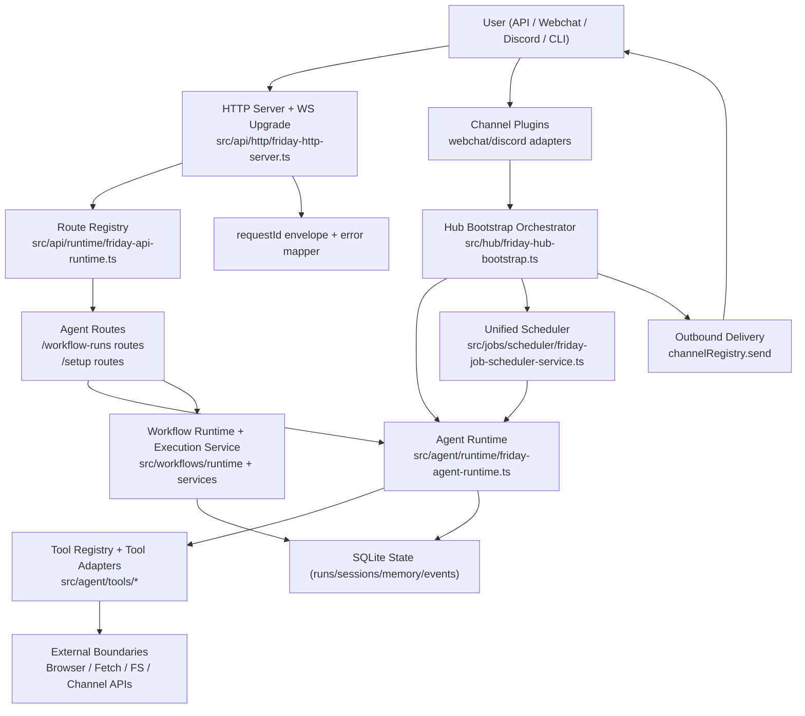

> Status: Current reference. For active product truth and operational boundaries, start with [`docs/current-source-of-truth.md`](../current-source-of-truth.md).

# Friday Architecture (Route + State + Tool Boundary)

## 1) High-Level Module Graph

## 2) Component Responsibilities

| Component | Responsibility | Key Function(s) |
|---|---|---|
| HTTP Router | request parsing, auth/rate-limit middleware, `requestId`, route matching, WS upgrade | `createFridayHttpServer` (`src/api/http/friday-http-server.ts`) |
| API Runtime Composer | wires route handlers to real runtime services | `createFridayApiRuntime` (`src/api/runtime/friday-api-runtime.ts`) |
| Agent Planner/Executor Loop | LLM turn loop, policy checks, tool dispatch, terminal state persistence | `executeRun` (`src/agent/runtime/friday-agent-runtime.ts:148`) |
| Tool Executor | per tool timeout, events, fallback, result capping | `executeToolCall` (`src/agent/runtime/friday-agent-runtime.ts:1507`) |
| Tool Adapters | concrete side effects (browser/fetch/file/exec/workflow/memory/channel) | `createFridayAgentToolRegistry` (`src/agent/tools/friday-agent-tool-registry.ts:97`) |
| Workflow Orchestration | DAG plan + node execution + run lifecycle | `startRun` (`src/workflows/services/friday-workflow-execution-service.ts:819`) |
| Workflow Evidence | run evidence payload/export/download fallback | `exportRunEvidence` / `downloadRunEvidenceExport` (`src/workflows/runtime/friday-workflow-runtime.ts:1610,1733`) |
| Channel Delivery | inbound normalize, run execute, outbound user-visible text/image send | `channelMessageHandler` (`src/hub/friday-hub-bootstrap.ts:1992`) |
| Scheduler | cron/every/at scheduling, timeout/backoff/catch-up, dynamic jobs | `createFridayJobSchedulerService` (`src/jobs/scheduler/friday-job-scheduler-service.ts:51`) |

## 3) State Model and Correlation Keys

| Key | Scope | Produced At | Consumed By | Storage |
|---|---|---|---|---|
| `requestId` | HTTP request scope | `createFridayHttpServer` | all API responses/error payloads | response envelope |
| `runId` (agent) | agent run scope | `executeRun` | tool events, run query APIs, SSE, channel failure audit trace | agent run tables + events |
| `sessionKey` | conversation scope | API input or synthesized | history load, memory tools, channel mapping | session tables |
| `runId` (workflow) | workflow run scope | `workflow execution startRun` | timeline/evidence APIs, run nodes | workflow run tables + event log |
| `correlationId` (workflow field) | workflow integration scope | workflow start input | run entity + integrations | workflow run row |
| `channelCorrelationId` | channel inbound message scope | `channelMessageHandler` | channel diagnostics/audit details | channel audit payload details |

## 4) Tool Boundary and Output Boundary

### Tool boundary

1. Agent runtime enters boundary in `executeToolCall`.
2. Boundary types:
- Process/OS: `exec`, file tools.
- Browser runtime: `browser` tool via Playwright manager.
- Network: `web_fetch` + SSRF guard.
- Internal service bridge: `workflow`, `memory`, `sessions`.
3. Hard guards:
- per-tool timeout (`FRIDAY_AGENT_TOOL_TIMEOUT_MS`)
- policy/readOnly blocking
- result-size capping
- tool_start/tool_end events

### Output boundary

1. API boundary: route handler returns `{ok,data,error,requestId}` envelope.
2. Channel boundary: `channelRegistry.send` sends outbound text/images to webchat/discord adapters.
3. Artifact boundary: screenshot/evidence files persisted and surfaced as paths/URIs.

## 5) Failure Handling and Recovery

| Failure Type | Current Handling |
|---|---|
| LLM/tool failure | run marked failed; error response returned; tool errors surfaced to model/user |
| Tool timeout/hang | per-tool abort controller + timeout in `executeToolCall` |
| Workflow async crash | catches log with `E-WF-RUN-ASYNC-001..004`, finalizes run failed |
| Scheduler job timeout/failure | marks timed_out/failed + exponential backoff |
| Stale run on reboot | `agentRuntime.resumeStaleRunsOnBoot()` marks stale runs failed |
| Output send failure | logs `E-CH-OUTBOUND-001` with structured context; persists fallback text to session; retries outbound send; second failure logs `E-CH-OUTBOUND-RETRY-001` |
| Unwired observability route | explicit 404 message "Observability API is not enabled..." |

## 6) Observability

| Signal | Where |
|---|---|
| Agent lifecycle events (`started/planning/executing/tool_start/tool_end/completed/failed`) | `FridayAgentEventEmitter` from runtime |
| Workflow timeline stream | event repository queried by `/v1/workflow-runs/:runId/timeline` |
| HTTP request-level tracing | `requestId` envelope in all API responses |
| Structured error code surface | `FridayDomainError` + API error mapper |
| Channel failure audit | `stateDir/.friday/audit.jsonl` with `errorCode/routeId/correlationId/channelCorrelationId/runId` |

## 7) Stability Notes from This Audit

1. No-tool false completion was a real stability hole; now guarded by evidence re-prompt and unverified note.
2. `web_fetch` transient failures now have controlled `browser` fallback, but SSRF/security blocks are never bypassed.
3. Feedback-record claims now require persistence tool evidence (`feedback` or `memory_store`) to avoid false acknowledgements.
