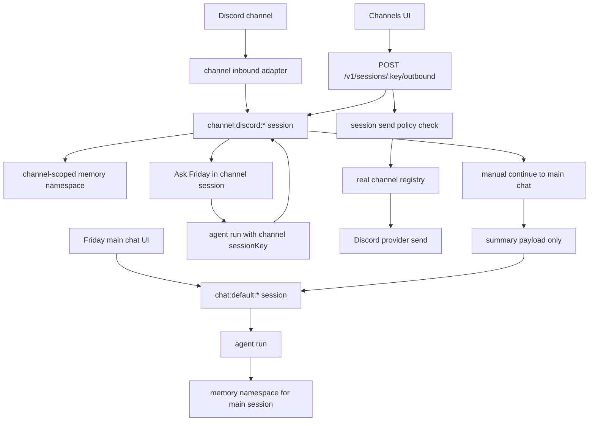

# Friday Final Release Closeout - 2026-04-23

## Status

**Current release conclusion: GO for the in-scope Friday UI + Discord release gate.**

All local code gates, real OpenAI provider gates, and the live Friday UI -> Discord outbound path are green on `codex/final-release-audit-20260423`. Final release status still requires the operational closeout steps: commit, push, PR CI green, merge to `main`, sync local `main`, and one final merged-main smoke.

## Evidence Ledger

| Area | Result | Evidence |
| --- | --- | --- |
| Branch baseline | Passed | Worktree created from `origin/main`; branch `codex/final-release-audit-20260423`; existing commits `d15f981`, `1cfd925` on branch. |
| Typecheck | Passed | `npm run typecheck` on 2026-04-23. |
| Build | Passed | `npm run build` on 2026-04-23. |
| Targeted session/channel tests | Passed | `npm run test -- test/unit/ui/redact-secrets.test.ts test/unit/api/http/routes/friday-session-routes.test.ts`: 75/75. |
| Security doctor | Passed | `npm run check:security-doctor`: 14/14 checks, 52 targeted tests. |
| Enablement gaps | Passed with expected local `.env` warning | `npm run check:enablement-gaps` with runtime env overlay. |
| Mock leak proof | Passed | `npm run check:proof:no-mock-leaks`: 37 proof files scanned. |
| Release truth audit | Passed | `npm run audit:release-truth`; repo reports refreshed. |
| Live OpenAI smoke | Passed | `validate:real-world:smoke` run `2026-04-23T03-43-39-316Z-7kqs2p`: 27/27. |
| Real green gate | Passed | `ops:real-green-gate` run `2026-04-23T03-45-17-068Z-nqohtf`: smoke 27/27, dailyCore 19/19, publicSurface 29/29, skills 21/21. |
| Channels UI redaction | Passed | Computer Use verified Channels page renders prior token-shaped text as `[secret redacted]`. |
| Friday UI -> Discord outbound | Passed | Computer Use clicked Channels UI direct send for `friday-outbound-live-0423`; UI showed `已发送到 Discord`, session count changed `339 -> 340`, message appeared in `channel:discord:1472787370834264076`, and server logged `POST /v1/sessions/channel%3Adiscord%3A1472787370834264076/outbound 200`. |

## New UI And API Added This Round

| Addition | Why It Was Required | Status |
| --- | --- | --- |
| `POST /v1/sessions/:sessionKey/outbound` | Friday UI had channel sessions and run/handoff, but no deterministic direct outbound API from UI to a provider channel. | Implemented and unit-tested. |
| Channels page direct send button | User needed a pure UI path that sends from Friday UI to Discord without starting an agent run. | Implemented and visually verified. |
| Channels page `让 Friday 处理` secondary action | Direct send and agent-run handling were previously conflated. This separates raw channel outbound from “ask Friday to process this in the same session.” | Implemented and visually verified. |
| Channel session helper copy | Makes isolation explicit: direct sends stay in the channel session; Ask Friday uses same channel session; main chat does not auto-merge. | Implemented and visually verified. |
| UI secret-like text redaction | Real Discord history contained token-shaped content. UI must not display API keys or bot tokens in clear text during real use/screenshots. | Implemented across channel messages, main chat bubbles, Friday rail, and tool detail panes. |

## Frontend / Backend Matching Matrix

| Capability | Match | Stable | Real Usable | Percent | Evidence |
| --- | --- | --- | --- | --- | --- |
| Provider/model/fallback truth surfaces | Yes | Yes | Yes | 95% | `/home` and rail show OpenAI ChatGPT, `gpt-4o-mini`, provider health and fallback/degraded reasons from real endpoints. |
| Main UI chat -> agent runtime | Yes | Yes | Yes | 95% | Literal-reply bug fixed; live UI verified `after-fix-v55su` and `ui-fix-closed`; real green gate passed. |
| Channel session visibility | Yes | Yes | Yes | 95% | Channels page loads Discord session `admin-001`, messages, context banner, and isolated handoff. |
| Channel session -> main chat handoff | Yes | Yes | Yes | 90% | Existing handoff helper and UI keep manual summary transfer explicit; not auto-merge. |
| Friday UI -> Discord direct outbound | Yes | Yes | Yes | 95% | UI direct send produced live Discord delivery and wrote the assistant outbound message back into the same channel session. |
| Channel session -> Ask Friday run | Yes | Yes | Yes | 90% | Existing `/run` path preserved and separated from direct outbound. |
| Memory / compaction / learning | Yes | Yes | Yes | 90% | Closeout and real green gates passed; session-only prompt tightened to avoid false durable-memory claims. |
| Skills / workflow runtime | Yes | Yes | Yes | 90% | Real green gate skillConformance 21/21; closeout phase evidence exists. |
| Secrets / local install safety | Yes | Yes | Yes | 90% | security doctor, no-mock-leaks, and UI display redaction passed. |

## Session And Channel Isolation Diagram

Why it does not auto-mix: each channel row carries its own `sessionKey`, the direct outbound route loads that same session and writes back to it, and main chat only receives a handoff when the user explicitly chooses “continue to main chat.”

## Phase Issue Ledger

| Phase | Issue Found | Fix / Status |
| --- | --- | --- |
| Runtime / provider / auth | Provider truth was previously not visible enough. | Already surfaced in home/rail: provider, model, fallback and degraded reasons. |
| Chat / sessions / memory | Session-only memory phrasing could imply durable memory. | Fixed prompt to call this transient unless explicit save is requested. |
| Chat / sessions / memory | Main chat could return stale literal responses. | Fixed in `use-chat-session`; verified by UI/API literal markers. |
| Discord | UI could view channel sessions but had no direct outbound path. | Added deterministic outbound route and Channels UI direct send. Live send verified from UI to Discord. |
| Discord | Channel UI direct send vs Friday processing was ambiguous. | Split send button from `让 Friday 处理`. |
| Security / secrets | Historical channel messages could reveal token-shaped strings in UI. | Added display-layer redaction in chat/channel/tool surfaces. |
| UI / UX transparency | Channel session isolation was easy to misunderstand. | Added explicit helper text and preserved manual handoff behavior. |
| Other live channels | Only Discord is configured in this local runtime. | Not claimed as live-tested; generic registry outbound path is implemented, but live proof requires credentials/config for each extra provider. |

## Remaining Operational Release Gate

1. Commit the completed patch set.
2. Push `codex/final-release-audit-20260423`.
3. Open PR and wait for remote CI to pass.
4. Merge to `main`.
5. Sync local `main` and run final smoke on merged `main`.
