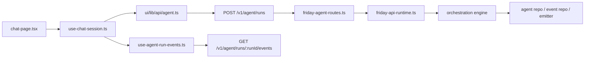

# Friday 全面代码级层路调查报告

日期：2026-04-03  
范围：本地可达全栈（UI、API、runtime、session/auth、deterministic/managed/agent 分支、SSE/realtime、persistence、test/closure 覆盖）  
不在本轮穷尽范围内：cloud、OAuth、外部 channels、MCP，仅作为阻塞/风险项单列

## 1. 执行摘要

这类“看起来很小、但跨层会挂住”的问题，在 Friday 里不是偶发手滑，而是有明确的系统性根因：

1. 关键公共契约没有稳定的单一权威源。
2. 同一条用户请求在不同执行分支上，没有被统一约束为同一组不变量。
3. API runtime 和 channel runtime 存在平行 composition root，接线重复但不完全一致。
4. 自动化覆盖更多锁住的是模块正确性和 `/assistant` 主路径，不是 `/chat` 这类具体产品面的跨层闭环。
5. 前端仍存在大量手写类型和局部兼容逻辑，导致“后端语义升级，前端局部滞后”的回归风险持续存在。

结论不是“Friday 不可用”。结论是：Friday 的主链路很强，但在“跨层契约 + 分支一致性 + 产品面闭环”这三处存在工程治理缺口，因此会出现小问题从局部漏出。

## 2. 调查方法与证据来源

### 2.1 静态审查

- 组合层与接线中心：
  - `src/hub/friday-hub-bootstrap.ts` 约 5214 行
  - `src/api/runtime/friday-api-runtime.ts` 约 2175 行
  - `ui/src/lib/api/types.ts` 约 2267 行
- API runtime 当前注册约 45 组 route factory。
- 重点审查的跨层链路：
  - `/chat`
  - `/assistant`
  - `/settings`
  - `/observability`
  - `POST /v1/agent/runs -> GET /v1/agent/runs/:runId -> GET /v1/agent/runs/:runId/events`
  - session key canonical 规则
  - context cost / runtime result / event stream 形状

### 2.2 运行证据

在 2026-04-03 的本地 Friday 实例上确认过：

- `GET /v1/health` 返回 `ok: true`
- `GET /v1/auth/me` 返回 200
- `GET /v1/system/session` 返回 200
- `GET /v1/system/summary` 返回 200
- `GET /v1/observability/overview` 返回 200
- `GET /v1/diagnosis/learning/overview` 返回 200
- 已通过真实本地 API 复现并验证 `/chat` 相关链路：
  - `POST /v1/agent/runs`
  - `GET /v1/agent/runs/:runId`
  - `GET /v1/agent/runs/:runId/events`

### 2.3 测试与 closure 审计

- 现有测试层级覆盖很广：unit / integration / contract / browser-e2e / live-e2e / closure。
- 但覆盖强度并不均匀，尤其是 `/chat` 的 UI 闭环明显弱于 `/assistant`。

## 3. 产品面与层路图

### 3.1 `/chat` 主链路

这是本轮问题暴露最明显的产品面，因为它同时依赖：

- session key canonical 规则
- `startRun` 返回形状
- `getRun` / `events` 的后续可用性
- SSE terminal 语义

这些语义跨了 UI hook、前端 API client、HTTP route、runtime adapter、repo/event bus 五层。

### 3.2 `/assistant` 主链路

`/assistant` 的路径更重，但它的自动化测试和日常使用都更强，因此很多问题会更早暴露。当前 browser E2E 也主要围绕 `/assistant` 写。

### 3.3 `/settings` 与 `/observability`

这两条路径现在主要依赖 system/observability 的只读接口。它们的契约集中度高于 chat/agent，但产品面级 browser/live 闭环仍偏弱。

## 4. 单一事实来源与重复定义矩阵

| 契约/语义 | 当前权威源 | 镜像/重复定义 | 现状判断 |
| --- | --- | --- | --- |
| `system.*` UI client | `packages/friday-operator-client` | `ui/src/lib/api/system.ts` 只是薄封装 | 相对健康 |
| `POST /v1/agent/runs` 返回形状 | 实际返回 `FridayAgentRuntimeResult` | `ui/src/lib/api/agent.ts` 自己定义 `StartRunResponse` | 权威不单一 |
| agent runtime result 类型 | `src/agent/runtime/friday-agent-runtime.types.ts` | `ui/src/lib/api/types.ts` 手写 `AgentRuntimeResult` | 手写镜像存在漂移风险 |
| workflow run start 返回形状 | `src/api/model/friday-api-workflow.types.ts` 的 `FridayStartRunResponse` | 前端消费更接近公开 API 模型 | 是对照组，治理更清晰 |
| session key canonical 规则 | `src/sessions/services/friday-session-key.ts` | `ui/src/hooks/use-chat-session.ts` 自己实现 build/coerce/normalize | 明确重复定义 |
| chat 页面 session 使用 | `use-chat-session.ts` | `chat-page.tsx` 直接读同一个 localStorage key | 存在跨组件隐式耦合 |
| agent events 形状 | route + event emitter + repo replay 的组合语义 | UI `AgentRunStreamEvent` 仍是手写消费类型 | 契约语义未被单点声明 |

### 4.1 关键证据

- system UI client 走共享 operator client：
  - `ui/src/lib/api/system.ts:1-12`
- agent run start 仍是前端手写响应：
  - `ui/src/lib/api/agent.ts:13-33`
  - `ui/src/lib/api/agent.ts:72-84`
- agent runtime result 在前后端各有一份类型：
  - `src/agent/runtime/friday-agent-runtime.types.ts:223-239`
  - `ui/src/lib/api/types.ts:277-289`
- workflow run start 有专门 API 模型，对比更清楚：
  - `src/api/model/friday-api-workflow.types.ts:461-475`
- backend session key canonical 规则在一处：
  - `src/sessions/services/friday-session-key.ts:44-58`
  - `src/sessions/services/friday-session-key.ts:92-156`
- frontend chat 仍自建 canonical/coerce 逻辑：
  - `ui/src/hooks/use-chat-session.ts:28-75`

## 5. 执行路径分支与不变量矩阵

### 5.1 Friday 当前至少有这些主分支

- `sync_immediate`
- `managed_async`
- `planning gate`
- `full agent runtime`
- `/assistant` 派生入口
- `/chat` 派生入口
- channel 派生入口

### 5.2 应当统一但实际上会漂移的不变量

| 分支 | 稳定 run identity | `getRun` | `events` | session/focus mirror | terminal 语义一致 | 当前判断 |
| --- | --- | --- | --- | --- | --- | --- |
| full agent runtime | 是 | 是 | 是 | 是 | 基本一致 | 强 |
| planning gate | 是 | 是 | 是 | 是 | 基本一致 | 强 |
| managed async | 是 | 是 | 依实现而定 | 基本有 | 中等 | 中 |
| sync immediate（API） | 现在是 | 现在是 | 现在是 | 是 | 依兼容层翻译 | 历史上漂移过 |
| sync immediate（channel） | 非公开 run 契约 | 不面向同一 API | 未见同等持久化钩子 | 依 channel wiring | 与 API 分支不完全同构 | 漂移风险高 |
| `/chat` 产品面 | 依赖 startRun + events 一致性 | 是 | 是 | 依 session key | 对 immediate 分支最敏感 | 本轮暴露问题点 |
| `/assistant` 产品面 | 依赖更少 | 多数是 | 不强依赖 chat 风格 SSE | 是 | 稳 | 覆盖更强 |

### 5.3 本轮最关键的结构性证据

API runtime 的 orchestration engine 接入了 `persistImmediateRunResult`：

- `src/api/runtime/friday-api-runtime.ts:1712-1779`
- `src/api/runtime/friday-api-runtime.ts:1781-1805`

channel runtime 的 orchestration engine 没有同样的接线：

- `src/hub/friday-hub-bootstrap.ts:4761-4792`

这说明“同一个 orchestration engine 概念”并没有由同一个 factory 在两个 composition root 上生成完全一致的语义。此前 `/chat` 的 immediate bug，本质上就是这类分支不变量不统一的一个显性样本。

## 6. Layer Wiring 审查结果

### 6.1 P0：`agent.runs.start` 没有稳定的公开 API owner，直接暴露内部 runtime 结果

**确认事实**

- route 直接返回 `deps.startRun(...)` 的结果：
  - `src/api/http/routes/friday-agent-routes.ts:133-290`
- API runtime 明确写了“把 engine result 映射回 `FridayAgentRuntimeResult` 兼容形状”：
  - `src/api/runtime/friday-api-runtime.ts:1809-1840`
- 前端却不是消费公开 API model，而是自己定义 `StartRunResponse`：
  - `ui/src/lib/api/agent.ts:28-33`
  - `ui/src/lib/api/agent.ts:72-84`

**影响**

- 公共 API 返回语义依附于内部 runtime 兼容层，不是清晰独立的公开 contract。
- 前端只拿了它关心的子集，因此隐藏语义变化更容易漏掉。
- workflow run 已经有显式 API model，但 agent run 没有，治理不一致。

**根因分类**

- 契约权威不单一
- 类型副本/手写镜像过多

### 6.2 P0：API runtime 与 channel runtime 的 orchestration wiring 漂移

**确认事实**

- API runtime 接了 `persistImmediateRunResult`
  - `src/api/runtime/friday-api-runtime.ts:1793-1800`
- channel runtime 没有
  - `src/hub/friday-hub-bootstrap.ts:4781-4791`

**影响**

- 同样是 deterministic/immediate 分支，不同入口会拥有不同的后置保证。
- 这类问题不会被单个模块测试发现，因为模块本身没错，错在组合层 wiring 不一致。

**根因分类**

- 分支不变量未统一
- composition root 过大/重复接线

### 6.3 P1：session key canonical 规则在后端和 chat UI 各自实现

**确认事实**

- canonical authority 在 backend：
  - `src/sessions/services/friday-session-key.ts:44-58`
  - `src/sessions/services/friday-session-key.ts:92-156`
  - `src/sessions/services/friday-session-key.ts:168-237`
- chat UI 仍有自己的 build/coerce/normalize：
  - `ui/src/hooks/use-chat-session.ts:28-75`

**影响**

- 后端规则变化后，前端局部存量状态可能立刻失配。
- 这次 `Session key must have exactly 3 segments` 就是这类 drift 的直接实例。

**根因分类**

- 契约权威不单一
- 兼容层/历史层与当前 steady-state 语义边界不清

### 6.4 P1：`/chat` 假设 `startRun` 后一定可流式订阅，但该不变量此前未被公开声明

**确认事实**

- chat 发送消息后会直接 `startRun`，然后依赖 `useAgentRunEvents` 去拉 `/events`：
  - `ui/src/hooks/use-chat-session.ts:157-223`
  - `ui/src/hooks/use-agent-run-events.ts:174-251`
- chat 页面把流式输出、tool activity、token usage 都绑在这条链上：
  - `ui/src/routes/chat-page.tsx:25-37`
  - `ui/src/routes/chat-page.tsx:134-157`
- route 级 tests 分别测试了 `start` 和 `events`，但没有把它们锁成“同一个 run 的跨路由闭环”：
  - `test/unit/api/http/routes/friday-agent-routes.test.ts:136-170`
  - `test/unit/api/http/routes/friday-agent-routes.test.ts:581-721`
- API runtime 的 deterministic dispatch test 只断言 `POST /v1/agent/runs` 的返回，不断言 `getRun/events`：
  - `test/unit/api/runtime/friday-api-runtime-deterministic-dispatch.test.ts:59-115`

**影响**

- `POST` 成功不代表 `events` 一定可用，但 chat 产品面当时把它当成隐含保证。
- 这会让“简单问题卡住”这种体验层 bug 漏过大量模块测试。

**根因分类**

- 分支不变量未统一
- 产品面闭环测试缺失

### 6.5 P2：`/chat` 自己管理 localStorage 会话状态，页面与 hook 通过 magic key 耦合

**确认事实**

- `use-chat-session.ts` 维护 `friday-chat-session-key`
  - `ui/src/hooks/use-chat-session.ts:28-29`
  - `ui/src/hooks/use-chat-session.ts:93-97`
- `chat-page.tsx` 直接读同一个 localStorage key 去拉 session usage：
  - `ui/src/routes/chat-page.tsx:25-32`

**影响**

- 产品面内部也没有统一 session abstraction。
- 这类“页面知道 hook 的私有存储协议”的模式很容易再制造兼容层问题。

**根因分类**

- 兼容层/历史层与当前 steady-state 语义边界不清
- 类型副本/局部协议过多

### 6.6 P2：system 面相对健康，进一步说明问题核心不是 Friday 全局崩坏，而是 contract 治理不均衡

**确认事实**

- `systemApi` 通过共享 operator client 暴露：
  - `ui/src/lib/api/system.ts:1-12`

**影响**

- 这证明 Friday 不是没有治理模式，而是治理模式没有统一覆盖到 agent/chat 这条链。

**根因分类**

- ownership 收敛不完整

## 7. 测试覆盖矩阵与缺口

### 7.1 产品面覆盖矩阵

| 产品面 | Unit | Contract/API | Browser E2E | Live E2E | Closure | 判断 |
| --- | --- | --- | --- | --- | --- | --- |
| `/chat` | 仅局部 hook/unit | route 存在，但不是跨路由闭环 | 缺失 | 缺失 | 缺失 | 高风险缺口 |
| `/assistant` | 强 | 强 | 强 | 间接强 | 强 | 覆盖最好 |
| `/settings` | 中 | system route 有 | 缺失或很弱 | 缺失 | 间接有 | 中风险 |
| `/observability` | 中 | service/route 有 | 缺失或很弱 | 缺失 | 间接有 | 中风险 |
| skills/workflows | 强 | 强 | 部分强 | 部分强 | 强 | 较稳 |

### 7.2 关键证据

- browser E2E 主要打 `/assistant`，不是 `/chat`：
  - `test/e2e/ui/friday-agent-os-browser-journeys.test.ts:19-22`
  - `test/e2e/ui/friday-agent-os-browser-journeys.test.ts:114-220`
- live journeys 当前没有 `chat` 也没有 `assistant`：
  - 审计结果：`test/e2e/live/friday-real-journeys.e2e.test.ts` 中 `NO_CHAT` / `NO_ASSISTANT`
- closure 会创建 session 并打 `/v1/agent/runs`，但不走 `/chat` UI，也不校验 `/events`：
  - `scripts/e2e/run-friday-closure.mjs:1548-1615`
- `use-chat-session` 当前 unit test 只覆盖 session key 与 immediate-response helper：
  - `test/unit/ui/use-chat-session.test.ts:10-59`

### 7.3 为什么这些测试没拦住 `/chat`

因为它们锁住的是不同层的局部正确性：

- route test：路由本身能返回
- runtime test：classifier/deterministic dispatch 能返回
- browser E2E：`/assistant` 产品面没坏
- closure：agent runs 和 memory 主链路没坏

但没有一层测试在明确要求：

> “对于 `/chat` 发起的一个 immediate/deterministic run，`startRun`、`getRun`、`events`、session key、terminal display 必须形成同一个稳定闭环。”

## 8. 为什么会出现“小问题”

### 8.1 不是 Friday 不行，而是治理重心不均衡

Friday 的核心能力非常多，主干也很强。问题在于：

- 主干能力做得很深
- 但跨层 contract 的权威归属没有完全收敛
- 产品面级闭环测试更多集中在 `/assistant`
- 历史兼容层、局部 helper、手写前端类型仍然很多

因此最容易漏出的不是“大功能完全不能用”，而是：

- 某个边分支少了一环
- 某个产品面沿用了旧假设
- 某个前端局部 helper 落后于后端 canonical 规则

这正是本轮两个 `/chat` 问题的共同模式。

### 8.2 本质根因分层

1. 契约权威不单一  
2. 分支不变量未统一  
3. composition root 过大且重复接线  
4. 产品面闭环测试缺失  
5. 类型副本/手写镜像过多  
6. 兼容层和 steady-state 边界不清  

## 9. 整改计划（Decision-Complete）

### Wave 1：先修高风险 contract / invariant

1. 为 `agent.runs.start/get/events` 建立明确公开 API model，不再直接暴露 runtime 兼容形状。
2. 把 “run 可订阅 / 不可订阅 / terminal inline” 语义变成 contract，而不是前端猜测。
3. session key canonical 规则只保留一个共享实现；UI 不再自己定义 build/coerce 规则。
4. 为 deterministic/immediate 分支建立统一 invariant：只要对外给出 `runId`，就必须可 `getRun`，并且要么可 `events`，要么 contract 明说不可流式。

### Wave 2：补齐闭环测试

1. 新增 `/chat` browser E2E：
   - 输入简单问题
   - 校验首条 assistant 响应出现
   - immediate 分支不挂住
2. 新增 API integration：
   - `POST /v1/agent/runs` 后立即 `GET run`
   - 再 `GET events`
   - 分别覆盖 `sync_immediate`、`planning gate`、`full agent`
3. 新增 channel runtime invariant test，确保 API runtime 与 channel runtime 的 orchestration wiring 语义一致。
4. 把 closure 加一条真正的 `/chat` 产品面 smoke，不只测 session + agent API。

### Wave 3：收敛类型、接线、ownership

1. 建立 agent 公共 contract owner，避免 UI 手写 `StartRunResponse`。
2. 优先让 UI 从共享 client / 共享 contract package 消费，而不是各页自己维护局部类型。
3. 把 orchestration engine 的 wiring 收到统一 factory，API 与 channel 只传差异化 deps，不允许复制一份接线逻辑再各改各的。
4. 把 chat session/storage 逻辑收成真正的 session adapter，页面不再直接读 magic localStorage key。

### Wave 4：复杂度治理

1. 持续拆分 `friday-hub-bootstrap.ts`
2. 持续拆分 `friday-api-runtime.ts`
3. 缩小 `ui/src/lib/api/types.ts` 的手写表面积
4. 为产品面建立“contract owner + browser owner + closure owner”三元 ownership，而不是只靠某一个层级兜底

## 10. 本轮调查的高优先级结论

### P0

- `agent run` 公共 contract 目前没有像 workflow run 那样清晰的 API owner。
- API runtime 与 channel runtime 的 orchestration wiring 已证实存在语义漂移风险。

### P1

- session key canonical 规则与 chat UI 的兼容逻辑存在双实现。
- `/chat` 的 `startRun -> getRun/events -> terminal display` 闭环在测试矩阵里长期缺位。

### P2

- chat 页面与 hook 通过 localStorage magic key 隐式耦合。
- system 侧治理较统一，说明需要的是治理扩展，而不是继续靠局部补丁。

## 11. 阻塞与未纳入穷尽范围

本轮未穷尽：

- cloud 目标
- OAuth 依赖
- 外部 channels 的真实第三方联调
- MCP 外部依赖链

这些项应单列为后续风险面，但不影响本报告对本地全栈根因的判断。

## 12. 最终结论

Friday 出现这类“小问题”的原因，不是单个模块不成熟，而是：

- agent/chat 这条链路的公开 contract 治理弱于 system/workflow
- immediate 分支的跨入口不变量此前没有被统一成强约束
- 测试矩阵更偏向模块和 `/assistant`，而不是 `/chat` 的产品面闭环

所以问题会以“小处漏出、大处仍能跑”的形式出现。

这类问题已经可以通过工程治理体系修掉，且整改顺序已经足够明确：  
先收 contract，再补闭环测试，再统一 wiring，最后做复杂度治理。
